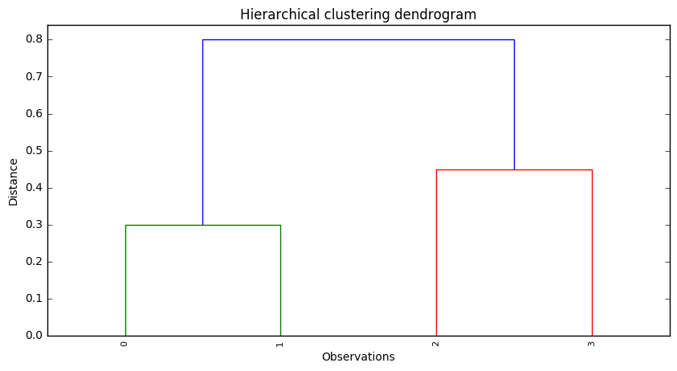

# Exercise 10.2


```python
import pandas as pd
import matplotlib.pyplot as plt
import numpy as np
from scipy.cluster.hierarchy import dendrogram, linkage

%matplotlib inline
```

# (a)


```python
# Dissimilarity matrix
'''
The Dissimilarity matrix is a matrix that express the similarity pair to pair between to sets. It's square, and symmetric. The diagonal
members are defined as zero, meaning that zero is the measure of dissimilarity between an element and itself. Thus, the information the 
matrix holds can be seen as a triangular matrix.

Source: https://en.wikibooks.org/wiki/Data_Mining_Algorithms_In_R/Clustering/Dissimilarity_Matrix_Calculation
'''
disMat = np.array([[0, 0.3, 0.4, 0.7],
                   [0.3, 0, 0.5, 0.8],
                   [0.4, 0.5, 0, 0.45],
                   [0.7, 0.8, 0.45, 0]])
```


```python
# Linkage matrix
'''
To solve this problem, we can use SciPy, in particular the function 'scipy.cluster.hierarchy.linkage'. However, in contrast to R's 'hclust',
'linkage' is not able to deal directly with dissimilarity matrices. It's inputs must be a 1d compressed distance matrix or a 2d array of
observation vectors.
Since we don't have a 2d array of observations (samples x features), we must use the 1d compressed distance matrix. The 1d compressed matrix
has the distances between all the possible combinations of observations ((0,1), (0,2), (0,3), (1,2), (1,3), and (2,3)). Distances can be 
seen as a dissimilarity measure, as they express how different the observations are. Accordingly, to solve the exercise we just need to 
transform the dissimilarity matrix into a 1d compressed distance matrix and use it in the 'linkage' function. This can be done using the
'triu_indices' function, which returns the indices for the upper-triangle of an (n, m) array (remember that the dissimilarity matrix is a 
triangluar matrix).
'''
h, w = disMat.shape
z = linkage(disMat[np.triu_indices(h,1)], method='complete')
```


```python
# Plot dendrogram
plt.figure(figsize=(10,5))
plt.title('Hierarchical clustering dendrogram')
plt.xlabel('Observations')
plt.ylabel('Distance')

dendrogram(z, leaf_rotation=90, leaf_font_size=8)
plt.show()
```





# (b)


```python
# Linkage matrix
z = linkage(disMat[np.triu_indices(h,1)], method='single')
```


```python
# Plot dendrogram
plt.figure(figsize=(10,5))
plt.title('Hierarchical clustering dendrogram')
plt.xlabel('Observations')
plt.ylabel('Distance')

dendrogram(z, leaf_rotation=90, leaf_font_size=8)
plt.show()
```


# (c)

In <b>Cluster A</b> we would have observations <b>0</b> and <b>1</b>, while in <b>Cluster B</b> we would have observations <b>2</b> and <b>3</b>.

# (d)

In <b>Cluster A</b> we would have observation <b>3</b>, while in <b>Cluster B</b> we would have observations <b>2</b>, <b>0</b> and <b>1</b>.

# (e)

This question is just about graphical manipulation. Although in R it is easy to do this manipulation, we didn't find an equivalent way to do it in Python. Since the answer to this question doesn't add significant value in terms of clusters knowledge, we didn't decided not to solve it. 

# References

* https://joernhees.de/blog/2015/08/26/scipy-hierarchical-clustering-and-dendrogram-tutorial/ (nice tutorial about using SciPy for hierarchical clustering and dendograms)
* https://en.wikibooks.org/wiki/Data_Mining_Algorithms_In_R/Clustering/Dissimilarity_Matrix_Calculation (Dissimilarity matrix definition)
* http://stackoverflow.com/questions/13079563/how-does-condensed-distance-matrix-work-pdist (condensed distance matrix explanation)
