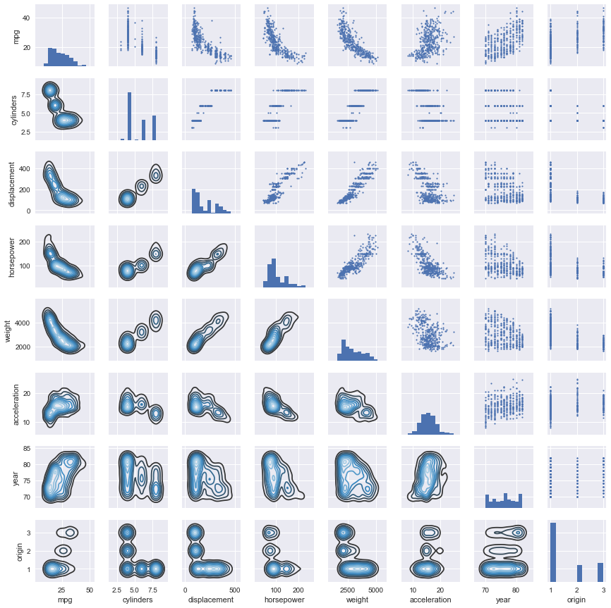

```python
%matplotlib inline
import pandas as pd
import seaborn as sns
import matplotlib.pyplot as plt

pd.options.display.float_format = '{:,.2f}'.format # Print only 2 decimal cases.
```


```python
df = pd.read_csv('../data/auto.csv')
df
```


<div>
<table border="1" class="dataframe">
  <thead>
    <tr style="text-align: right;">
      <th></th>
      <th>mpg</th>
      <th>cylinders</th>
      <th>displacement</th>
      <th>horsepower</th>
      <th>weight</th>
      <th>acceleration</th>
      <th>year</th>
      <th>origin</th>
      <th>name</th>
    </tr>
  </thead>
  <tbody>
    <tr>
      <th>0</th>
      <td>18.00</td>
      <td>8</td>
      <td>307.00</td>
      <td>130</td>
      <td>3504</td>
      <td>12.00</td>
      <td>70</td>
      <td>1</td>
      <td>chevrolet chevelle malibu</td>
    </tr>
    <tr>
      <th>1</th>
      <td>15.00</td>
      <td>8</td>
      <td>350.00</td>
      <td>165</td>
      <td>3693</td>
      <td>11.50</td>
      <td>70</td>
      <td>1</td>
      <td>buick skylark 320</td>
    </tr>
    <tr>
      <th>2</th>
      <td>18.00</td>
      <td>8</td>
      <td>318.00</td>
      <td>150</td>
      <td>3436</td>
      <td>11.00</td>
      <td>70</td>
      <td>1</td>
      <td>plymouth satellite</td>
    </tr>
    <tr>
      <th>3</th>
      <td>16.00</td>
      <td>8</td>
      <td>304.00</td>
      <td>150</td>
      <td>3433</td>
      <td>12.00</td>
      <td>70</td>
      <td>1</td>
      <td>amc rebel sst</td>
    </tr>
    <tr>
      <th>4</th>
      <td>17.00</td>
      <td>8</td>
      <td>302.00</td>
      <td>140</td>
      <td>3449</td>
      <td>10.50</td>
      <td>70</td>
      <td>1</td>
      <td>ford torino</td>
    </tr>
    <tr>
      <th>5</th>
      <td>15.00</td>
      <td>8</td>
      <td>429.00</td>
      <td>198</td>
      <td>4341</td>
      <td>10.00</td>
      <td>70</td>
      <td>1</td>
      <td>ford galaxie 500</td>
    </tr>
    <tr>
      <th>6</th>
      <td>14.00</td>
      <td>8</td>
      <td>454.00</td>
      <td>220</td>
      <td>4354</td>
      <td>9.00</td>
      <td>70</td>
      <td>1</td>
      <td>chevrolet impala</td>
    </tr>
    <tr>
      <th>7</th>
      <td>14.00</td>
      <td>8</td>
      <td>440.00</td>
      <td>215</td>
      <td>4312</td>
      <td>8.50</td>
      <td>70</td>
      <td>1</td>
      <td>plymouth fury iii</td>
    </tr>
    <tr>
      <th>8</th>
      <td>14.00</td>
      <td>8</td>
      <td>455.00</td>
      <td>225</td>
      <td>4425</td>
      <td>10.00</td>
      <td>70</td>
      <td>1</td>
      <td>pontiac catalina</td>
    </tr>
    <tr>
      <th>9</th>
      <td>15.00</td>
      <td>8</td>
      <td>390.00</td>
      <td>190</td>
      <td>3850</td>
      <td>8.50</td>
      <td>70</td>
      <td>1</td>
      <td>amc ambassador dpl</td>
    </tr>
    <tr>
      <th>10</th>
      <td>15.00</td>
      <td>8</td>
      <td>383.00</td>
      <td>170</td>
      <td>3563</td>
      <td>10.00</td>
      <td>70</td>
      <td>1</td>
      <td>dodge challenger se</td>
    </tr>
    <tr>
      <th>11</th>
      <td>14.00</td>
      <td>8</td>
      <td>340.00</td>
      <td>160</td>
      <td>3609</td>
      <td>8.00</td>
      <td>70</td>
      <td>1</td>
      <td>plymouth 'cuda 340</td>
    </tr>
    <tr>
      <th>12</th>
      <td>15.00</td>
      <td>8</td>
      <td>400.00</td>
      <td>150</td>
      <td>3761</td>
      <td>9.50</td>
      <td>70</td>
      <td>1</td>
      <td>chevrolet monte carlo</td>
    </tr>
    <tr>
      <th>13</th>
      <td>14.00</td>
      <td>8</td>
      <td>455.00</td>
      <td>225</td>
      <td>3086</td>
      <td>10.00</td>
      <td>70</td>
      <td>1</td>
      <td>buick estate wagon (sw)</td>
    </tr>
    <tr>
      <th>14</th>
      <td>24.00</td>
      <td>4</td>
      <td>113.00</td>
      <td>95</td>
      <td>2372</td>
      <td>15.00</td>
      <td>70</td>
      <td>3</td>
      <td>toyota corona mark ii</td>
    </tr>
    <tr>
      <th>15</th>
      <td>22.00</td>
      <td>6</td>
      <td>198.00</td>
      <td>95</td>
      <td>2833</td>
      <td>15.50</td>
      <td>70</td>
      <td>1</td>
      <td>plymouth duster</td>
    </tr>
    <tr>
      <th>16</th>
      <td>18.00</td>
      <td>6</td>
      <td>199.00</td>
      <td>97</td>
      <td>2774</td>
      <td>15.50</td>
      <td>70</td>
      <td>1</td>
      <td>amc hornet</td>
    </tr>
    <tr>
      <th>17</th>
      <td>21.00</td>
      <td>6</td>
      <td>200.00</td>
      <td>85</td>
      <td>2587</td>
      <td>16.00</td>
      <td>70</td>
      <td>1</td>
      <td>ford maverick</td>
    </tr>
    <tr>
      <th>18</th>
      <td>27.00</td>
      <td>4</td>
      <td>97.00</td>
      <td>88</td>
      <td>2130</td>
      <td>14.50</td>
      <td>70</td>
      <td>3</td>
      <td>datsun pl510</td>
    </tr>
    <tr>
      <th>19</th>
      <td>26.00</td>
      <td>4</td>
      <td>97.00</td>
      <td>46</td>
      <td>1835</td>
      <td>20.50</td>
      <td>70</td>
      <td>2</td>
      <td>volkswagen 1131 deluxe sedan</td>
    </tr>
    <tr>
      <th>20</th>
      <td>25.00</td>
      <td>4</td>
      <td>110.00</td>
      <td>87</td>
      <td>2672</td>
      <td>17.50</td>
      <td>70</td>
      <td>2</td>
      <td>peugeot 504</td>
    </tr>
    <tr>
      <th>21</th>
      <td>24.00</td>
      <td>4</td>
      <td>107.00</td>
      <td>90</td>
      <td>2430</td>
      <td>14.50</td>
      <td>70</td>
      <td>2</td>
      <td>audi 100 ls</td>
    </tr>
    <tr>
      <th>22</th>
      <td>25.00</td>
      <td>4</td>
      <td>104.00</td>
      <td>95</td>
      <td>2375</td>
      <td>17.50</td>
      <td>70</td>
      <td>2</td>
      <td>saab 99e</td>
    </tr>
    <tr>
      <th>23</th>
      <td>26.00</td>
      <td>4</td>
      <td>121.00</td>
      <td>113</td>
      <td>2234</td>
      <td>12.50</td>
      <td>70</td>
      <td>2</td>
      <td>bmw 2002</td>
    </tr>
    <tr>
      <th>24</th>
      <td>21.00</td>
      <td>6</td>
      <td>199.00</td>
      <td>90</td>
      <td>2648</td>
      <td>15.00</td>
      <td>70</td>
      <td>1</td>
      <td>amc gremlin</td>
    </tr>
    <tr>
      <th>25</th>
      <td>10.00</td>
      <td>8</td>
      <td>360.00</td>
      <td>215</td>
      <td>4615</td>
      <td>14.00</td>
      <td>70</td>
      <td>1</td>
      <td>ford f250</td>
    </tr>
    <tr>
      <th>26</th>
      <td>10.00</td>
      <td>8</td>
      <td>307.00</td>
      <td>200</td>
      <td>4376</td>
      <td>15.00</td>
      <td>70</td>
      <td>1</td>
      <td>chevy c20</td>
    </tr>
    <tr>
      <th>27</th>
      <td>11.00</td>
      <td>8</td>
      <td>318.00</td>
      <td>210</td>
      <td>4382</td>
      <td>13.50</td>
      <td>70</td>
      <td>1</td>
      <td>dodge d200</td>
    </tr>
    <tr>
      <th>28</th>
      <td>9.00</td>
      <td>8</td>
      <td>304.00</td>
      <td>193</td>
      <td>4732</td>
      <td>18.50</td>
      <td>70</td>
      <td>1</td>
      <td>hi 1200d</td>
    </tr>
    <tr>
      <th>29</th>
      <td>27.00</td>
      <td>4</td>
      <td>97.00</td>
      <td>88</td>
      <td>2130</td>
      <td>14.50</td>
      <td>71</td>
      <td>3</td>
      <td>datsun pl510</td>
    </tr>
    <tr>
      <th>...</th>
      <td>...</td>
      <td>...</td>
      <td>...</td>
      <td>...</td>
      <td>...</td>
      <td>...</td>
      <td>...</td>
      <td>...</td>
      <td>...</td>
    </tr>
    <tr>
      <th>367</th>
      <td>28.00</td>
      <td>4</td>
      <td>112.00</td>
      <td>88</td>
      <td>2605</td>
      <td>19.60</td>
      <td>82</td>
      <td>1</td>
      <td>chevrolet cavalier</td>
    </tr>
    <tr>
      <th>368</th>
      <td>27.00</td>
      <td>4</td>
      <td>112.00</td>
      <td>88</td>
      <td>2640</td>
      <td>18.60</td>
      <td>82</td>
      <td>1</td>
      <td>chevrolet cavalier wagon</td>
    </tr>
    <tr>
      <th>369</th>
      <td>34.00</td>
      <td>4</td>
      <td>112.00</td>
      <td>88</td>
      <td>2395</td>
      <td>18.00</td>
      <td>82</td>
      <td>1</td>
      <td>chevrolet cavalier 2-door</td>
    </tr>
    <tr>
      <th>370</th>
      <td>31.00</td>
      <td>4</td>
      <td>112.00</td>
      <td>85</td>
      <td>2575</td>
      <td>16.20</td>
      <td>82</td>
      <td>1</td>
      <td>pontiac j2000 se hatchback</td>
    </tr>
    <tr>
      <th>371</th>
      <td>29.00</td>
      <td>4</td>
      <td>135.00</td>
      <td>84</td>
      <td>2525</td>
      <td>16.00</td>
      <td>82</td>
      <td>1</td>
      <td>dodge aries se</td>
    </tr>
    <tr>
      <th>372</th>
      <td>27.00</td>
      <td>4</td>
      <td>151.00</td>
      <td>90</td>
      <td>2735</td>
      <td>18.00</td>
      <td>82</td>
      <td>1</td>
      <td>pontiac phoenix</td>
    </tr>
    <tr>
      <th>373</th>
      <td>24.00</td>
      <td>4</td>
      <td>140.00</td>
      <td>92</td>
      <td>2865</td>
      <td>16.40</td>
      <td>82</td>
      <td>1</td>
      <td>ford fairmont futura</td>
    </tr>
    <tr>
      <th>374</th>
      <td>36.00</td>
      <td>4</td>
      <td>105.00</td>
      <td>74</td>
      <td>1980</td>
      <td>15.30</td>
      <td>82</td>
      <td>2</td>
      <td>volkswagen rabbit l</td>
    </tr>
    <tr>
      <th>375</th>
      <td>37.00</td>
      <td>4</td>
      <td>91.00</td>
      <td>68</td>
      <td>2025</td>
      <td>18.20</td>
      <td>82</td>
      <td>3</td>
      <td>mazda glc custom l</td>
    </tr>
    <tr>
      <th>376</th>
      <td>31.00</td>
      <td>4</td>
      <td>91.00</td>
      <td>68</td>
      <td>1970</td>
      <td>17.60</td>
      <td>82</td>
      <td>3</td>
      <td>mazda glc custom</td>
    </tr>
    <tr>
      <th>377</th>
      <td>38.00</td>
      <td>4</td>
      <td>105.00</td>
      <td>63</td>
      <td>2125</td>
      <td>14.70</td>
      <td>82</td>
      <td>1</td>
      <td>plymouth horizon miser</td>
    </tr>
    <tr>
      <th>378</th>
      <td>36.00</td>
      <td>4</td>
      <td>98.00</td>
      <td>70</td>
      <td>2125</td>
      <td>17.30</td>
      <td>82</td>
      <td>1</td>
      <td>mercury lynx l</td>
    </tr>
    <tr>
      <th>379</th>
      <td>36.00</td>
      <td>4</td>
      <td>120.00</td>
      <td>88</td>
      <td>2160</td>
      <td>14.50</td>
      <td>82</td>
      <td>3</td>
      <td>nissan stanza xe</td>
    </tr>
    <tr>
      <th>380</th>
      <td>36.00</td>
      <td>4</td>
      <td>107.00</td>
      <td>75</td>
      <td>2205</td>
      <td>14.50</td>
      <td>82</td>
      <td>3</td>
      <td>honda accord</td>
    </tr>
    <tr>
      <th>381</th>
      <td>34.00</td>
      <td>4</td>
      <td>108.00</td>
      <td>70</td>
      <td>2245</td>
      <td>16.90</td>
      <td>82</td>
      <td>3</td>
      <td>toyota corolla</td>
    </tr>
    <tr>
      <th>382</th>
      <td>38.00</td>
      <td>4</td>
      <td>91.00</td>
      <td>67</td>
      <td>1965</td>
      <td>15.00</td>
      <td>82</td>
      <td>3</td>
      <td>honda civic</td>
    </tr>
    <tr>
      <th>383</th>
      <td>32.00</td>
      <td>4</td>
      <td>91.00</td>
      <td>67</td>
      <td>1965</td>
      <td>15.70</td>
      <td>82</td>
      <td>3</td>
      <td>honda civic (auto)</td>
    </tr>
    <tr>
      <th>384</th>
      <td>38.00</td>
      <td>4</td>
      <td>91.00</td>
      <td>67</td>
      <td>1995</td>
      <td>16.20</td>
      <td>82</td>
      <td>3</td>
      <td>datsun 310 gx</td>
    </tr>
    <tr>
      <th>385</th>
      <td>25.00</td>
      <td>6</td>
      <td>181.00</td>
      <td>110</td>
      <td>2945</td>
      <td>16.40</td>
      <td>82</td>
      <td>1</td>
      <td>buick century limited</td>
    </tr>
    <tr>
      <th>386</th>
      <td>38.00</td>
      <td>6</td>
      <td>262.00</td>
      <td>85</td>
      <td>3015</td>
      <td>17.00</td>
      <td>82</td>
      <td>1</td>
      <td>oldsmobile cutlass ciera (diesel)</td>
    </tr>
    <tr>
      <th>387</th>
      <td>26.00</td>
      <td>4</td>
      <td>156.00</td>
      <td>92</td>
      <td>2585</td>
      <td>14.50</td>
      <td>82</td>
      <td>1</td>
      <td>chrysler lebaron medallion</td>
    </tr>
    <tr>
      <th>388</th>
      <td>22.00</td>
      <td>6</td>
      <td>232.00</td>
      <td>112</td>
      <td>2835</td>
      <td>14.70</td>
      <td>82</td>
      <td>1</td>
      <td>ford granada l</td>
    </tr>
    <tr>
      <th>389</th>
      <td>32.00</td>
      <td>4</td>
      <td>144.00</td>
      <td>96</td>
      <td>2665</td>
      <td>13.90</td>
      <td>82</td>
      <td>3</td>
      <td>toyota celica gt</td>
    </tr>
    <tr>
      <th>390</th>
      <td>36.00</td>
      <td>4</td>
      <td>135.00</td>
      <td>84</td>
      <td>2370</td>
      <td>13.00</td>
      <td>82</td>
      <td>1</td>
      <td>dodge charger 2.2</td>
    </tr>
    <tr>
      <th>391</th>
      <td>27.00</td>
      <td>4</td>
      <td>151.00</td>
      <td>90</td>
      <td>2950</td>
      <td>17.30</td>
      <td>82</td>
      <td>1</td>
      <td>chevrolet camaro</td>
    </tr>
    <tr>
      <th>392</th>
      <td>27.00</td>
      <td>4</td>
      <td>140.00</td>
      <td>86</td>
      <td>2790</td>
      <td>15.60</td>
      <td>82</td>
      <td>1</td>
      <td>ford mustang gl</td>
    </tr>
    <tr>
      <th>393</th>
      <td>44.00</td>
      <td>4</td>
      <td>97.00</td>
      <td>52</td>
      <td>2130</td>
      <td>24.60</td>
      <td>82</td>
      <td>2</td>
      <td>vw pickup</td>
    </tr>
    <tr>
      <th>394</th>
      <td>32.00</td>
      <td>4</td>
      <td>135.00</td>
      <td>84</td>
      <td>2295</td>
      <td>11.60</td>
      <td>82</td>
      <td>1</td>
      <td>dodge rampage</td>
    </tr>
    <tr>
      <th>395</th>
      <td>28.00</td>
      <td>4</td>
      <td>120.00</td>
      <td>79</td>
      <td>2625</td>
      <td>18.60</td>
      <td>82</td>
      <td>1</td>
      <td>ford ranger</td>
    </tr>
    <tr>
      <th>396</th>
      <td>31.00</td>
      <td>4</td>
      <td>119.00</td>
      <td>82</td>
      <td>2720</td>
      <td>19.40</td>
      <td>82</td>
      <td>1</td>
      <td>chevy s-10</td>
    </tr>
  </tbody>
</table>
<p>397 rows × 9 columns</p>
</div>


Looks good so far, no missing values in sight.


```python
df.info()
```

    <class 'pandas.core.frame.DataFrame'>
    RangeIndex: 397 entries, 0 to 396
    Data columns (total 9 columns):
    mpg             397 non-null float64
    cylinders       397 non-null int64
    displacement    397 non-null float64
    horsepower      397 non-null object
    weight          397 non-null int64
    acceleration    397 non-null float64
    year            397 non-null int64
    origin          397 non-null int64
    name            397 non-null object
    dtypes: float64(3), int64(4), object(2)
    memory usage: 28.0+ KB


It seems suspicious that 'horsepower' is of 'object' type. Let's have a closer look.


```python
df.horsepower.unique()
```


    array(['130', '165', '150', '140', '198', '220', '215', '225', '190',
           '170', '160', '95', '97', '85', '88', '46', '87', '90', '113',
           '200', '210', '193', '?', '100', '105', '175', '153', '180', '110',
           '72', '86', '70', '76', '65', '69', '60', '80', '54', '208', '155',
           '112', '92', '145', '137', '158', '167', '94', '107', '230', '49',
           '75', '91', '122', '67', '83', '78', '52', '61', '93', '148', '129',
           '96', '71', '98', '115', '53', '81', '79', '120', '152', '102',
           '108', '68', '58', '149', '89', '63', '48', '66', '139', '103',
           '125', '133', '138', '135', '142', '77', '62', '132', '84', '64',
           '74', '116', '82'], dtype=object)


Ok, so there are some missing values represented by a [question mark](http://batman.wikia.com/wiki/The_Riddler).


```python
df = df[df.horsepower != '?'].copy() # [1]
df['horsepower']=pd.to_numeric(df['horsepower'])
```

[[1]](http://pandas.pydata.org/pandas-docs/stable/indexing.html#returning-a-view-versus-a-copy)


```python
df.info()
```

    <class 'pandas.core.frame.DataFrame'>
    Int64Index: 392 entries, 0 to 396
    Data columns (total 9 columns):
    mpg             392 non-null float64
    cylinders       392 non-null int64
    displacement    392 non-null float64
    horsepower      392 non-null int64
    weight          392 non-null int64
    acceleration    392 non-null float64
    year            392 non-null int64
    origin          392 non-null int64
    name            392 non-null object
    dtypes: float64(3), int64(5), object(1)
    memory usage: 30.6+ KB


## a) Quantitative and qualitative predictors


```python
df.head()
```


<div>
<table border="1" class="dataframe">
  <thead>
    <tr style="text-align: right;">
      <th></th>
      <th>mpg</th>
      <th>cylinders</th>
      <th>displacement</th>
      <th>horsepower</th>
      <th>weight</th>
      <th>acceleration</th>
      <th>year</th>
      <th>origin</th>
      <th>name</th>
    </tr>
  </thead>
  <tbody>
    <tr>
      <th>0</th>
      <td>18.00</td>
      <td>8</td>
      <td>307.00</td>
      <td>130</td>
      <td>3504</td>
      <td>12.00</td>
      <td>70</td>
      <td>1</td>
      <td>chevrolet chevelle malibu</td>
    </tr>
    <tr>
      <th>1</th>
      <td>15.00</td>
      <td>8</td>
      <td>350.00</td>
      <td>165</td>
      <td>3693</td>
      <td>11.50</td>
      <td>70</td>
      <td>1</td>
      <td>buick skylark 320</td>
    </tr>
    <tr>
      <th>2</th>
      <td>18.00</td>
      <td>8</td>
      <td>318.00</td>
      <td>150</td>
      <td>3436</td>
      <td>11.00</td>
      <td>70</td>
      <td>1</td>
      <td>plymouth satellite</td>
    </tr>
    <tr>
      <th>3</th>
      <td>16.00</td>
      <td>8</td>
      <td>304.00</td>
      <td>150</td>
      <td>3433</td>
      <td>12.00</td>
      <td>70</td>
      <td>1</td>
      <td>amc rebel sst</td>
    </tr>
    <tr>
      <th>4</th>
      <td>17.00</td>
      <td>8</td>
      <td>302.00</td>
      <td>140</td>
      <td>3449</td>
      <td>10.50</td>
      <td>70</td>
      <td>1</td>
      <td>ford torino</td>
    </tr>
  </tbody>
</table>
</div>


Quantitative predictors:


```python
quantitative = df.select_dtypes(include=['number']).columns
quantitative
```


    Index(['mpg', 'cylinders', 'displacement', 'horsepower', 'weight',
           'acceleration', 'year', 'origin'],
          dtype='object')


Qualitative predictors:


```python
qualitative = df.select_dtypes(exclude=['number']).columns
qualitative
```


    Index(['name'], dtype='object')


## b) Range of each quantitative predictor


```python
a = df.describe()
a.loc['range'] = a.loc['max'] - a.loc['min']
a.loc['range']
```


    mpg               37.60
    cylinders          5.00
    displacement     387.00
    horsepower       184.00
    weight         3,527.00
    acceleration      16.80
    year              12.00
    origin             2.00
    Name: range, dtype: float64


## c) Mean and standard deviation


```python
a.loc[['mean','std', 'range']]
```


<div>
<table border="1" class="dataframe">
  <thead>
    <tr style="text-align: right;">
      <th></th>
      <th>mpg</th>
      <th>cylinders</th>
      <th>displacement</th>
      <th>horsepower</th>
      <th>weight</th>
      <th>acceleration</th>
      <th>year</th>
      <th>origin</th>
    </tr>
  </thead>
  <tbody>
    <tr>
      <th>mean</th>
      <td>23.45</td>
      <td>5.47</td>
      <td>194.41</td>
      <td>104.47</td>
      <td>2,977.58</td>
      <td>15.54</td>
      <td>75.98</td>
      <td>1.58</td>
    </tr>
    <tr>
      <th>std</th>
      <td>7.81</td>
      <td>1.71</td>
      <td>104.64</td>
      <td>38.49</td>
      <td>849.40</td>
      <td>2.76</td>
      <td>3.68</td>
      <td>0.81</td>
    </tr>
    <tr>
      <th>range</th>
      <td>37.60</td>
      <td>5.00</td>
      <td>387.00</td>
      <td>184.00</td>
      <td>3,527.00</td>
      <td>16.80</td>
      <td>12.00</td>
      <td>2.00</td>
    </tr>
  </tbody>
</table>
</div>


## d) Mean and standard deviation, removing observations


```python
df_b = df.drop(df.index[10:85])
b = df_b.describe()
b.loc['range'] = b.loc['max'] - b.loc['min']
b.loc[['mean','std', 'range']]
```


<div>
<table border="1" class="dataframe">
  <thead>
    <tr style="text-align: right;">
      <th></th>
      <th>mpg</th>
      <th>cylinders</th>
      <th>displacement</th>
      <th>horsepower</th>
      <th>weight</th>
      <th>acceleration</th>
      <th>year</th>
      <th>origin</th>
    </tr>
  </thead>
  <tbody>
    <tr>
      <th>mean</th>
      <td>24.37</td>
      <td>5.38</td>
      <td>187.88</td>
      <td>101.00</td>
      <td>2,938.85</td>
      <td>15.70</td>
      <td>77.12</td>
      <td>1.60</td>
    </tr>
    <tr>
      <th>std</th>
      <td>7.87</td>
      <td>1.66</td>
      <td>100.17</td>
      <td>36.00</td>
      <td>811.64</td>
      <td>2.72</td>
      <td>3.13</td>
      <td>0.82</td>
    </tr>
    <tr>
      <th>range</th>
      <td>35.60</td>
      <td>5.00</td>
      <td>387.00</td>
      <td>184.00</td>
      <td>3,348.00</td>
      <td>16.30</td>
      <td>12.00</td>
      <td>2.00</td>
    </tr>
  </tbody>
</table>
</div>


## e) Visualizing relationships between variables

We use some common visualization tools, namely:

* Scatterplots
* Box plots
* Histograms


```python
g = sns.PairGrid(df, size=2)
g.map_upper(plt.scatter, s=3)
g.map_diag(plt.hist)
g.map_lower(sns.kdeplot, cmap="Blues_d")
g.fig.set_size_inches(12, 12)
```





* The histogram for 'acceleration' resembles a normal distribution.
* 'displacement' and 'weight' have a strong linear relationship.
* 'mpg' has a non-linear relationship with 'weight', 'horsepower' and 'displacement'.

## f) Predicting mpg

Based on the previous question, we could use weight, horsepower and displacement. As seen in the scatterplots, these variables seem to have a non-linear relationship with mpg. Are these relationships statistically significant? Exercises [3.8](../chapter3/exercise8/) and [3.9](../chapter3/exercise9/) delve further into this matter.
