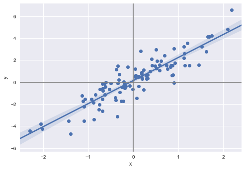

# Exercise 3.11


```python
%matplotlib inline
import numpy as np
import pandas as pd
import statsmodels.formula.api as smf
import matplotlib.pyplot as plt
import seaborn as sns

np.random.seed(1)
# does not generate the same sequences as R
# it seems there's no easy, elegant way of getting Python and R to generate the same random sequences
# http://stackoverflow.com/questions/22213298/creating-same-random-number-sequence-in-python-numpy-and-r

x = np.random.normal(size=100)
y = 2*x+np.random.normal(size=100)

df = pd.DataFrame({'x': x, 'y': y})

fig, ax = plt.subplots()
sns.regplot(x='x', y='y', data=df, scatter_kws={"s": 50, "alpha": 1}, ax=ax)
ax.axhline(color='gray')
ax.axvline(color='gray')


```


    <matplotlib.lines.Line2D at 0x118965588>





## (a)


```python
reg = smf.ols('y ~ x + 0', df).fit()
reg.summary()
```


<table class="simpletable">
<caption>OLS Regression Results</caption>
<tr>
  <th>Dep. Variable:</th>            <td>y</td>        <th>  R-squared:         </th> <td>   0.798</td>
</tr>
<tr>
  <th>Model:</th>                   <td>OLS</td>       <th>  Adj. R-squared:    </th> <td>   0.796</td>
</tr>
<tr>
  <th>Method:</th>             <td>Least Squares</td>  <th>  F-statistic:       </th> <td>   391.7</td>
</tr>
<tr>
  <th>Date:</th>             <td>Fri, 08 Dec 2017</td> <th>  Prob (F-statistic):</th> <td>3.46e-36</td>
</tr>
<tr>
  <th>Time:</th>                 <td>09:50:01</td>     <th>  Log-Likelihood:    </th> <td> -135.67</td>
</tr>
<tr>
  <th>No. Observations:</th>      <td>   100</td>      <th>  AIC:               </th> <td>   273.3</td>
</tr>
<tr>
  <th>Df Residuals:</th>          <td>    99</td>      <th>  BIC:               </th> <td>   275.9</td>
</tr>
<tr>
  <th>Df Model:</th>              <td>     1</td>      <th>                     </th>     <td> </td>   
</tr>
<tr>
  <th>Covariance Type:</th>      <td>nonrobust</td>    <th>                     </th>     <td> </td>   
</tr>
</table>
<table class="simpletable">
<tr>
  <td></td>     <th>coef</th>     <th>std err</th>      <th>t</th>      <th>P>|t|</th>  <th>[0.025</th>    <th>0.975]</th>  
</tr>
<tr>
  <th>x</th> <td>    2.1067</td> <td>    0.106</td> <td>   19.792</td> <td> 0.000</td> <td>    1.896</td> <td>    2.318</td>
</tr>
</table>
<table class="simpletable">
<tr>
  <th>Omnibus:</th>       <td> 0.880</td> <th>  Durbin-Watson:     </th> <td>   2.106</td>
</tr>
<tr>
  <th>Prob(Omnibus):</th> <td> 0.644</td> <th>  Jarque-Bera (JB):  </th> <td>   0.554</td>
</tr>
<tr>
  <th>Skew:</th>          <td>-0.172</td> <th>  Prob(JB):          </th> <td>   0.758</td>
</tr>
<tr>
  <th>Kurtosis:</th>      <td> 3.119</td> <th>  Cond. No.          </th> <td>    1.00</td>
</tr>
</table>


From the table above, we see that the coefficient estimate $\hat{\beta} = 2.1067$ and the standard error of this coefficient estimate is 0.106. The t-statistic is equal to 19.792 and the p-value is close to 0 (less than 0.0005). We can therefore reject the null hypothesis and conclude that there is evidence for a relationship between x and y.

## (b)


```python
reg = smf.ols('x ~ y + 0', df).fit()
reg.summary()
```


<table class="simpletable">
<caption>OLS Regression Results</caption>
<tr>
  <th>Dep. Variable:</th>            <td>x</td>        <th>  R-squared:         </th> <td>   0.798</td>
</tr>
<tr>
  <th>Model:</th>                   <td>OLS</td>       <th>  Adj. R-squared:    </th> <td>   0.796</td>
</tr>
<tr>
  <th>Method:</th>             <td>Least Squares</td>  <th>  F-statistic:       </th> <td>   391.7</td>
</tr>
<tr>
  <th>Date:</th>             <td>Fri, 08 Dec 2017</td> <th>  Prob (F-statistic):</th> <td>3.46e-36</td>
</tr>
<tr>
  <th>Time:</th>                 <td>09:50:01</td>     <th>  Log-Likelihood:    </th> <td> -49.891</td>
</tr>
<tr>
  <th>No. Observations:</th>      <td>   100</td>      <th>  AIC:               </th> <td>   101.8</td>
</tr>
<tr>
  <th>Df Residuals:</th>          <td>    99</td>      <th>  BIC:               </th> <td>   104.4</td>
</tr>
<tr>
  <th>Df Model:</th>              <td>     1</td>      <th>                     </th>     <td> </td>   
</tr>
<tr>
  <th>Covariance Type:</th>      <td>nonrobust</td>    <th>                     </th>     <td> </td>   
</tr>
</table>
<table class="simpletable">
<tr>
  <td></td>     <th>coef</th>     <th>std err</th>      <th>t</th>      <th>P>|t|</th>  <th>[0.025</th>    <th>0.975]</th>  
</tr>
<tr>
  <th>y</th> <td>    0.3789</td> <td>    0.019</td> <td>   19.792</td> <td> 0.000</td> <td>    0.341</td> <td>    0.417</td>
</tr>
</table>
<table class="simpletable">
<tr>
  <th>Omnibus:</th>       <td> 0.476</td> <th>  Durbin-Watson:     </th> <td>   2.166</td>
</tr>
<tr>
  <th>Prob(Omnibus):</th> <td> 0.788</td> <th>  Jarque-Bera (JB):  </th> <td>   0.631</td>
</tr>
<tr>
  <th>Skew:</th>          <td> 0.115</td> <th>  Prob(JB):          </th> <td>   0.729</td>
</tr>
<tr>
  <th>Kurtosis:</th>      <td> 2.685</td> <th>  Cond. No.          </th> <td>    1.00</td>
</tr>
</table>


From the table above, we see that the coefficient estimate $\hat{\beta} = 0.3789$ and the standard error of this coefficient estimate is 0.019. The t-statistic is equal to 19.792 and the p-value is close to 0 (less than 0.0005). We can therefore reject the null hypothesis and conclude that there is evidence for a relationship between x and y.

## (c)

As we can see from the two tables above, the t-statistics are the same, which means that the p-values are the same. Why the t-statistics are the same is the subject of question (e) below.
Perhaps surprisingly, the coefficient estimates are not the inverse of each other.
That is, $\hat{\beta}_y \neq 1/ \hat{\beta}_x$, where $\hat{\beta}_y$ and $\hat{\beta}_x$ are the coefficients of the models $Y = \hat{\beta}_y X$ and $X = \hat{\beta}_x Y$, respectively.
We know $\hat{\beta}_x \simeq 2$, but $\hat{\beta}_y$ seems to be closer to 0.4 than 0.5.
What is going on here?

The short answer: it has to do with the fitting method and with the non-symmetric loss function.

The visual insight is given in this [answer](https://stats.stackexchange.com/a/20560). As the two figures in this link suggest, we are not minimizing the same loss function when we find the estimate coefficient. 

This can also be seen algebraically. The coefficient estimates are the values that minimize the loss functions of ordinary least squares for these linear models without intercept, which leads to:

$\hat{\beta}_y = \underset{\beta}{\operatorname{argmin}} \sum (y_i-\beta x_i)^2 = \frac{\sum y_i x_i}{\sum y_i^2} \left(= \frac{\operatorname{E}[X Y]}{\operatorname{E}[Y^2]} = \frac{\operatorname{E}[X Y] - \operatorname{E}[X]\operatorname{E}[Y]}{\operatorname{E}[(Y-\operatorname{E}[Y])^2]} = \frac{\operatorname{cov}(X, Y)}{\operatorname{var}(Y)}\right)$,

$\hat{\beta}_x = \underset{\beta}{\operatorname{argmin}} \sum (x_i-\beta y_i)^2 = \frac{\sum y_i x_i}{\sum x_i^2}  \left(= \frac{\operatorname{E}[X Y]}{\operatorname{E}[X^2]} = \frac{\operatorname{E}[X Y] - \operatorname{E}[X]\operatorname{E}[Y]}{\operatorname{E}[(X-\operatorname{E}[X])^2]} = \frac{\operatorname{cov}(X, Y)}{\operatorname{var}(X)}\right)$, 

since $\operatorname{E}[X]=\operatorname{E}[Y]=0$.

Since the covariance is symmetric the coefficient estimates will depend on the respective variances.
In other words, the coefficients estimates will depend on and differ by the respectives spreads of the data, $\sum y_i^2$ and $\sum x_i^2$.

We can see how the additional noise of Y breaks the symmetry.
We know that the $\operatorname{var}(X) = 1$, so that $\operatorname{var}(Y) = \operatorname{var}(2X + \epsilon ) = 4 \operatorname{var}(X) + \operatorname{var}(\epsilon) = 4 (1) + 1 = 5$.
Since $\sum y_i x_i =\sum (2 x_i + \epsilon_i) x_i = 2 \sum x_i^2 + \sum x_i \epsilon_i \sim 2$. So  $\hat{\beta}_x \sim 2/1 = 2$ and $\hat{\beta}_y \sim 2/5 = .4$

If we use a loss function symmetrical in x and y (as the rectangles or total least squares regression, or PCA, figured below), then the coeffiecients will be the same.


## (d)

This is a simple exercise of manipulating the formulas given.

We start with a simplification of a part of the formula for $SE(\hat{\beta})$:

$\sum_{i=1}^{n} (y_i - x_i \beta)^2 = \sum_{i=1}^{n} (y_i^2 - 2 x_i \beta + x_i^2 \beta^2) =  \sum_{i=1}^{n} y_i^2 - 2 \beta  \sum_{i=1}^{n} x_i  +  \beta^2 \sum_{i=1}^{n} x_i^2  $

which using the formula (3.38) from the text $\hat{\beta}=\sum_{i=1}^{n} x_i y_i/\sum_{j=1}^{n} x_j^2$ becomes:

$  \sum_{i=1}^{n} y_i^2 - 2 \frac{(\sum_{i=1}^{n} x_i y_i)^2}{\sum_{j=1}^{n} x_j^2 } + \frac{(\sum_{i=1}^{n} x_i y_i)^2}{\sum_{j=1}^{n} x_j^2 } =  \sum_{i=1}^{n} y_i^2 -  \frac{(\sum_{i=1}^{n} x_i y_i)^2}{\sum_{i=1}^{n} x_i^2 }.$


With this, we restart from the formula for the t-statistic and simplify:

$\frac{\hat{\beta}}{SE(\hat{\beta})}=   \frac{(\sum_{i=1}^{n} x_i y_i) \sqrt{n-1} \sqrt{\sum_{i=1}^{n} x_i^2}  }{  ( \sum_{i=1}^{n} x_i^2  )  \sqrt{\sum_{i=1}^{n} (y_i - x_i \beta)^2}} = \frac{(\sum_{i=1}^{n} x_i y_i) \sqrt{n-1}    }{ \sqrt{ (\sum_{i=1}^{n} x_i^2  ) \sum_{i=1}^{n} (y_i - x_i \beta)^2}} $

where we now substitute our previous simplification in the denominator:

$  \frac{(\sum_{i=1}^{n} x_i y_i) \sqrt{n-1}    }{ \sqrt{ (\sum_{i=1}^{n} x_i^2  )   \left( \sum_{i=1}^{n} y_i^2 -  \frac{(\sum_{i=1}^{n} x_i y_i)^2}{\sum_{i=1}^{n} x_i^2 } \right)}} = \frac{  (\sqrt{n-1} )   \sum_{i=1}^{n} x_i y_i    }{ \sqrt{ (\sum_{i=1}^{n} x_i^2  )( \sum_{i=1}^{n} y_i^2 ) -  (\sum_{i=1}^{n} x_i y_i)^2 }  }, $

as we wanted.

## (e)

Since the expression for the t-statistic is symmetric in $x_i$ and $y_i$, it will have the same value whether we regress Y on X or X on Y.

## (f)


```python
regyx = smf.ols('y ~ x', df).fit()
regxy = smf.ols('x ~ y', df).fit()
print(regyx.tvalues)
print(regxy.tvalues)
```

    Intercept     1.564347
    x            19.782585
    dtype: float64
    Intercept    -1.089559
    y            19.782585
    dtype: float64


## References:

* [https://stats.stackexchange.com/questions/20553/effect-of-switching-response-and-explanatory-variable-in-simple-linear-regressio](https://stats.stackexchange.com/questions/20553/effect-of-switching-response-and-explanatory-variable-in-simple-linear-regressio)
* [https://stats.stackexchange.com/questions/22718/what-is-the-difference-between-linear-regression-on-y-with-x-and-x-with-y](https://stats.stackexchange.com/questions/22718/what-is-the-difference-between-linear-regression-on-y-with-x-and-x-with-y)


