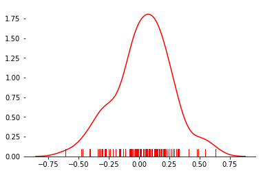
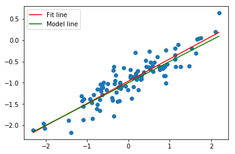
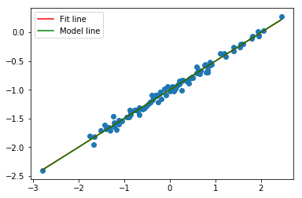

# Exercise 3.13


```python
%matplotlib inline
import numpy as np
import pandas as pd

import statsmodels.formula.api as smf
from sklearn.linear_model import LinearRegression

import matplotlib.pyplot as plt
import seaborn as sns


np.random.seed(1)
# does not generate the same sequences as R
# it seems there's no easy, elegant way of getting Python and R to generate the same random sequences
# http://stackoverflow.com/questions/22213298/creating-same-random-number-sequence-in-python-numpy-and-r
```

## (a)


```python
x = np.random.normal(size=100)

# http://seaborn.pydata.org/examples/distplot_options.html
fig, ax = plt.subplots()
sns.despine(left=True)

# Plot a kernel density estimate and rug plot
sns.distplot(x, hist=False, rug=True, color="r", ax=ax);
```


## (b)


```python
eps = np.random.normal(scale = .25, size=100)

fig, ax = plt.subplots()
sns.despine(left=True)
sns.distplot(eps, hist=False, rug=True, color="r", ax=ax);
```





## (c)


```python
y = -1 + .5*x + eps
print('Length of y = ' + str(len(y)))
```

    Length of y = 100


Naturally, vector y has length 100, since it is a linear combination of 2 vectors of length 100.

In this model $\beta_0 = -1$ and $\beta_1=1/2$.

## (d)


```python
df = pd.DataFrame({'x': x, 'y': y})
sns.jointplot(x='x', y='y', data=df);
```


As expected, it does seem linear with a variance on the order of 0.5.
No alarming indication of high leverage points or outliers.

## (e)


```python
reg = smf.ols('y ~ x', df).fit()
reg.summary()
```


<table class="simpletable">
<caption>OLS Regression Results</caption>
<tr>
  <th>Dep. Variable:</th>            <td>y</td>        <th>  R-squared:         </th> <td>   0.800</td>
</tr>
<tr>
  <th>Model:</th>                   <td>OLS</td>       <th>  Adj. R-squared:    </th> <td>   0.798</td>
</tr>
<tr>
  <th>Method:</th>             <td>Least Squares</td>  <th>  F-statistic:       </th> <td>   391.4</td>
</tr>
<tr>
  <th>Date:</th>             <td>Fri, 08 Dec 2017</td> <th>  Prob (F-statistic):</th> <td>5.39e-36</td>
</tr>
<tr>
  <th>Time:</th>                 <td>13:05:05</td>     <th>  Log-Likelihood:    </th> <td>  4.1908</td>
</tr>
<tr>
  <th>No. Observations:</th>      <td>   100</td>      <th>  AIC:               </th> <td>  -4.382</td>
</tr>
<tr>
  <th>Df Residuals:</th>          <td>    98</td>      <th>  BIC:               </th> <td>  0.8288</td>
</tr>
<tr>
  <th>Df Model:</th>              <td>     1</td>      <th>                     </th>     <td> </td>   
</tr>
<tr>
  <th>Covariance Type:</th>      <td>nonrobust</td>    <th>                     </th>     <td> </td>   
</tr>
</table>
<table class="simpletable">
<tr>
      <td></td>         <th>coef</th>     <th>std err</th>      <th>t</th>      <th>P>|t|</th>  <th>[0.025</th>    <th>0.975]</th>  
</tr>
<tr>
  <th>Intercept</th> <td>   -0.9632</td> <td>    0.023</td> <td>  -40.999</td> <td> 0.000</td> <td>   -1.010</td> <td>   -0.917</td>
</tr>
<tr>
  <th>x</th>         <td>    0.5239</td> <td>    0.026</td> <td>   19.783</td> <td> 0.000</td> <td>    0.471</td> <td>    0.576</td>
</tr>
</table>
<table class="simpletable">
<tr>
  <th>Omnibus:</th>       <td> 0.898</td> <th>  Durbin-Watson:     </th> <td>   2.157</td>
</tr>
<tr>
  <th>Prob(Omnibus):</th> <td> 0.638</td> <th>  Jarque-Bera (JB):  </th> <td>   0.561</td>
</tr>
<tr>
  <th>Skew:</th>          <td>-0.172</td> <th>  Prob(JB):          </th> <td>   0.755</td>
</tr>
<tr>
  <th>Kurtosis:</th>      <td> 3.127</td> <th>  Cond. No.          </th> <td>    1.15</td>
</tr>
</table>


The coefficients of the regression are similar to the "true" values, although they are not equal (naturally). They fall within the 95% confidence interval in both cases.

## (f)


```python
model = LinearRegression(fit_intercept= True)
model.fit(x[:, np.newaxis],y)


plt.scatter(df.x, df.y);

xfit = np.linspace(df.x.min(), df.x.max(), 100)
yfit = model.predict(xfit[:, np.newaxis])
fit, = plt.plot(xfit, yfit, color='r');

xpop = np.linspace(df.x.min(), df.x.max(), 100)
ypop = -1 + .5*xpop
pop, = plt.plot(xpop, ypop, color='g');
plt.legend([fit, pop],['Fit line','Model line'])
```


    <matplotlib.legend.Legend at 0x10c324eb8>





## (g)


```python
reg = smf.ols('y ~ x + I(x**2)', df).fit()
reg.summary()
```


<table class="simpletable">
<caption>OLS Regression Results</caption>
<tr>
  <th>Dep. Variable:</th>            <td>y</td>        <th>  R-squared:         </th> <td>   0.800</td>
</tr>
<tr>
  <th>Model:</th>                   <td>OLS</td>       <th>  Adj. R-squared:    </th> <td>   0.796</td>
</tr>
<tr>
  <th>Method:</th>             <td>Least Squares</td>  <th>  F-statistic:       </th> <td>   193.8</td>
</tr>
<tr>
  <th>Date:</th>             <td>Fri, 08 Dec 2017</td> <th>  Prob (F-statistic):</th> <td>1.32e-34</td>
</tr>
<tr>
  <th>Time:</th>                 <td>13:05:14</td>     <th>  Log-Likelihood:    </th> <td>  4.2077</td>
</tr>
<tr>
  <th>No. Observations:</th>      <td>   100</td>      <th>  AIC:               </th> <td>  -2.415</td>
</tr>
<tr>
  <th>Df Residuals:</th>          <td>    97</td>      <th>  BIC:               </th> <td>   5.400</td>
</tr>
<tr>
  <th>Df Model:</th>              <td>     2</td>      <th>                     </th>     <td> </td>   
</tr>
<tr>
  <th>Covariance Type:</th>      <td>nonrobust</td>    <th>                     </th>     <td> </td>   
</tr>
</table>
<table class="simpletable">
<tr>
      <td></td>         <th>coef</th>     <th>std err</th>      <th>t</th>      <th>P>|t|</th>  <th>[0.025</th>    <th>0.975]</th>  
</tr>
<tr>
  <th>Intercept</th> <td>   -0.9663</td> <td>    0.029</td> <td>  -33.486</td> <td> 0.000</td> <td>   -1.024</td> <td>   -0.909</td>
</tr>
<tr>
  <th>x</th>         <td>    0.5234</td> <td>    0.027</td> <td>   19.582</td> <td> 0.000</td> <td>    0.470</td> <td>    0.576</td>
</tr>
<tr>
  <th>I(x ** 2)</th> <td>    0.0039</td> <td>    0.021</td> <td>    0.181</td> <td> 0.856</td> <td>   -0.038</td> <td>    0.046</td>
</tr>
</table>
<table class="simpletable">
<tr>
  <th>Omnibus:</th>       <td> 0.893</td> <th>  Durbin-Watson:     </th> <td>   2.152</td>
</tr>
<tr>
  <th>Prob(Omnibus):</th> <td> 0.640</td> <th>  Jarque-Bera (JB):  </th> <td>   0.552</td>
</tr>
<tr>
  <th>Skew:</th>          <td>-0.170</td> <th>  Prob(JB):          </th> <td>   0.759</td>
</tr>
<tr>
  <th>Kurtosis:</th>      <td> 3.132</td> <th>  Cond. No.          </th> <td>    2.10</td>
</tr>
</table>


After fitting a model with basis functions $X$ and $X^2$, looking at the table above we can see that the p-value for the squared term is 0.856, so we can conclude that there is no evidence to reject the null hypothesis asserting the coefficient of the second order term is zero. In other words, there is no statistically significant relationship between $X^2$ and $Y$ - the quadratic term does not improve the model fit. This is also evident when comparing the R-squared of both fits. They are equal, even though the second model has an additional variable.

## (h)


```python
x = np.random.normal(size=100)
eps = np.random.normal(scale = .05, size=100)
y = -1 + .5*x + eps

df = pd.DataFrame({'x': x, 'y': y})
sns.jointplot(x='x', y='y', data=df)

model = LinearRegression(fit_intercept= True)
model.fit(x[:, np.newaxis],y)

plt.subplots()
plt.scatter(df.x, df.y);


xfit = np.linspace(df.x.min(), df.x.max(), 100)
yfit = model.predict(xfit[:, np.newaxis])
fit, = plt.plot(xfit, yfit, color='r');

xpop = np.linspace(df.x.min(), df.x.max(), 100)
ypop = -1 + .5*xpop
pop, = plt.plot(xpop, ypop, color='g');
plt.legend([fit, pop],['Fit line','Model line'])

```


    <matplotlib.legend.Legend at 0x10c742b38>





```python
reg = smf.ols('y ~ x', df).fit()
reg.summary()
```


<table class="simpletable">
<caption>OLS Regression Results</caption>
<tr>
  <th>Dep. Variable:</th>            <td>y</td>        <th>  R-squared:         </th> <td>   0.989</td>
</tr>
<tr>
  <th>Model:</th>                   <td>OLS</td>       <th>  Adj. R-squared:    </th> <td>   0.989</td>
</tr>
<tr>
  <th>Method:</th>             <td>Least Squares</td>  <th>  F-statistic:       </th> <td>   8662.</td>
</tr>
<tr>
  <th>Date:</th>             <td>Fri, 08 Dec 2017</td> <th>  Prob (F-statistic):</th> <td>1.97e-97</td>
</tr>
<tr>
  <th>Time:</th>                 <td>13:05:22</td>     <th>  Log-Likelihood:    </th> <td>  151.58</td>
</tr>
<tr>
  <th>No. Observations:</th>      <td>   100</td>      <th>  AIC:               </th> <td>  -299.2</td>
</tr>
<tr>
  <th>Df Residuals:</th>          <td>    98</td>      <th>  BIC:               </th> <td>  -293.9</td>
</tr>
<tr>
  <th>Df Model:</th>              <td>     1</td>      <th>                     </th>     <td> </td>   
</tr>
<tr>
  <th>Covariance Type:</th>      <td>nonrobust</td>    <th>                     </th>     <td> </td>   
</tr>
</table>
<table class="simpletable">
<tr>
      <td></td>         <th>coef</th>     <th>std err</th>      <th>t</th>      <th>P>|t|</th>  <th>[0.025</th>    <th>0.975]</th>  
</tr>
<tr>
  <th>Intercept</th> <td>   -1.0010</td> <td>    0.005</td> <td> -186.443</td> <td> 0.000</td> <td>   -1.012</td> <td>   -0.990</td>
</tr>
<tr>
  <th>x</th>         <td>    0.4972</td> <td>    0.005</td> <td>   93.071</td> <td> 0.000</td> <td>    0.487</td> <td>    0.508</td>
</tr>
</table>
<table class="simpletable">
<tr>
  <th>Omnibus:</th>       <td> 0.426</td> <th>  Durbin-Watson:     </th> <td>   1.977</td>
</tr>
<tr>
  <th>Prob(Omnibus):</th> <td> 0.808</td> <th>  Jarque-Bera (JB):  </th> <td>   0.121</td>
</tr>
<tr>
  <th>Skew:</th>          <td>-0.045</td> <th>  Prob(JB):          </th> <td>   0.941</td>
</tr>
<tr>
  <th>Kurtosis:</th>      <td> 3.145</td> <th>  Cond. No.          </th> <td>    1.01</td>
</tr>
</table>


As expected, we have a better fit, a better confidence intervals, and a higher R-squared. 

Our model fits this data set better than the previous one that was generated from a noisier distribution.

## (i)


```python
x = np.random.normal(size=100)
eps = np.random.normal(scale = 1, size=100)
y = -1 + .5*x + eps

df = pd.DataFrame({'x': x, 'y': y})
sns.jointplot(x='x', y='y', data=df)

model = LinearRegression(fit_intercept= True)
model.fit(x[:, np.newaxis],y)

plt.subplots()
plt.scatter(df.x, df.y);


xfit = np.linspace(df.x.min(), df.x.max(), 100)
yfit = model.predict(xfit[:, np.newaxis])
fit, = plt.plot(xfit, yfit, color='r');

xpop = np.linspace(df.x.min(), df.x.max(), 100)
ypop = -1 + .5*xpop
pop, = plt.plot(xpop, ypop, color='g');
plt.legend([fit, pop],['Fit line','Model line'])

```


    <matplotlib.legend.Legend at 0x10bc05b00>


## (i)


```python
reg = smf.ols('y ~ x', df).fit()
reg.summary()
```


<table class="simpletable">
<caption>OLS Regression Results</caption>
<tr>
  <th>Dep. Variable:</th>            <td>y</td>        <th>  R-squared:         </th> <td>   0.257</td>
</tr>
<tr>
  <th>Model:</th>                   <td>OLS</td>       <th>  Adj. R-squared:    </th> <td>   0.250</td>
</tr>
<tr>
  <th>Method:</th>             <td>Least Squares</td>  <th>  F-statistic:       </th> <td>   33.96</td>
</tr>
<tr>
  <th>Date:</th>             <td>Fri, 08 Dec 2017</td> <th>  Prob (F-statistic):</th> <td>7.19e-08</td>
</tr>
<tr>
  <th>Time:</th>                 <td>13:05:27</td>     <th>  Log-Likelihood:    </th> <td> -145.66</td>
</tr>
<tr>
  <th>No. Observations:</th>      <td>   100</td>      <th>  AIC:               </th> <td>   295.3</td>
</tr>
<tr>
  <th>Df Residuals:</th>          <td>    98</td>      <th>  BIC:               </th> <td>   300.5</td>
</tr>
<tr>
  <th>Df Model:</th>              <td>     1</td>      <th>                     </th>     <td> </td>   
</tr>
<tr>
  <th>Covariance Type:</th>      <td>nonrobust</td>    <th>                     </th>     <td> </td>   
</tr>
</table>
<table class="simpletable">
<tr>
      <td></td>         <th>coef</th>     <th>std err</th>      <th>t</th>      <th>P>|t|</th>  <th>[0.025</th>    <th>0.975]</th>  
</tr>
<tr>
  <th>Intercept</th> <td>   -0.8802</td> <td>    0.105</td> <td>   -8.375</td> <td> 0.000</td> <td>   -1.089</td> <td>   -0.672</td>
</tr>
<tr>
  <th>x</th>         <td>    0.5903</td> <td>    0.101</td> <td>    5.828</td> <td> 0.000</td> <td>    0.389</td> <td>    0.791</td>
</tr>
</table>
<table class="simpletable">
<tr>
  <th>Omnibus:</th>       <td> 3.633</td> <th>  Durbin-Watson:     </th> <td>   1.972</td>
</tr>
<tr>
  <th>Prob(Omnibus):</th> <td> 0.163</td> <th>  Jarque-Bera (JB):  </th> <td>   3.566</td>
</tr>
<tr>
  <th>Skew:</th>          <td> 0.192</td> <th>  Prob(JB):          </th> <td>   0.168</td>
</tr>
<tr>
  <th>Kurtosis:</th>      <td> 3.842</td> <th>  Cond. No.          </th> <td>    1.07</td>
</tr>
</table>


Now, on the other hand, we have a much worse fit. The R-squared is just .178 and the confidence intervals for the coefficients are much wider. Still there's no doubt we are in the presence of a statistically significant relationship, with very low p-values.

## (j)

Here's a table with the various confidence intervals:

|            Noise     	| lower $\beta_0$	|    $\beta_0$	|     upper $\beta_0$	 	|   lower $\beta_1$	|    $\beta_1$	|     upper $\beta_1$	 	|
|--------------------:	|----:	|----:	|------	|---	|---	|---	|
| $\varepsilon = .05$ 	|    -1.009 	| 0.9984 	|-0.987  	|  0.489 	|   0.5002 	|  0.512 	|
| $\varepsilon=.25$ 	|  -1.010 	|    -0.9632 	|   -0.917   	|  0.471 	| 0.5239  	|  0.576 	|
| $\varepsilon = 1$ 	|   	-1.098 	|   -0.8869	|   -0.675 	| 0.267  	|    0.4697 	| 0.672 	| 

As expected the width of the intervals increases as the level of noise increases.
