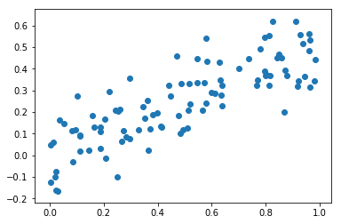
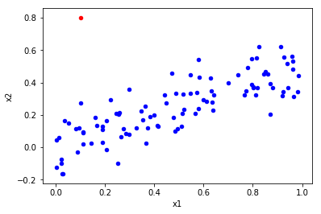

# Exercise 3.14


```python
import pandas as pd
import numpy as np
import matplotlib.pyplot as plt

import statsmodels.api as sm # To use statsmodel
import statsmodels.formula.api as smf # To use statsmodel with R-style formulas
from statsmodels.stats import outliers_influence
from sklearn.linear_model import LinearRegression

%matplotlib inline
```

# (a)


```python
np.random.seed(5) # Python and R random generators give different values
x1 = np.random.uniform(size=100)
x2 = 0.5 * x1 + np.random.normal(size=100) / 10
y = 2 + 2 * x1 + 0.3 * x2 + np.random.normal(size=100)

# http://stackoverflow.com/questions/22213298/creating-same-random-number-sequence-in-python-numpy-and-r
```

Model form:

$$
Y = \beta_0 + \beta_1  X_1 + \beta_2  X_2 + \epsilon = 2 + 2 X_1 + 0.3 X_2 + \epsilon.
$$


# (b)


```python
# Get correlations
np.corrcoef(x1,x2)
```


    array([[ 1.        ,  0.81936924],
           [ 0.81936924,  1.        ]])


The correlation coefficient between $X_1$ and $X_2$ is <b>0.819</b>.


```python
# Draw scatterplot
plt.scatter(x1,x2);
```





# (c)


```python
# Define data
X = pd.DataFrame({'x1':x1, 'x2':x2})
X = sm.add_constant(X)  # No constant is added by the model unless we're using formulas, so we have to add it

# Create model
model = sm.OLS(y, X)

# Fit regression model
results = model.fit()

# Print results
results.summary()
```


<table class="simpletable">
<caption>OLS Regression Results</caption>
<tr>
  <th>Dep. Variable:</th>            <td>y</td>        <th>  R-squared:         </th> <td>   0.444</td>
</tr>
<tr>
  <th>Model:</th>                   <td>OLS</td>       <th>  Adj. R-squared:    </th> <td>   0.433</td>
</tr>
<tr>
  <th>Method:</th>             <td>Least Squares</td>  <th>  F-statistic:       </th> <td>   38.74</td>
</tr>
<tr>
  <th>Date:</th>             <td>Fri, 08 Dec 2017</td> <th>  Prob (F-statistic):</th> <td>4.31e-13</td>
</tr>
<tr>
  <th>Time:</th>                 <td>09:50:56</td>     <th>  Log-Likelihood:    </th> <td> -123.67</td>
</tr>
<tr>
  <th>No. Observations:</th>      <td>   100</td>      <th>  AIC:               </th> <td>   253.3</td>
</tr>
<tr>
  <th>Df Residuals:</th>          <td>    97</td>      <th>  BIC:               </th> <td>   261.1</td>
</tr>
<tr>
  <th>Df Model:</th>              <td>     2</td>      <th>                     </th>     <td> </td>   
</tr>
<tr>
  <th>Covariance Type:</th>      <td>nonrobust</td>    <th>                     </th>     <td> </td>   
</tr>
</table>
<table class="simpletable">
<tr>
    <td></td>       <th>coef</th>     <th>std err</th>      <th>t</th>      <th>P>|t|</th>  <th>[0.025</th>    <th>0.975]</th>  
</tr>
<tr>
  <th>const</th> <td>    1.8158</td> <td>    0.162</td> <td>   11.231</td> <td> 0.000</td> <td>    1.495</td> <td>    2.137</td>
</tr>
<tr>
  <th>x1</th>    <td>    2.0758</td> <td>    0.488</td> <td>    4.257</td> <td> 0.000</td> <td>    1.108</td> <td>    3.044</td>
</tr>
<tr>
  <th>x2</th>    <td>    0.7584</td> <td>    0.817</td> <td>    0.929</td> <td> 0.355</td> <td>   -0.862</td> <td>    2.379</td>
</tr>
</table>
<table class="simpletable">
<tr>
  <th>Omnibus:</th>       <td> 0.718</td> <th>  Durbin-Watson:     </th> <td>   1.960</td>
</tr>
<tr>
  <th>Prob(Omnibus):</th> <td> 0.698</td> <th>  Jarque-Bera (JB):  </th> <td>   0.574</td>
</tr>
<tr>
  <th>Skew:</th>          <td>-0.185</td> <th>  Prob(JB):          </th> <td>   0.750</td>
</tr>
<tr>
  <th>Kurtosis:</th>      <td> 2.981</td> <th>  Cond. No.          </th> <td>    12.5</td>
</tr>
</table>


According to the results we have:

* $\hat{\beta_0} = 1.8158$ 
* $\hat{\beta_1} = 2.0758$ 
* $\hat{\beta_2} = 0.7584$ 

These values are estimators of the true coefficients, which have the following values:

* $\beta_0 = 2$
* $\beta_1 = 2$
* $\beta_2 = 0.3$

As we can see, there are some differences between the coefficients, especially in the case of $\hat{\beta_2}$ (0.7584 vs. 0.3). 

<b> $H_0 : \beta_1 = 0$ </b>. The rejection of the null hypothesis depends on the t-statistic (t). In the case of $\beta_1$, this value is high. If the t-statistics is high, the p-value will be low. The p-value is the probability of observing any value equal to |t| or larger than (P>|t|), assuming that the coefficient is zero. Thus, if the p-value is low we should <b>reject the null hypothesis and accept the alternative hypothesis</b>.

<b> $H_0 : \beta_2 = 0$ </b>. In this case the t-statistic is low (0.929) and the p-value is high (0.355). Accordingly, the <b>null hypothesis can't be rejected</b>.

<b>Alternative solution</b>

A different way to approximate the equation using R-style formula in StatsModel.


```python
# Define data
df = pd.DataFrame({'x1':x1, 'x2':x2, 'y':y})  # We don't need to add constant because we will use formulas

# Create model
mod = smf.ols(formula='y ~ x1 + x2', data=df)  # R-style command

# Fit model
res = mod.fit()

# Print results
print (res.summary())
```

                                OLS Regression Results                            
    ==============================================================================
    Dep. Variable:                      y   R-squared:                       0.444
    Model:                            OLS   Adj. R-squared:                  0.433
    Method:                 Least Squares   F-statistic:                     38.74
    Date:                Fri, 08 Dec 2017   Prob (F-statistic):           4.31e-13
    Time:                        09:50:56   Log-Likelihood:                -123.67
    No. Observations:                 100   AIC:                             253.3
    Df Residuals:                      97   BIC:                             261.1
    Df Model:                           2                                         
    Covariance Type:            nonrobust                                         
    ==============================================================================
                     coef    std err          t      P>|t|      [0.025      0.975]
    ------------------------------------------------------------------------------
    Intercept      1.8158      0.162     11.231      0.000       1.495       2.137
    x1             2.0758      0.488      4.257      0.000       1.108       3.044
    x2             0.7584      0.817      0.929      0.355      -0.862       2.379
    ==============================================================================
    Omnibus:                        0.718   Durbin-Watson:                   1.960
    Prob(Omnibus):                  0.698   Jarque-Bera (JB):                0.574
    Skew:                          -0.185   Prob(JB):                        0.750
    Kurtosis:                       2.981   Cond. No.                         12.5
    ==============================================================================
    
    Warnings:
    [1] Standard Errors assume that the covariance matrix of the errors is correctly specified.


<b>Alternative solution</b>

This is an alternative solution using Scikit instead of StatsModel.


```python
# Create model
lr = LinearRegression()

# Fit model
mod = lr.fit(X,y)

# Get coefficients
mod.coef_
```


    array([ 0.        ,  2.0758066 ,  0.75840009])


# (d)


```python
X = pd.DataFrame({'x1':x1})
X = sm.add_constant(X)

model = sm.OLS(y, X)
results = model.fit()
print(results.summary())
```

                                OLS Regression Results                            
    ==============================================================================
    Dep. Variable:                      y   R-squared:                       0.439
    Model:                            OLS   Adj. R-squared:                  0.433
    Method:                 Least Squares   F-statistic:                     76.72
    Date:                Fri, 08 Dec 2017   Prob (F-statistic):           5.93e-14
    Time:                        09:50:56   Log-Likelihood:                -124.11
    No. Observations:                 100   AIC:                             252.2
    Df Residuals:                      98   BIC:                             257.4
    Df Model:                           1                                         
    Covariance Type:            nonrobust                                         
    ==============================================================================
                     coef    std err          t      P>|t|      [0.025      0.975]
    ------------------------------------------------------------------------------
    const          1.8229      0.161     11.295      0.000       1.503       2.143
    x1             2.4468      0.279      8.759      0.000       1.892       3.001
    ==============================================================================
    Omnibus:                        0.357   Durbin-Watson:                   1.986
    Prob(Omnibus):                  0.836   Jarque-Bera (JB):                0.272
    Skew:                          -0.127   Prob(JB):                        0.873
    Kurtosis:                       2.963   Cond. No.                         4.17
    ==============================================================================
    
    Warnings:
    [1] Standard Errors assume that the covariance matrix of the errors is correctly specified.


The coefficient value <b>increased</b> to 2.4468 and the <b>null hypothesis can be rejected and the alternative hypothesis accepted</b> because p-value is zero. It can be said that this results are in line with our expectations from (c).

# (e)


```python
X = pd.DataFrame({'x2':x2})
X = sm.add_constant(X)

model = sm.OLS(y, X)
results = model.fit()
print(results.summary())
```

                                OLS Regression Results                            
    ==============================================================================
    Dep. Variable:                      y   R-squared:                       0.340
    Model:                            OLS   Adj. R-squared:                  0.333
    Method:                 Least Squares   F-statistic:                     50.53
    Date:                Fri, 08 Dec 2017   Prob (F-statistic):           1.92e-10
    Time:                        09:50:56   Log-Likelihood:                -132.23
    No. Observations:                 100   AIC:                             268.5
    Df Residuals:                      98   BIC:                             273.7
    Df Model:                           1                                         
    Covariance Type:            nonrobust                                         
    ==============================================================================
                     coef    std err          t      P>|t|      [0.025      0.975]
    ------------------------------------------------------------------------------
    const          2.1250      0.157     13.572      0.000       1.814       2.436
    x2             3.6070      0.507      7.108      0.000       2.600       4.614
    ==============================================================================
    Omnibus:                        1.537   Durbin-Watson:                   1.828
    Prob(Omnibus):                  0.464   Jarque-Bera (JB):                1.597
    Skew:                          -0.272   Prob(JB):                        0.450
    Kurtosis:                       2.704   Cond. No.                         5.89
    ==============================================================================
    
    Warnings:
    [1] Standard Errors assume that the covariance matrix of the errors is correctly specified.


The coefficient value <b>increased</b> to 3.6070 and the <b>null hypothesis can be rejected and the alternative hypothesis accepted</b> because p-value is zero.

These results are significantly different from (c). In (c) the coefficient associated with $x_2$ had a lower value and the p-value suggested that the null hypothesis couldn't be rejected (coefficient value could be zero). Now, the coefficient value is higher (even higher than the coefficient value resulting from the case where only $x_1$ is used) and the null hypothesis can be rejected and the alternative hypothesis accepted.

# (f)

The results <b>do not contradict</b>.
What's happening here is a <b>collinearity</b> phenomenon.
As suggested by the high correlation values and by the scatter plot (and, of course, from the generation of Y), we can linearly predict $x_1$ from $x_2$ (and vice-versa) with a substantial degree of accuracy. This is a clue of collinearity that is confirmed by the regression model. When both variables are combined in the same linear model, one of them loses explanatory power because the variance it explains is already being explained by the other variable. Accordingly, if considered individually, both variables lead to the rejection of the null hypothesis but, if considered together, one of the variables is dismissable.

Finally, the values of the coefficients agree with what we know from the underlying model. If one writes $X2$ in terms of $X1$, substitutes it in the model and adds both coefficients of $X1$, we get 2.15. This value is well within the confidence interval calculated in (d), namely [1.892; 3.001]. Likewise, for $X2$ the expected value of the coefficient is 4.3 which is inside the [2.600; 4.614] interval calculated in (e).

# (g)


```python
# Add observation 
x1 = np.append(x1, 0.1)  # To x1
x2 = np.append(x2, 0.8)  # To x2
y = np.append(y, 6)  # To y

# Add to dataframe (easier for outlier analysis plots)
sample = {'x1': .1, 'x2': .8, 'y': 6}  # Create point
df = df.append(sample, ignore_index=True)  # Append sample to existing dataframe
```

### Models analysis


```python
# Model (c)
X = pd.DataFrame({'x1':x1, 'x2':x2})
X = sm.add_constant(X)  # No constant is added by the model unless we're using formulas, so we have to add it

model = sm.OLS(y, X)
results = model.fit()

print(results.summary())
```

                                OLS Regression Results                            
    ==============================================================================
    Dep. Variable:                      y   R-squared:                       0.425
    Model:                            OLS   Adj. R-squared:                  0.414
    Method:                 Least Squares   F-statistic:                     36.26
    Date:                Fri, 08 Dec 2017   Prob (F-statistic):           1.64e-12
    Time:                        09:50:56   Log-Likelihood:                -129.50
    No. Observations:                 101   AIC:                             265.0
    Df Residuals:                      98   BIC:                             272.8
    Df Model:                           2                                         
    Covariance Type:            nonrobust                                         
    ==============================================================================
                     coef    std err          t      P>|t|      [0.025      0.975]
    ------------------------------------------------------------------------------
    const          1.8697      0.168     11.111      0.000       1.536       2.204
    x1             1.2421      0.432      2.876      0.005       0.385       2.099
    x2             2.2711      0.698      3.254      0.002       0.886       3.656
    ==============================================================================
    Omnibus:                        0.673   Durbin-Watson:                   1.803
    Prob(Omnibus):                  0.714   Jarque-Bera (JB):                0.465
    Skew:                          -0.165   Prob(JB):                        0.792
    Kurtosis:                       3.035   Cond. No.                         10.2
    ==============================================================================
    
    Warnings:
    [1] Standard Errors assume that the covariance matrix of the errors is correctly specified.


```python
# Model (d)
X = pd.DataFrame({'x1':x1})
X = sm.add_constant(X)  # No constant is added by the model unless we're using formulas, so we have to add it

model = sm.OLS(y, X)
results = model.fit()

print(results.summary())
```

                                OLS Regression Results                            
    ==============================================================================
    Dep. Variable:                      y   R-squared:                       0.363
    Model:                            OLS   Adj. R-squared:                  0.357
    Method:                 Least Squares   F-statistic:                     56.46
    Date:                Fri, 08 Dec 2017   Prob (F-statistic):           2.60e-11
    Time:                        09:50:56   Log-Likelihood:                -134.68
    No. Observations:                 101   AIC:                             273.4
    Df Residuals:                      99   BIC:                             278.6
    Df Model:                           1                                         
    Covariance Type:            nonrobust                                         
    ==============================================================================
                     coef    std err          t      P>|t|      [0.025      0.975]
    ------------------------------------------------------------------------------
    const          1.9419      0.175     11.116      0.000       1.595       2.288
    x1             2.2829      0.304      7.514      0.000       1.680       2.886
    ==============================================================================
    Omnibus:                       12.832   Durbin-Watson:                   1.773
    Prob(Omnibus):                  0.002   Jarque-Bera (JB):               21.470
    Skew:                           0.522   Prob(JB):                     2.18e-05
    Kurtosis:                       5.003   Cond. No.                         4.14
    ==============================================================================
    
    Warnings:
    [1] Standard Errors assume that the covariance matrix of the errors is correctly specified.


```python
# Model (e)
X = pd.DataFrame({'x2':x2})
X = sm.add_constant(X)  # No constant is added by the model unless we're using formulas, so we have to add it

model = sm.OLS(y, X)
results = model.fit()

print(results.summary())
```

                                OLS Regression Results                            
    ==============================================================================
    Dep. Variable:                      y   R-squared:                       0.377
    Model:                            OLS   Adj. R-squared:                  0.370
    Method:                 Least Squares   F-statistic:                     59.84
    Date:                Fri, 08 Dec 2017   Prob (F-statistic):           8.79e-12
    Time:                        09:50:56   Log-Likelihood:                -133.59
    No. Observations:                 101   AIC:                             271.2
    Df Residuals:                      99   BIC:                             276.4
    Df Model:                           1                                         
    Covariance Type:            nonrobust                                         
    ==============================================================================
                     coef    std err          t      P>|t|      [0.025      0.975]
    ------------------------------------------------------------------------------
    const          2.0962      0.154     13.604      0.000       1.790       2.402
    x2             3.7581      0.486      7.736      0.000       2.794       4.722
    ==============================================================================
    Omnibus:                        1.784   Durbin-Watson:                   1.803
    Prob(Omnibus):                  0.410   Jarque-Bera (JB):                1.826
    Skew:                          -0.299   Prob(JB):                        0.401
    Kurtosis:                       2.726   Cond. No.                         5.68
    ==============================================================================
    
    Warnings:
    [1] Standard Errors assume that the covariance matrix of the errors is correctly specified.


Effect on models:
* <b>Model (c)</b>. R-squared decreased, which means that the predictive capacity of the model was reduced. The value of the regression coefficients changed: x1 coefficient decreased and x2 coefficient increased. As a consequence, x2 became the coefficient with higher value. The null hypothesis is now rejected in both variables.
* <b>Model (d)</b>. The only significant change was the reduction of R-squared.
* <b>Model (e)</b>. The only significant change was a small increase of R-squared.

### Outliers and high leverage points analysis

<b>Outliers</b>

An outlier is a point for which $y_i$ is far from the expected range predicted by the fit of the model. This raises the question of whether it is representative of the population.

Outliers can be identified from a univariate, bivariate, or multivariate perspective based on the number of variables (characteristics) considered. We should use as many perspectives as possible, looking for a consistent pattern across them to identify outliers.
   
Cases that fall markedly outside the range of other observations will be seen as isolated points in the scatterplot. A drawback of the bivariate method in general is the potentially large number of scatterplots that arise as the number of variables increases. For 3 variables, it is only 3 graphs for all pairwise comparisons. But for 5 variables, it takes 10 graphs, and for 10 variables it takes 45 scatterplots! Since this analysis doesn't involve more than 2 variables, we can perform all pairwise comparisons.

<b>High leverage points</b>

We just saw that outliers are observations for which the response $y_i$ is unusual given the predictor $x_i$. In contrast, observations with high leverage have an unusual value for $x_i$. In statistics, particularly in regression analysis, leverage is a measure of how far away the independent variable values of an observation are from those of the other observations.

In a simple linear regression, high leverage observations are fairly easy to
identify, since we can simply look for observations for which the predictor
value is outside of the normal range of the observations. With a single predictor, an extreme x value is simply one that is particularly high or low. 

But in a multiple linear regression with many predictors, it is possible to have an observation that is well within the range of each individual predictor’s values, but that is unusual in terms of the full set of predictors. With multiple predictors, extreme x values may be particularly high or low for one or more predictors, or may be "unusual" combinations of predictor values (e.g., with two predictors that are positively correlated, an unusual combination of predictor values might be a high value of one predictor paired with a low value of the other predictor).


```python
# Bivariate analysis (x1,x2)
sample = df.iloc[-1:]  # To get the last observation
other = df.iloc[:-1]  # To get all the observations but the last
ax = other.plot(kind='scatter',x='x1',y='x2', color='blue');  # Plot all observations but the last in blue
sample.plot(ax=ax, kind='scatter',x='x1',y='x2', color='red');  # Plot last observation added in red
```





* There is an unusual combination of predictor values, so it looks like an high leverage point.

<b>Note:</b> we are not comparing predictors with responses nor evaluating if $y_i$ is far from the value predicted by the model. Therefore, it doesn't make sense to discuss if it's an outlier or not based on this plot.


```python
# Bivariate analysis (x1,y)
sample = df.iloc[-1:]  # To get the last observation
other = df.iloc[:-1]  # To get all the observations but the last
ax = other.plot(kind='scatter',x='x1',y='y', color='blue');  # Plot all observations but the last in blue
sample.plot(ax=ax, kind='scatter',x='x1',y='y', color='red');  # Plot last observation added in red
```


* The red point does not follow the trend, so it looks like an outlier.
* The red point doesn't have an unusual $x_1$ value, so it doesn't look like an high leverage point.


```python
# Bivariate analysis (x2,y)
sample = df.iloc[-1:]  # To get the last observation
other = df.iloc[:-1]  # To get all the observations but the last
ax = other.plot(kind='scatter',x='x2',y='y', color='blue');  # Plot all observations but the last in blue
sample.plot(ax=ax, kind='scatter',x='x2',y='y', color='red');  # Plot last observation added in red
```


* The red point follows the trend, so it doesn't look like an outlier.
* The red point has an extreme $x_2$ value, so it looks like an high leverage point.

<b>In summary:</b> the observation added influences significantly the model, in particular if we consider the regression model that includes $x_1$ and $x_2$. In this case, $x_2$ passed from a neglected variable to a significant variable. This means that even being just 1  observation in 100, this observation reduced the existing phenomenon of collinearity. Also, the R-squared of the model reduced, which signifies a decrease in the model predicition capacity.

According to the scatter plots, the observation added seems to be both an outlier and and an high leverage point. This conclusion can be taken from the visual observation of the observation added when confronted with the remaining observations. The added observations shows an unusual combination of predictor values, extreme predictor values and a substantial different behaviour when compared with other observations in several cases.

## References

* https://onlinecourses.science.psu.edu/stat501/node/337
* Hair, J. F., Black, B., Babin, B., Anderson, R. E., & Tatham, R. L. (2010). [Multivariate Data Analysis](https://smile.amazon.com/Multivariate-Data-Analysis-Joseph-Hair/dp/0138132631?sa-no-redirect=1) (7th
ed.). Upper Saddle River, NJ: Prentice-Hall
