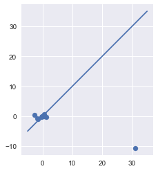
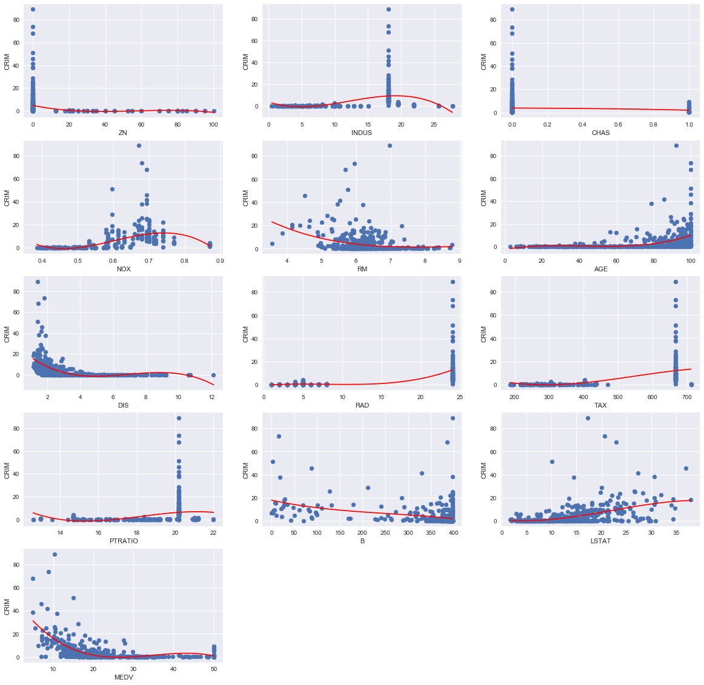

# Exercise 3.15


```python
import pandas as pd
import numpy as np
import seaborn as sns
import matplotlib.pyplot as plt
import statsmodels.formula.api as smf #statsmodels is a Python module for statistics
import statsmodels.api as sm
from sklearn.datasets import load_boston

%matplotlib inline
```


```python
boston = load_boston()
df = pd.DataFrame(boston.data, columns=boston.feature_names)
df['MEDV'] = pd.Series(boston.target)
```


```python
df.head()
```


<div>
<style>
    .dataframe thead tr:only-child th {
        text-align: right;
    }

    .dataframe thead th {
        text-align: left;
    }

    .dataframe tbody tr th {
        vertical-align: top;
    }
</style>
<table border="1" class="dataframe">
  <thead>
    <tr style="text-align: right;">
      <th></th>
      <th>CRIM</th>
      <th>ZN</th>
      <th>INDUS</th>
      <th>CHAS</th>
      <th>NOX</th>
      <th>RM</th>
      <th>AGE</th>
      <th>DIS</th>
      <th>RAD</th>
      <th>TAX</th>
      <th>PTRATIO</th>
      <th>B</th>
      <th>LSTAT</th>
      <th>MEDV</th>
    </tr>
  </thead>
  <tbody>
    <tr>
      <th>0</th>
      <td>0.00632</td>
      <td>18.0</td>
      <td>2.31</td>
      <td>0.0</td>
      <td>0.538</td>
      <td>6.575</td>
      <td>65.2</td>
      <td>4.0900</td>
      <td>1.0</td>
      <td>296.0</td>
      <td>15.3</td>
      <td>396.90</td>
      <td>4.98</td>
      <td>24.0</td>
    </tr>
    <tr>
      <th>1</th>
      <td>0.02731</td>
      <td>0.0</td>
      <td>7.07</td>
      <td>0.0</td>
      <td>0.469</td>
      <td>6.421</td>
      <td>78.9</td>
      <td>4.9671</td>
      <td>2.0</td>
      <td>242.0</td>
      <td>17.8</td>
      <td>396.90</td>
      <td>9.14</td>
      <td>21.6</td>
    </tr>
    <tr>
      <th>2</th>
      <td>0.02729</td>
      <td>0.0</td>
      <td>7.07</td>
      <td>0.0</td>
      <td>0.469</td>
      <td>7.185</td>
      <td>61.1</td>
      <td>4.9671</td>
      <td>2.0</td>
      <td>242.0</td>
      <td>17.8</td>
      <td>392.83</td>
      <td>4.03</td>
      <td>34.7</td>
    </tr>
    <tr>
      <th>3</th>
      <td>0.03237</td>
      <td>0.0</td>
      <td>2.18</td>
      <td>0.0</td>
      <td>0.458</td>
      <td>6.998</td>
      <td>45.8</td>
      <td>6.0622</td>
      <td>3.0</td>
      <td>222.0</td>
      <td>18.7</td>
      <td>394.63</td>
      <td>2.94</td>
      <td>33.4</td>
    </tr>
    <tr>
      <th>4</th>
      <td>0.06905</td>
      <td>0.0</td>
      <td>2.18</td>
      <td>0.0</td>
      <td>0.458</td>
      <td>7.147</td>
      <td>54.2</td>
      <td>6.0622</td>
      <td>3.0</td>
      <td>222.0</td>
      <td>18.7</td>
      <td>396.90</td>
      <td>5.33</td>
      <td>36.2</td>
    </tr>
  </tbody>
</table>
</div>


## (a)


```python
print("{:>9} {:>22} {:>24}".format("predictor", "coef","pvalue"))
coefs = {}

predictors = [c for c in list(df) if c not in ["CRIM"]]
for predictor in predictors:
    model = 'CRIM ~ ' + predictor
    res = smf.ols(formula = model, data=df).fit()
    # http://www.statsmodels.org/devel/generated/statsmodels.regression.linear_model.RegressionResults.html
    print("{:>9} {:>22} {:>24}".format(predictor, res.params[predictor],res.pvalues[predictor]))
    coefs[predictor] = [res.params[predictor]] 


```

    predictor                   coef                   pvalue
           ZN   -0.07352128504760275    6.151721643267655e-06
        INDUS     0.5068466125328721    2.444137454620807e-21
         CHAS    -1.8715451282984525      0.21434357527851233
          NOX       30.9752586128881    9.159490025915888e-23
           RM    -2.6910453263732346    5.838093667798685e-07
          AGE    0.10713083068208369   4.2590641745370265e-16
          DIS     -1.542831118235415   1.2688320361261509e-18
          RAD     0.6141366715916436   1.6206052887449367e-55
          TAX     0.0295625570653893    9.759521193159848e-47
      PTRATIO     1.1446126207906333   3.8751218902071097e-11
            B   -0.03553454597446588   1.4320876785176315e-18
        LSTAT     0.5444063736854577    7.124777983462517e-27
         MEDV    -0.3606473433413291   2.0835501108140565e-19


The list above indicates that every predictor except CHAS has a statistically significant association with CRIM at the 1% level. We now plot every predictor against the response with the regression line from the fit. 


```python
plt.figure(figsize=(20, 20))

for i, predictor in enumerate(predictors):
    model = 'CRIM ~ ' + predictor
    res = smf.ols(formula = model, data=df).fit()
    plt.subplot(5,3,i+1)
    plt.xlabel(predictor)
    plt.ylabel("CRIM")
    plt.scatter(df[predictor], df['CRIM'])
    plt.plot(df[predictor], res.fittedvalues, color='red')
```


## (b)


```python
all_columns = "+".join([c for c in list(df) if c not in ["CRIM"]])
model = " CRIM ~ " + all_columns
res = smf.ols(formula = model, data=df).fit()
print(res.summary())
```

                                OLS Regression Results                            
    ==============================================================================
    Dep. Variable:                   CRIM   R-squared:                       0.448
    Model:                            OLS   Adj. R-squared:                  0.434
    Method:                 Least Squares   F-statistic:                     30.73
    Date:                Fri, 08 Dec 2017   Prob (F-statistic):           2.04e-55
    Time:                        09:51:22   Log-Likelihood:                -1655.7
    No. Observations:                 506   AIC:                             3339.
    Df Residuals:                     492   BIC:                             3399.
    Df Model:                          13                                         
    Covariance Type:            nonrobust                                         
    ==============================================================================
                     coef    std err          t      P>|t|      [0.025      0.975]
    ------------------------------------------------------------------------------
    Intercept     17.4184      7.270      2.396      0.017       3.135      31.702
    ZN             0.0449      0.019      2.386      0.017       0.008       0.082
    INDUS         -0.0616      0.084     -0.735      0.463      -0.226       0.103
    CHAS          -0.7414      1.186     -0.625      0.532      -3.071       1.588
    NOX          -10.6455      5.301     -2.008      0.045     -21.061      -0.230
    RM             0.3811      0.616      0.619      0.536      -0.829       1.591
    AGE            0.0020      0.018      0.112      0.911      -0.033       0.037
    DIS           -0.9950      0.283     -3.514      0.000      -1.551      -0.439
    RAD            0.5888      0.088      6.656      0.000       0.415       0.763
    TAX           -0.0037      0.005     -0.723      0.470      -0.014       0.006
    PTRATIO       -0.2787      0.187     -1.488      0.137      -0.647       0.089
    B             -0.0069      0.004     -1.857      0.064      -0.014       0.000
    LSTAT          0.1213      0.076      1.594      0.112      -0.028       0.271
    MEDV          -0.1992      0.061     -3.276      0.001      -0.319      -0.080
    ==============================================================================
    Omnibus:                      662.271   Durbin-Watson:                   1.515
    Prob(Omnibus):                  0.000   Jarque-Bera (JB):            82701.666
    Skew:                           6.544   Prob(JB):                         0.00
    Kurtosis:                      64.248   Cond. No.                     1.58e+04
    ==============================================================================
    
    Warnings:
    [1] Standard Errors assume that the covariance matrix of the errors is correctly specified.
    [2] The condition number is large, 1.58e+04. This might indicate that there are
    strong multicollinearity or other numerical problems.


Inspecting the t-statistics and p-values from the table above indicates that we can reject the null-hypothesis at the 1% level for every predictor except DIS and RAD.

## (c)


```python
for pred in coefs:
    coefs[pred].append(res.params[pred])
```


```python
plt.scatter([coefs[pred][0] for pred in coefs], [coefs[pred][1] for pred in coefs])
plt.plot([-5,35],[-5,35]) # plot y=x
plt.gca().set_aspect('equal', adjustable='box')
plt.show()
```





```python
plt.scatter([coefs[pred][0] for pred in coefs if pred != "NOX"], [coefs[pred][1] for pred in coefs if pred != "NOX"])
plt.plot([-3,1], [-3,1]) # plot y=x
plt.gca().set_aspect('equal', adjustable='box')
plt.show()
```


```python
for pred in coefs:
    print("{:>9} {:>22} {:>24}".format(pred, coefs[pred][0], coefs[pred][1]))
```

           ZN   -0.07352128504760275      0.04491938833833456
        INDUS     0.5068466125328721     -0.06157595914315758
         CHAS    -1.8715451282984525      -0.7414350725371193
          NOX       30.9752586128881      -10.645499846398824
           RM    -2.6910453263732346       0.3810702287184484
          AGE    0.10713083068208369    0.0020113635247448122
          DIS     -1.542831118235415       -0.994991753906636
          RAD     0.6141366715916436       0.5888381693758202
          TAX     0.0295625570653893   -0.0037457234762569955
      PTRATIO     1.1446126207906333      -0.2787310489008303
            B   -0.03553454597446588   -0.0068551485297145675
        LSTAT     0.5444063736854577      0.12126930458422257
         MEDV    -0.3606473433413291      -0.1992178026131782


As can be seen from the two plots and table above there's a reasonable correlation between the coefficients of the individual and multiple regressions, except for a couple of outliers (namely, NOX, and perhaps PTRATIO if we try to "fit" the line y=x).

However, since we can only reject the null hypothesis for DIS and RAD, the other values are not very meaningful. We would also expect them to differ significantly between the individual and multiple regression case, since in the former the coefficient is the average change in the response from a unit change in the predictor completely ignoring the other predictors. In the latter case, the coefficient is the average change in the response from a unit change in the predictor while holding the other predictor fixed. Because of possible correlations, non-linearities and collinearities between the predictors, there is no expectancy that, in general, the coefficients in each case will be of the same magnitude or sign.

## (d)


```python
print("{:>9} {:>22} {:>24}".format("predictor", "coef","pvalue"))
coefs = {}
    
plt.figure(figsize=(20, 20))

for i, predictor in enumerate(predictors):
    model = 'CRIM ~ ' + predictor + " + np.power(" + predictor + ", 2) + np.power(" + predictor + ", 3)"
    res = smf.ols(formula = model, data=df).fit()
    plt.subplot(5,3,i+1)
    plt.xlabel(predictor)
    plt.ylabel("CRIM")
    plt.scatter(df[predictor], df['CRIM'])
    x = np.linspace(min(df[predictor]),max(df[predictor]), 100)
    y = res.params[0] + x*res.params[1]+ res.params[2]*(x**2)+ res.params[3]*(x**3)
    plt.plot(x, y, color='red')    
```

    predictor                   coef                   pvalue





```python
print("{:>13} {:>22} {:>22} {:>22} {:>22} {:>22}".format("Pvalues for", "beta_0", "beta_1", "beta_2", "beta_3", "f_pvalue"))

for predictor in predictors:
    model = 'CRIM ~ ' + predictor + " + np.power(" + predictor + ", 2) + np.power(" + predictor + ", 3)"
    res = smf.ols(formula = model, data=df).fit()
    # http://www.statsmodels.org/devel/generated/statsmodels.regression.linear_model.RegressionResults.html
    print("{:>13} {:>22} {:>22} {:>22} {:>22} {:>22}".format(predictor, res.pvalues[0], res.pvalues[1], res.pvalues[2], res.pvalues[3], res.f_pvalue))
    coefs[predictor] = [res.params[predictor]] 
```

      Pvalues for                 beta_0                 beta_1                 beta_2                 beta_3               f_pvalue
               ZN  7.007549102153049e-26   0.002759025816137138    0.09562861334020208    0.23222420001929456  1.493835486494624e-06
            INDUS    0.02127779341724847  5.996850336550802e-05  4.530067332031857e-10 1.7044411827492229e-12  3.883757105301397e-32
             CHAS 1.8392584982986124e-19     0.2143435752785134     0.2143435752785135     0.2143435752785135    0.21434357527854317
              NOX 2.5889952588127288e-11  5.832574000017562e-13  1.522887409265701e-14 1.5877781649655969e-15  1.944006533283078e-37
               RM    0.08318387284841824    0.21659351269645624     0.3727454652123774     0.5206758617415794  9.064938181874174e-08
              AGE    0.35608818782287965    0.14200846484879873    0.04742487317735903   0.006784649759092411 1.7617378955702614e-20
              DIS  2.625993995501171e-30  7.973990285059572e-18   5.55230636339025e-12 1.1612920278009457e-08   6.20393032552023e-35
              RAD     0.7687397958579762     0.6248690273355282     0.6147821175450365    0.48510593419963344 1.4667061463067613e-54
              TAX    0.10749505285358406    0.11270703155044363    0.14066729321605811    0.24747620662298378 3.6866247874075365e-49
          PTRATIO    0.00263349568053505  0.0032336441833622862   0.004384600558546921   0.006674970321795337  5.989427223419224e-13
                B  4.087085804886006e-14    0.13513295148754378     0.4474840389744088     0.5086733122770439  7.828704859359701e-17
            LSTAT     0.5940911637166147     0.3752691902431662    0.07929438940026551    0.15533172089582745  4.128065320901066e-26
             MEDV 1.3488354131610002e-45  5.306129587965229e-28 4.8367172078814855e-18 1.3247686426755871e-12 2.6524355817735603e-58


From the plots and table above, we can find evidence of a non-linear association, cubic type, between INDUS, NOX, AGE, DIS, PTRATIO and MEDV. In general, to get a sense if a non-linear association is present, we can plot the residuals of the linear fit against the fitted values and see if there is a non-linear trend.
