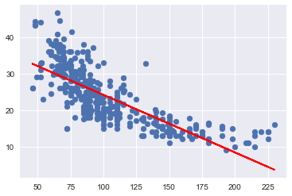
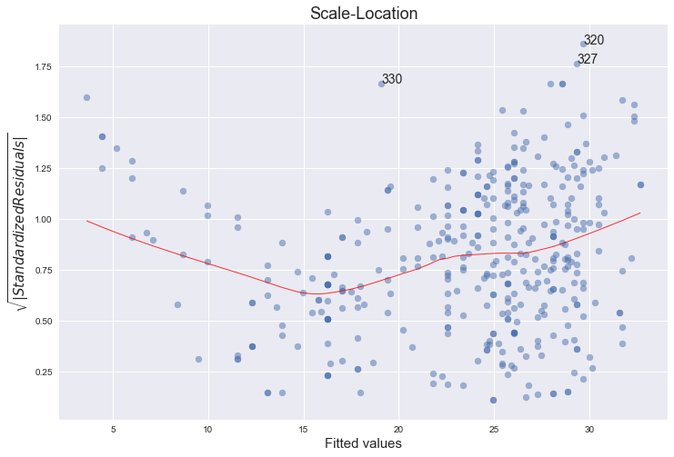

# Exercise 3.8


```python
import pandas as pd
import numpy as np
import seaborn as sns
import matplotlib.pyplot as plt
import statsmodels.formula.api as smf  # Statsmodels is a Python module for statistics
import statsmodels.api as sm

%matplotlib inline
```


```python
df = pd.read_csv('../data/auto.csv') # import dataset
```


```python
df.head() # just to have a look
```


<div>
<style>
    .dataframe thead tr:only-child th {
        text-align: right;
    }

    .dataframe thead th {
        text-align: left;
    }

    .dataframe tbody tr th {
        vertical-align: top;
    }
</style>
<table border="1" class="dataframe">
  <thead>
    <tr style="text-align: right;">
      <th></th>
      <th>mpg</th>
      <th>cylinders</th>
      <th>displacement</th>
      <th>horsepower</th>
      <th>weight</th>
      <th>acceleration</th>
      <th>year</th>
      <th>origin</th>
      <th>name</th>
    </tr>
  </thead>
  <tbody>
    <tr>
      <th>0</th>
      <td>18.0</td>
      <td>8</td>
      <td>307.0</td>
      <td>130</td>
      <td>3504</td>
      <td>12.0</td>
      <td>70</td>
      <td>1</td>
      <td>chevrolet chevelle malibu</td>
    </tr>
    <tr>
      <th>1</th>
      <td>15.0</td>
      <td>8</td>
      <td>350.0</td>
      <td>165</td>
      <td>3693</td>
      <td>11.5</td>
      <td>70</td>
      <td>1</td>
      <td>buick skylark 320</td>
    </tr>
    <tr>
      <th>2</th>
      <td>18.0</td>
      <td>8</td>
      <td>318.0</td>
      <td>150</td>
      <td>3436</td>
      <td>11.0</td>
      <td>70</td>
      <td>1</td>
      <td>plymouth satellite</td>
    </tr>
    <tr>
      <th>3</th>
      <td>16.0</td>
      <td>8</td>
      <td>304.0</td>
      <td>150</td>
      <td>3433</td>
      <td>12.0</td>
      <td>70</td>
      <td>1</td>
      <td>amc rebel sst</td>
    </tr>
    <tr>
      <th>4</th>
      <td>17.0</td>
      <td>8</td>
      <td>302.0</td>
      <td>140</td>
      <td>3449</td>
      <td>10.5</td>
      <td>70</td>
      <td>1</td>
      <td>ford torino</td>
    </tr>
  </tbody>
</table>
</div>


## (a)


```python
# prepare data for modelling (training set)
X_train = df['horsepower'] # horsepower as predictor
y_train = df['mpg']        # mpg as response
```


```python
X_train.head() # just to check
```


    0    130
    1    165
    2    150
    3    150
    4    140
    Name: horsepower, dtype: object


```python
y_train.head() # just to check
```


    0    18.0
    1    15.0
    2    18.0
    3    16.0
    4    17.0
    Name: mpg, dtype: float64


```python
X_train.unique() # check for data quality (missing data, errors, etc.)
```


    array(['130', '165', '150', '140', '198', '220', '215', '225', '190',
           '170', '160', '95', '97', '85', '88', '46', '87', '90', '113',
           '200', '210', '193', '?', '100', '105', '175', '153', '180', '110',
           '72', '86', '70', '76', '65', '69', '60', '80', '54', '208', '155',
           '112', '92', '145', '137', '158', '167', '94', '107', '230', '49',
           '75', '91', '122', '67', '83', '78', '52', '61', '93', '148', '129',
           '96', '71', '98', '115', '53', '81', '79', '120', '152', '102',
           '108', '68', '58', '149', '89', '63', '48', '66', '139', '103',
           '125', '133', '138', '135', '142', '77', '62', '132', '84', '64',
           '74', '116', '82'], dtype=object)


* There is a strange value: **'?'**


```python
# handling with '?' observations (delete them)
droplist = X_train[X_train == '?'].index # get index of observations with '?' value
X_train = X_train.drop(droplist)         # drop those observations
y_train = y_train.drop(droplist)         # ensure dimensional compatibility between variables
X_train.unique()                         # test
```


    array(['130', '165', '150', '140', '198', '220', '215', '225', '190',
           '170', '160', '95', '97', '85', '88', '46', '87', '90', '113',
           '200', '210', '193', '100', '105', '175', '153', '180', '110', '72',
           '86', '70', '76', '65', '69', '60', '80', '54', '208', '155', '112',
           '92', '145', '137', '158', '167', '94', '107', '230', '49', '75',
           '91', '122', '67', '83', '78', '52', '61', '93', '148', '129', '96',
           '71', '98', '115', '53', '81', '79', '120', '152', '102', '108',
           '68', '58', '149', '89', '63', '48', '66', '139', '103', '125',
           '133', '138', '135', '142', '77', '62', '132', '84', '64', '74',
           '116', '82'], dtype=object)


```python
y_train.unique() # check for data quality (missing data, errors, etc.)
```


    array([ 18. ,  15. ,  16. ,  17. ,  14. ,  24. ,  22. ,  21. ,  27. ,
            26. ,  25. ,  10. ,  11. ,   9. ,  28. ,  19. ,  12. ,  13. ,
            23. ,  30. ,  31. ,  35. ,  20. ,  29. ,  32. ,  33. ,  17.5,
            15.5,  14.5,  22.5,  24.5,  18.5,  29.5,  26.5,  16.5,  31.5,
            36. ,  25.5,  33.5,  20.5,  30.5,  21.5,  43.1,  36.1,  32.8,
            39.4,  19.9,  19.4,  20.2,  19.2,  25.1,  20.6,  20.8,  18.6,
            18.1,  17.7,  27.5,  27.2,  30.9,  21.1,  23.2,  23.8,  23.9,
            20.3,  21.6,  16.2,  19.8,  22.3,  17.6,  18.2,  16.9,  31.9,
            34.1,  35.7,  27.4,  25.4,  34.2,  34.5,  31.8,  37.3,  28.4,
            28.8,  26.8,  41.5,  38.1,  32.1,  37.2,  26.4,  24.3,  19.1,
            34.3,  29.8,  31.3,  37. ,  32.2,  46.6,  27.9,  40.8,  44.3,
            43.4,  36.4,  44.6,  33.8,  32.7,  23.7,  32.4,  26.6,  25.8,
            23.5,  39.1,  39. ,  35.1,  32.3,  37.7,  34.7,  34.4,  29.9,
            33.7,  32.9,  31.6,  28.1,  30.7,  24.2,  22.4,  34. ,  38. ,  44. ])


```python
# create dataframe to use statsmodel
d = {'horsepower':X_train.astype('float'), 'mpg':y_train}
df = pd.DataFrame(data=d)
df.head()
```


<div>
<style>
    .dataframe thead tr:only-child th {
        text-align: right;
    }

    .dataframe thead th {
        text-align: left;
    }

    .dataframe tbody tr th {
        vertical-align: top;
    }
</style>
<table border="1" class="dataframe">
  <thead>
    <tr style="text-align: right;">
      <th></th>
      <th>horsepower</th>
      <th>mpg</th>
    </tr>
  </thead>
  <tbody>
    <tr>
      <th>0</th>
      <td>130.0</td>
      <td>18.0</td>
    </tr>
    <tr>
      <th>1</th>
      <td>165.0</td>
      <td>15.0</td>
    </tr>
    <tr>
      <th>2</th>
      <td>150.0</td>
      <td>18.0</td>
    </tr>
    <tr>
      <th>3</th>
      <td>150.0</td>
      <td>16.0</td>
    </tr>
    <tr>
      <th>4</th>
      <td>140.0</td>
      <td>17.0</td>
    </tr>
  </tbody>
</table>
</div>


```python
# plot
plt.scatter(X_train,y_train);
```


```python
# using statsmodel for linear regression (http://statsmodels.sourceforge.net/)
mod = smf.ols(formula='mpg ~ horsepower', data = df)
res = mod.fit()
print(res.summary())
```

                                OLS Regression Results                            
    ==============================================================================
    Dep. Variable:                    mpg   R-squared:                       0.606
    Model:                            OLS   Adj. R-squared:                  0.605
    Method:                 Least Squares   F-statistic:                     599.7
    Date:                Fri, 08 Dec 2017   Prob (F-statistic):           7.03e-81
    Time:                        09:48:30   Log-Likelihood:                -1178.7
    No. Observations:                 392   AIC:                             2361.
    Df Residuals:                     390   BIC:                             2369.
    Df Model:                           1                                         
    Covariance Type:            nonrobust                                         
    ==============================================================================
                     coef    std err          t      P>|t|      [0.025      0.975]
    ------------------------------------------------------------------------------
    Intercept     39.9359      0.717     55.660      0.000      38.525      41.347
    horsepower    -0.1578      0.006    -24.489      0.000      -0.171      -0.145
    ==============================================================================
    Omnibus:                       16.432   Durbin-Watson:                   0.920
    Prob(Omnibus):                  0.000   Jarque-Bera (JB):               17.305
    Skew:                           0.492   Prob(JB):                     0.000175
    Kurtosis:                       3.299   Cond. No.                         322.
    ==============================================================================
    
    Warnings:
    [1] Standard Errors assume that the covariance matrix of the errors is correctly specified.


### i.

Yes, there is a relationship between the predictor and the response. We can reject the null hypothesis that the regression coefficients are zero, since the F-statistic is much larger than 1 and the p-value is close to zero.

### ii

Since the R-squared value is just about 0.606, we can say that approximately 60% of the variance in mpg is explained by horsepower.

### iii

The relationship is negative because the coefficient corresponding to horsepower is equal to -0.1578.

### iv

This exercise is a bit trickier to do in Python, since there's no standard out-of-the-box function for it (please let us know if you could find one). If we were solving this exercise in R, we would just need to use the functions confint() and predict() (see bottom of page 111 of ISLR). 

On page 82 of ISLR, they describe the qualitative difference between a confidence and a prediction interval. However, the text does not explain how to calculate the intervals.
For a good description and derivation on how to calculate these intervals see Casella and Berger [1], section 11.3.5 ("Estimation and Prediction at a Specified x=x0"). 
The distinction between the two types of interval is also well laid out in the answer [2], adapted from section 4.1 of Faraway [3].

The answer is calculated below. 
The predicted 'mpg' is equal to 24.46708, with a 95% confidence interval of (23.97308, 24.96108) and a 95% prediction interval of (14.80940, 34.12476).
These are the same values as calculated with the R functions confint() and predict().


 


```python
# this code follows Chapter 11 of Casella and Berger [1]
# below we comment the lines with the page numbers of the text where the corresponding formulas appear

from scipy.stats import t
from math import sqrt

def interval(x, y, x0,alpha = .05):
    n = np.size(x)
    x_bar = np.mean(x)
    y_bar = np.mean(y)
    S_xx = np.sum((x-x_bar)**2)         # page 541
    S_xy = np.sum((x-x_bar)*(y-y_bar))  # page 541
    b = S_xy/S_xx                       # page 542
    a = y_bar - b*x_bar                 # page 542
    S2 = np.sum((y-a-b*x)**2)/(n-2)     # page 552
    S = sqrt(S2)
    ts = t.ppf(1-alpha/2, n-2)
    w_conf = ts*S*sqrt(1/n + (x0-x_bar)**2/S_xx)      # page 558
    w_pred = ts*S*sqrt(1 + 1/n + (x0-x_bar)**2/S_xx)  # page 559
    print("                fit \t lwr \t  upr")
    print("confidence %3.5f %3.5f %3.5f" % (a+b*x0, a+b*x0 - w_conf, a+b*x0 + w_conf))
    print("prediction %3.5f %3.5f %3.5f" % (a+b*x0, a+b*x0 - w_pred, a+b*x0 + w_pred))

x = df['horsepower']
y = df['mpg']
x0 = 98    
    
interval(x, y, x0)
```

                    fit 	 lwr 	  upr
    confidence 24.46708 23.97308 24.96108
    prediction 24.46708 14.80940 34.12476


### References

[1] Casella, George, and Roger L. Berger. Statistical inference. Vol. 2. Pacific Grove, CA: Duxbury, 2002. [amazon](https://smile.amazon.com/Statistical-Inference-George-Casella/dp/0534243126)

[2] [https://stats.stackexchange.com/a/271232](https://stats.stackexchange.com/a/271232)

[3] Faraway, Julian J. Linear models with R. CRC press, 2014.  [amazon](https://smile.amazon.com/Linear-Models-Chapman-Statistical-Science/dp/1439887330)

## (b)


```python
plt.subplots(1,1) #to get both plots in the same figure 
plt.scatter(X_train.astype('float'), y_train);
plt.plot(X_train.astype('float'), res.fittedvalues, color='red');
```





## (c)

In R [4], by default, plot() on a fit produces 4 plots: 
 * a plot of residuals against fitted values,
 * a Scale-Location plot of sqrt(| residuals |) against fitted values,
 * a Normal Q-Q plot,
 * a plot of residuals against leverages.
 
Below, we plot each of these 4 plots. We used the code published by Emre Can [5] with a few adaptations.


```python
import statsmodels.formula.api as smf
from statsmodels.graphics.gofplots import ProbPlot

plt.style.use('seaborn') # pretty matplotlib plots
plt.rc('font', size=14)
plt.rc('figure', titlesize=18)
plt.rc('axes', labelsize=15)
plt.rc('axes', titlesize=18)

model_f = 'mpg ~ horsepower'

df.reset_index(drop=True, inplace=True)

model = smf.ols(formula=model_f, data=df)

model_fit = model.fit()

# fitted values (need a constant term for intercept)
model_fitted_y = model_fit.fittedvalues

# model residuals
model_residuals = model_fit.resid

# normalized residuals
model_norm_residuals = model_fit.get_influence().resid_studentized_internal

# absolute squared normalized residuals
model_norm_residuals_abs_sqrt = np.sqrt(np.abs(model_norm_residuals))

# absolute residuals
model_abs_resid = np.abs(model_residuals)

# leverage, from statsmodels internals
model_leverage = model_fit.get_influence().hat_matrix_diag

# cook's distance, from statsmodels internals
model_cooks = model_fit.get_influence().cooks_distance[0]
```

### Residuals against fitted values


```python
plot_lm_1 = plt.figure(1)
plot_lm_1.set_figheight(8)
plot_lm_1.set_figwidth(12)

plot_lm_1.axes[0] = sns.residplot(model_fitted_y, 'mpg', data=df,
                                  lowess=True,
                                  scatter_kws={'alpha': 0.5},
                                  line_kws={'color': 'red', 'lw': 1, 'alpha': 0.8})

plot_lm_1.axes[0].set_title('Residuals vs Fitted')
plot_lm_1.axes[0].set_xlabel('Fitted values')
plot_lm_1.axes[0].set_ylabel('Residuals')


# annotations
abs_resid = model_abs_resid.sort_values(ascending=False)
abs_resid_top_3 = abs_resid[:3]

for i in abs_resid_top_3.index:
    plot_lm_1.axes[0].annotate(i, 
                               xy=(model_fitted_y[i], 
                                   model_residuals[i]));
```


The red line is a smooth fit to the residuals which helps to spot any trends. 
We can clearly see a strong non-linearity indicated by the curve of the red line.
Figure 3.9 of the text also comments on this and shows the same plot for a quadratical fit, where the this trend is now almost non-existant.
The funnel shape of the plotted residuals indicates that we are in the presence of heteroscedasticity. 

### Normal Q-Q plot


```python
QQ = ProbPlot(model_norm_residuals)
plot_lm_2 = QQ.qqplot(line='45', alpha=0.5, color='#4C72B0', lw=1)

plot_lm_2.set_figheight(8)
plot_lm_2.set_figwidth(12)

plot_lm_2.axes[0].set_title('Normal Q-Q')
plot_lm_2.axes[0].set_xlabel('Theoretical Quantiles')
plot_lm_2.axes[0].set_ylabel('Standardized Residuals');

# annotations
abs_norm_resid = np.flip(np.argsort(np.abs(model_norm_residuals)), 0)
abs_norm_resid_top_3 = abs_norm_resid[:3]

for r, i in enumerate(abs_norm_resid_top_3):
    plot_lm_2.axes[0].annotate(i, 
                               xy=(np.flip(QQ.theoretical_quantiles, 0)[r],
                                   model_norm_residuals[i]));
```


The qq-plot indicates that the assumption of normality does hold, since we can fit a straight line quite well, although there seems to be a slight left skew.

The links below provide nice explanations and intuitions of the concept of qq-plots and pp-plots and how to interpret them.

* [https://stats.stackexchange.com/questions/52212/qq-plot-does-not-match-histogram/52221#52221](https://stats.stackexchange.com/questions/52212/qq-plot-does-not-match-histogram/52221#52221)
* https://stats.stackexchange.com/questions/101274/how-to-interpret-a-qq-plot
* https://xiongge.shinyapps.io/QQplots/
* https://stats.stackexchange.com/questions/92141/pp-plots-vs-qq-plots/100383#100383
    

### Scale-Location plot of sqrt(|residuals|) against fitted values


```python
plot_lm_3 = plt.figure(3)
plot_lm_3.set_figheight(8)
plot_lm_3.set_figwidth(12)

plt.scatter(model_fitted_y, model_norm_residuals_abs_sqrt, alpha=0.5)
sns.regplot(model_fitted_y, model_norm_residuals_abs_sqrt, 
            scatter=False, 
            ci=False, 
            lowess=True,
            line_kws={'color': 'red', 'lw': 1, 'alpha': 0.8})

plot_lm_3.axes[0].set_title('Scale-Location')
plot_lm_3.axes[0].set_xlabel('Fitted values')
plot_lm_3.axes[0].set_ylabel('$\sqrt{|Standardized Residuals|}$');


for i in abs_norm_resid_top_3:
    plot_lm_3.axes[0].annotate(i, 
                               xy=(model_fitted_y[i], 
                                   model_norm_residuals_abs_sqrt[i]));
```





This plot is similar to the first one - it plots the residuals against the fitted values, although here they are all made positive and normalized.
It is clear from the plot that the assumption of homoscedasticity is not held.

"The third plot is a scale-location plot (square rooted standardized residual vs. predicted value). This is useful for checking the assumption of homoscedasticity. In this particular plot we are checking to see if there is a pattern in the residuals."

(source: http://sphweb.bumc.bu.edu/otlt/MPH-Modules/BS/R/R5_Correlation-Regression/R5_Correlation-Regression7.html)

### Residuals against leverages


```python
plot_lm_4 = plt.figure(4)
plot_lm_4.set_figheight(8)
plot_lm_4.set_figwidth(12)

plt.scatter(model_leverage, model_norm_residuals, alpha=0.5)
sns.regplot(model_leverage, model_norm_residuals, 
            scatter=False, 
            ci=False, 
            lowess=True,
            line_kws={'color': 'red', 'lw': 1, 'alpha': 0.8})

plot_lm_4.axes[0].set_xlim(0, 0.20)
plot_lm_4.axes[0].set_ylim(-3, 5)
plot_lm_4.axes[0].set_title('Residuals vs Leverage')
plot_lm_4.axes[0].set_xlabel('Leverage')
plot_lm_4.axes[0].set_ylabel('Standardized Residuals')

# annotations
leverage_top_3 = np.flip(np.argsort(model_cooks), 0)[:3]

for i in leverage_top_3:
    plot_lm_4.axes[0].annotate(i, 
                               xy=(model_leverage[i], 
                                   model_norm_residuals[i]))
    
# shenanigans for cook's distance contours
def graph(formula, x_range, label=None, ls='-'):
    x = x_range
    y = formula(x)
    plt.plot(x, y, label=label, lw=1, ls=ls, color='red')

p = len(model_fit.params) # number of model parameters

graph(lambda x: np.sqrt((0.5 * p * (1 - x)) / x), 
      np.linspace(0.001, 0.200, 50), 
      'Cook\'s distance = .5', ls='--') # 0.5 line

graph(lambda x: np.sqrt((1 * p * (1 - x)) / x), 
      np.linspace(0.001, 0.200, 50), 'Cook\'s distance = 1', ls=':') # 1 line

plt.legend(loc='upper right');
```


The higher leverage points concentrate on the upper half of this plot, which indicates a deviation from normality.
On the other hand, from the plot we can see that every point has a Cook's distance well below 1, which indicates that no point has much individual influence on the fit.


"The fourth plot is of "Cook's distance", which is a measure of the influence of each observation on the regression coefficients. The Cook's distance statistic is a measure, for each observation in turn, of the extent of change in model estimates when that particular observation is omitted. Any observation for which the Cook's distance is close to 1 or more, or that is substantially larger than other Cook's distances (highly influential data points), requires investigation."

(source: http://sphweb.bumc.bu.edu/otlt/MPH-Modules/BS/R/R5_Correlation-Regression/R5_Correlation-Regression7.html)

### References
[4] https://stat.ethz.ch/R-manual/R-devel/library/stats/html/plot.lm.html

[5] https://emredjan.github.io/blog/2017/07/11/emulating-r-plots-in-python/
