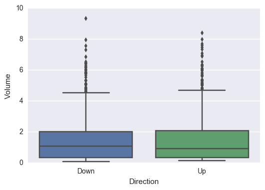
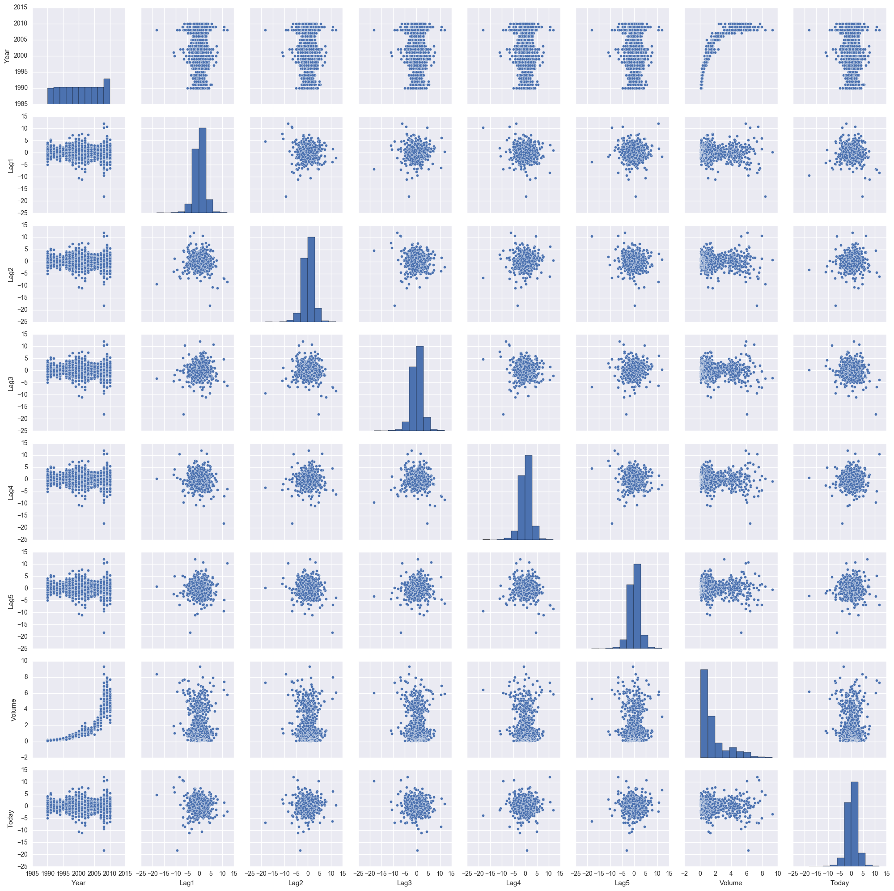
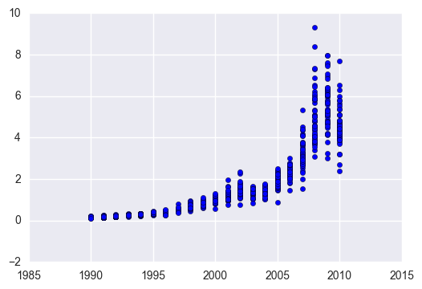

# Exercise 4.10


```python
import pandas as pd
import numpy as np
import matplotlib.pyplot as plt
import seaborn as sns #visualization library
from sklearn.linear_model import LogisticRegression #problem will be solved with scikit
from sklearn.metrics import accuracy_score
from sklearn.discriminant_analysis import LinearDiscriminantAnalysis #linear discriminant analysis
from sklearn.discriminant_analysis import QuadraticDiscriminantAnalysis #quadratic discriminant analysis
from sklearn.neighbors import KNeighborsClassifier #K nearest neighbours (KNN)

import statsmodels.api as sm #to compute p-values
from patsy import dmatrices

%matplotlib inline
```


```python
df = pd.read_csv('../data/Weekly.csv',index_col=0)
```


```python
df.head()
```


<div>
<style scoped>
    .dataframe tbody tr th:only-of-type {
        vertical-align: middle;
    }

    .dataframe tbody tr th {
        vertical-align: top;
    }

    .dataframe thead th {
        text-align: right;
    }
</style>
<table border="1" class="dataframe">
  <thead>
    <tr style="text-align: right;">
      <th></th>
      <th>Year</th>
      <th>Lag1</th>
      <th>Lag2</th>
      <th>Lag3</th>
      <th>Lag4</th>
      <th>Lag5</th>
      <th>Volume</th>
      <th>Today</th>
      <th>Direction</th>
    </tr>
  </thead>
  <tbody>
    <tr>
      <th>1</th>
      <td>1990</td>
      <td>0.816</td>
      <td>1.572</td>
      <td>-3.936</td>
      <td>-0.229</td>
      <td>-3.484</td>
      <td>0.154976</td>
      <td>-0.270</td>
      <td>Down</td>
    </tr>
    <tr>
      <th>2</th>
      <td>1990</td>
      <td>-0.270</td>
      <td>0.816</td>
      <td>1.572</td>
      <td>-3.936</td>
      <td>-0.229</td>
      <td>0.148574</td>
      <td>-2.576</td>
      <td>Down</td>
    </tr>
    <tr>
      <th>3</th>
      <td>1990</td>
      <td>-2.576</td>
      <td>-0.270</td>
      <td>0.816</td>
      <td>1.572</td>
      <td>-3.936</td>
      <td>0.159837</td>
      <td>3.514</td>
      <td>Up</td>
    </tr>
    <tr>
      <th>4</th>
      <td>1990</td>
      <td>3.514</td>
      <td>-2.576</td>
      <td>-0.270</td>
      <td>0.816</td>
      <td>1.572</td>
      <td>0.161630</td>
      <td>0.712</td>
      <td>Up</td>
    </tr>
    <tr>
      <th>5</th>
      <td>1990</td>
      <td>0.712</td>
      <td>3.514</td>
      <td>-2.576</td>
      <td>-0.270</td>
      <td>0.816</td>
      <td>0.153728</td>
      <td>1.178</td>
      <td>Up</td>
    </tr>
  </tbody>
</table>
</div>


# (a)


```python
df.describe() #descriptive statistics
```


<div>
<table border="1" class="dataframe">
  <thead>
    <tr style="text-align: right;">
      <th></th>
      <th>Year</th>
      <th>Lag1</th>
      <th>Lag2</th>
      <th>Lag3</th>
      <th>Lag4</th>
      <th>Lag5</th>
      <th>Volume</th>
      <th>Today</th>
    </tr>
  </thead>
  <tbody>
    <tr>
      <th>count</th>
      <td>1089.000000</td>
      <td>1089.000000</td>
      <td>1089.000000</td>
      <td>1089.000000</td>
      <td>1089.000000</td>
      <td>1089.000000</td>
      <td>1089.000000</td>
      <td>1089.000000</td>
    </tr>
    <tr>
      <th>mean</th>
      <td>2000.048669</td>
      <td>0.150585</td>
      <td>0.151079</td>
      <td>0.147205</td>
      <td>0.145818</td>
      <td>0.139893</td>
      <td>1.574618</td>
      <td>0.149899</td>
    </tr>
    <tr>
      <th>std</th>
      <td>6.033182</td>
      <td>2.357013</td>
      <td>2.357254</td>
      <td>2.360502</td>
      <td>2.360279</td>
      <td>2.361285</td>
      <td>1.686636</td>
      <td>2.356927</td>
    </tr>
    <tr>
      <th>min</th>
      <td>1990.000000</td>
      <td>-18.195000</td>
      <td>-18.195000</td>
      <td>-18.195000</td>
      <td>-18.195000</td>
      <td>-18.195000</td>
      <td>0.087465</td>
      <td>-18.195000</td>
    </tr>
    <tr>
      <th>25%</th>
      <td>1995.000000</td>
      <td>-1.154000</td>
      <td>-1.154000</td>
      <td>-1.158000</td>
      <td>-1.158000</td>
      <td>-1.166000</td>
      <td>0.332022</td>
      <td>-1.154000</td>
    </tr>
    <tr>
      <th>50%</th>
      <td>2000.000000</td>
      <td>0.241000</td>
      <td>0.241000</td>
      <td>0.241000</td>
      <td>0.238000</td>
      <td>0.234000</td>
      <td>1.002680</td>
      <td>0.241000</td>
    </tr>
    <tr>
      <th>75%</th>
      <td>2005.000000</td>
      <td>1.405000</td>
      <td>1.409000</td>
      <td>1.409000</td>
      <td>1.409000</td>
      <td>1.405000</td>
      <td>2.053727</td>
      <td>1.405000</td>
    </tr>
    <tr>
      <th>max</th>
      <td>2010.000000</td>
      <td>12.026000</td>
      <td>12.026000</td>
      <td>12.026000</td>
      <td>12.026000</td>
      <td>12.026000</td>
      <td>9.328214</td>
      <td>12.026000</td>
    </tr>
  </tbody>
</table>
</div>


```python
df.corr() #correlation matrix
```


<div>
<table border="1" class="dataframe">
  <thead>
    <tr style="text-align: right;">
      <th></th>
      <th>Year</th>
      <th>Lag1</th>
      <th>Lag2</th>
      <th>Lag3</th>
      <th>Lag4</th>
      <th>Lag5</th>
      <th>Volume</th>
      <th>Today</th>
    </tr>
  </thead>
  <tbody>
    <tr>
      <th>Year</th>
      <td>1.000000</td>
      <td>-0.032289</td>
      <td>-0.033390</td>
      <td>-0.030006</td>
      <td>-0.031128</td>
      <td>-0.030519</td>
      <td>0.841942</td>
      <td>-0.032460</td>
    </tr>
    <tr>
      <th>Lag1</th>
      <td>-0.032289</td>
      <td>1.000000</td>
      <td>-0.074853</td>
      <td>0.058636</td>
      <td>-0.071274</td>
      <td>-0.008183</td>
      <td>-0.064951</td>
      <td>-0.075032</td>
    </tr>
    <tr>
      <th>Lag2</th>
      <td>-0.033390</td>
      <td>-0.074853</td>
      <td>1.000000</td>
      <td>-0.075721</td>
      <td>0.058382</td>
      <td>-0.072499</td>
      <td>-0.085513</td>
      <td>0.059167</td>
    </tr>
    <tr>
      <th>Lag3</th>
      <td>-0.030006</td>
      <td>0.058636</td>
      <td>-0.075721</td>
      <td>1.000000</td>
      <td>-0.075396</td>
      <td>0.060657</td>
      <td>-0.069288</td>
      <td>-0.071244</td>
    </tr>
    <tr>
      <th>Lag4</th>
      <td>-0.031128</td>
      <td>-0.071274</td>
      <td>0.058382</td>
      <td>-0.075396</td>
      <td>1.000000</td>
      <td>-0.075675</td>
      <td>-0.061075</td>
      <td>-0.007826</td>
    </tr>
    <tr>
      <th>Lag5</th>
      <td>-0.030519</td>
      <td>-0.008183</td>
      <td>-0.072499</td>
      <td>0.060657</td>
      <td>-0.075675</td>
      <td>1.000000</td>
      <td>-0.058517</td>
      <td>0.011013</td>
    </tr>
    <tr>
      <th>Volume</th>
      <td>0.841942</td>
      <td>-0.064951</td>
      <td>-0.085513</td>
      <td>-0.069288</td>
      <td>-0.061075</td>
      <td>-0.058517</td>
      <td>1.000000</td>
      <td>-0.033078</td>
    </tr>
    <tr>
      <th>Today</th>
      <td>-0.032460</td>
      <td>-0.075032</td>
      <td>0.059167</td>
      <td>-0.071244</td>
      <td>-0.007826</td>
      <td>0.011013</td>
      <td>-0.033078</td>
      <td>1.000000</td>
    </tr>
  </tbody>
</table>
</div>


* Relationship Year/Volume should be explored


```python
sns.distplot(df['Today']);
```

    C:\Program Files\Anaconda3\lib\site-packages\statsmodels\nonparametric\kdetools.py:20: VisibleDeprecationWarning: using a non-integer number instead of an integer will result in an error in the future
      y = X[:m/2+1] + np.r_[0,X[m/2+1:],0]*1j


```python
sns.boxplot(x='Direction', y='Volume', data=df);
```





```python
sns.pairplot(df);
```





```python
plt.scatter(df['Year'],df['Volume']);
```





* The Year/Volume relationship is the only one with a visible pattern

# (b)


```python
#logistic regression model
train_cols = ['Lag1','Lag2','Lag3','Lag4','Lag5','Volume'] #independent var. considered in the logistic model
lr = LogisticRegression()
mod = lr.fit(df[train_cols], df['Direction'])
```


```python
mod.coef_ #independent var. coefficients
```


    array([[-0.04117292,  0.05846974, -0.01599122, -0.02769998, -0.01440289,
            -0.02212844]])


```python
mod.intercept_ #interception
```


    array([ 0.26484745])


```python
#p-values determine if the predictors appear to be statistically significant 
#it's easier to get p-values with statsmodel

#we need to transform the target value to non-categorical
#if we don't do this, statsmodel will try to use dummy variables
#dummy variables don't work here because they will create a target value with 2 columns
df['Direction'] = df['Direction'].map({'Down':0, 'Up':1})

#fit model
y, X = dmatrices('Direction ~ Lag1 + Lag2 + Lag3 + Lag4 + Lag5 + Volume', data=df, return_type='dataframe')
#logit = sm.Logit(y.ix[:,0], X) #
logit = sm.Logit(y, X) 
result = logit.fit()
```

    Optimization terminated successfully.
             Current function value: 0.682441
             Iterations 4


```python
print(result.summary())
```

                               Logit Regression Results                           
    ==============================================================================
    Dep. Variable:              Direction   No. Observations:                 1089
    Model:                          Logit   Df Residuals:                     1082
    Method:                           MLE   Df Model:                            6
    Date:                Fri, 27 Jan 2017   Pseudo R-squ.:                0.006580
    Time:                        05:36:33   Log-Likelihood:                -743.18
    converged:                       True   LL-Null:                       -748.10
                                            LLR p-value:                    0.1313
    ==============================================================================
                     coef    std err          z      P>|z|      [95.0% Conf. Int.]
    ------------------------------------------------------------------------------
    Intercept      0.2669      0.086      3.106      0.002         0.098     0.435
    Lag1          -0.0413      0.026     -1.563      0.118        -0.093     0.010
    Lag2           0.0584      0.027      2.175      0.030         0.006     0.111
    Lag3          -0.0161      0.027     -0.602      0.547        -0.068     0.036
    Lag4          -0.0278      0.026     -1.050      0.294        -0.080     0.024
    Lag5          -0.0145      0.026     -0.549      0.583        -0.066     0.037
    Volume        -0.0227      0.037     -0.616      0.538        -0.095     0.050
    ==============================================================================


Lag2 seems to be a predictor with statistical significance. We can say that because Lag2 has a small P|z|, meaning that there's a small probability that Lag2 coefficient is equal to zero.

<b>Note</b>: Notice that the coefficients are not exactly the same. That happens because scikit-learn applies some kind of parameter regularization. You can confirm this by reading the scikit-learn documentation, as suggested here: http://stats.stackexchange.com/questions/203740/logistic-regression-scikit-learn-vs-statsmodels. An option to overcome this is to for LogisticRegression to use a big C value (e.g. 1e9).

# (c)


```python
#confusion matrix
conf_mat = confusion_matrix(df['Direction'], lr.predict(df[train_cols]))
print(conf_mat) #alternative to 'fancy' plot
```

    [[ 55 429]
     [ 47 558]]


```python
#'fancy' confusion matrix plot
#based on: Raschka (2014)
fig, ax = plt.subplots(figsize=(2, 2))
ax.matshow(conf_mat, cmap=plt.cm.Reds, alpha=0.3)
for i in range(conf_mat.shape[0]):
    for j in range(conf_mat.shape[1]):
        ax.text(x=j, y=i,
        s=conf_mat[i, j],
        va='center', ha='center')
plt.xlabel('predicted label')
plt.ylabel('true label')
plt.show()
```


* The confusion matrix gives us two types of mistakes: 1) false positives; 2) false negatives.
* A <i>false positive</i> occurs when our prediction gives us a positive value but the real value is negative. A <i>false negative</i> occurs when our prediction gives us a negative value but the real value is positive.
* Assuming that class 1 ('Up') is the positive class, our model correctly classified 55 samples that belong to class 0 (true negatives) and 558 samples that belong to class 1 (true positives). However, our model also incorrectly misclassified 429 samples from class 0 to class 1 (false negatives), and it predicted that 47 samples were 'Up' although they were 'Down' (false positives).

<b>Note:</b> 'Down' is class 0 because it is the first 'Direction' class in the dataset. When encoding the categorical variable, scikit will automatically attribute the value 0 to the first class it gets, value 1 to the second class it gets and so one.


```python
#overall fraction of correct predictions
lr.score(df[train_cols],df['Direction'])
```


    0.56290174471992649


# (d)


```python
#partitioning the dataset
df_9908 = df[(df['Year'] >=1990) & (df['Year'] <=2008)]
df_0910 = df[(df['Year'] >=2009) & (df['Year'] <=2010)]
```


```python
#to avoid 'ValueError: Found arrays with inconsistent numbers of sample'
#shape must be (X,1) and not (X,)
X = df_9908['Lag2']
X = X.reshape(np.shape(X)[0],1)
```


```python
#logistic regression
mod = lr.fit(X,df_9908['Direction']) #regression object already exists; just need to fit it to the new data
```


```python
#confusion matrix
X = df_0910['Lag2']
X = X.reshape(np.shape(X)[0],1)

conf_mat = confusion_matrix(df_0910['Direction'], lr.predict(X))
print(conf_mat)
```

    [[ 9 34]
     [ 5 56]]


```python
#overall fraction of correct predictions
lr.score(X, df_0910['Direction'])
```


    0.625


# (e)


```python
#getting data ready
X = df_9908['Lag2']
X = X.reshape(np.shape(X)[0],1)

#linear discriminant analysis (LDA)
lda = LinearDiscriminantAnalysis()
lda.fit(X,df_9908['Direction'])
```


    LinearDiscriminantAnalysis(n_components=None, priors=None, shrinkage=None,
                  solver='svd', store_covariance=False, tol=0.0001)


```python
#getting data ready
X = df_0910['Lag2']
X = X.reshape(np.shape(X)[0],1)

#confusion matrix
conf_mat = confusion_matrix(df_0910['Direction'], lda.predict(X))
print(conf_mat)
```

    [[ 9 34]
     [ 5 56]]


```python
#overall fraction of correct predictions
#it will be helpful for the next question
lda.score(X, df_0910['Direction'])
```


    0.625


# (f)


```python
#getting data ready
X = df_9908['Lag2']
X = X.reshape(np.shape(X)[0],1)

#quadratic discriminant analysis (QDA)
qda = QuadraticDiscriminantAnalysis()
qda.fit(X,df_9908['Direction'])
```


    QuadraticDiscriminantAnalysis(priors=None, reg_param=0.0,
                   store_covariances=False, tol=0.0001)


```python
#getting data ready
X = df_0910['Lag2']
X = X.reshape(np.shape(X)[0],1)

#confusion matrix
conf_mat = confusion_matrix(df_0910['Direction'], qda.predict(X))
print(conf_mat)
```

    [[ 0 43]
     [ 0 61]]


```python
#overall fraction of correct predictions
#it will be helpful for the next question
qda.score(X, df_0910['Direction'])
```


    0.58653846153846156


# (g)


```python
#getting data ready
X = df_9908['Lag2']
X = X.reshape(np.shape(X)[0],1)

#creating an instance of Neighbours Classifier and fitting the data
nbrs = KNeighborsClassifier(n_neighbors=1)
nbrs.fit(X,df_9908['Direction'])
```


    KNeighborsClassifier(algorithm='auto', leaf_size=30, metric='minkowski',
               metric_params=None, n_jobs=1, n_neighbors=1, p=2,
               weights='uniform')


```python
#getting data ready
X = df_0910['Lag2']
X = X.reshape(np.shape(X)[0],1)

#confusion matrix
conf_mat = confusion_matrix(df_0910['Direction'], nbrs.predict(X))
print(conf_mat)
```

    [[21 22]
     [31 30]]


```python
#overall fraction of correct predictions
#it will be helpful for the next question
nbrs.score(X, df_0910['Direction'])
```


    0.49038461538461536


# (h)

The methods that appear to provide the best results are the <b>logistic regression</b> and the <b>linear discriminant analysis (LDA)</b>. They are the methods where score (overall fraction of correct predictions) is higher (0.625 vs 0.587 vs 0.490)

# (i)


```python
#trying with a different number of neighbors
n_nbrs = 10

#getting data ready for the neigb
X = df_9908['Lag2']
X = X.reshape(np.shape(X)[0],1)

#creating an instance of Neighbours Classifier and fitting the data
nbrs = KNeighborsClassifier(n_neighbors=n_nbrs)
nbrs.fit(X,df_9908['Direction'])

#getting data ready for the confusion matrix
X = df_0910['Lag2']
X = X.reshape(np.shape(X)[0],1)

#confusion matrix
conf_mat = confusion_matrix(df_0910['Direction'], nbrs.predict(X))
print(conf_mat)
```

    [[22 21]
     [24 37]]


Now, it's time to play a little bit with models. We leave this entertaining task to the reader, as homework.

# References
* Raschka, S., 2014, Python Machine Learning
