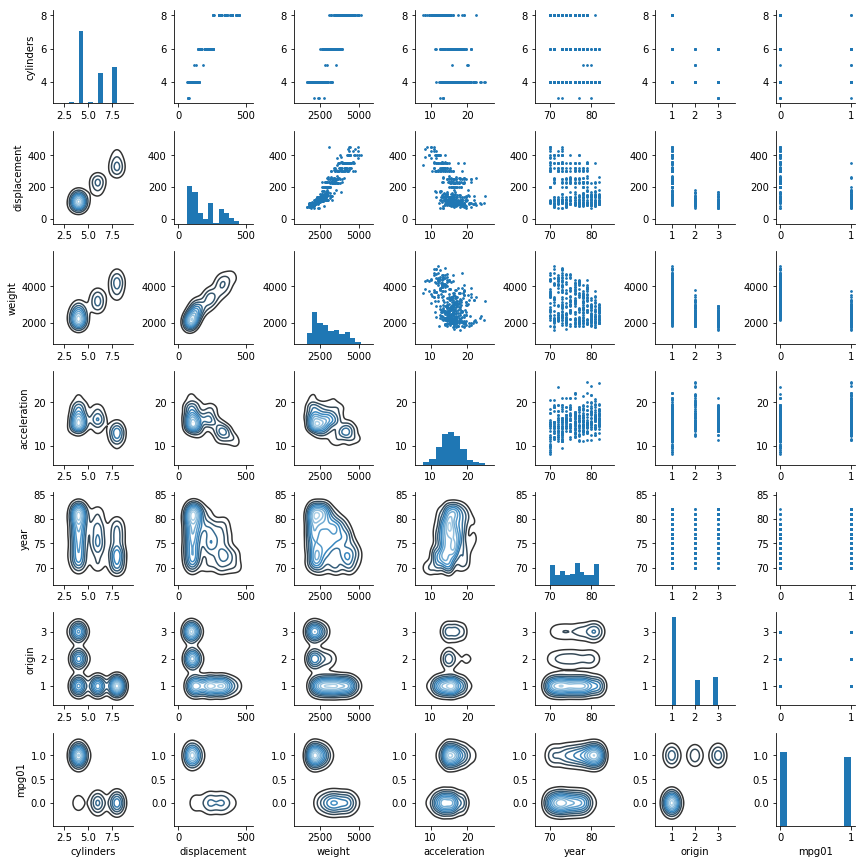

# Exercise 4.11


```python
import pandas as pd
import numpy as np
import matplotlib.pyplot as plt
import seaborn as sns 

from sklearn.cross_validation import train_test_split
from sklearn.metrics import accuracy_score
from sklearn.discriminant_analysis import LinearDiscriminantAnalysis 
from sklearn.discriminant_analysis import QuadraticDiscriminantAnalysis 
from sklearn.linear_model import LogisticRegression 
from sklearn.neighbors import KNeighborsClassifier 

%matplotlib inline
```

    /Users/disciplina/anaconda3/envs/islp/lib/python3.6/site-packages/sklearn/cross_validation.py:41: DeprecationWarning: This module was deprecated in version 0.18 in favor of the model_selection module into which all the refactored classes and functions are moved. Also note that the interface of the new CV iterators are different from that of this module. This module will be removed in 0.20.
      "This module will be removed in 0.20.", DeprecationWarning)


```python
df = pd.read_csv('../data/Auto.csv')
```


```python
df.head()
```


<div>
<style scoped>
    .dataframe tbody tr th:only-of-type {
        vertical-align: middle;
    }

    .dataframe tbody tr th {
        vertical-align: top;
    }

    .dataframe thead th {
        text-align: right;
    }
</style>
<table border="1" class="dataframe">
  <thead>
    <tr style="text-align: right;">
      <th></th>
      <th>mpg</th>
      <th>cylinders</th>
      <th>displacement</th>
      <th>horsepower</th>
      <th>weight</th>
      <th>acceleration</th>
      <th>year</th>
      <th>origin</th>
      <th>name</th>
    </tr>
  </thead>
  <tbody>
    <tr>
      <th>0</th>
      <td>18.0</td>
      <td>8</td>
      <td>307.0</td>
      <td>130</td>
      <td>3504</td>
      <td>12.0</td>
      <td>70</td>
      <td>1</td>
      <td>chevrolet chevelle malibu</td>
    </tr>
    <tr>
      <th>1</th>
      <td>15.0</td>
      <td>8</td>
      <td>350.0</td>
      <td>165</td>
      <td>3693</td>
      <td>11.5</td>
      <td>70</td>
      <td>1</td>
      <td>buick skylark 320</td>
    </tr>
    <tr>
      <th>2</th>
      <td>18.0</td>
      <td>8</td>
      <td>318.0</td>
      <td>150</td>
      <td>3436</td>
      <td>11.0</td>
      <td>70</td>
      <td>1</td>
      <td>plymouth satellite</td>
    </tr>
    <tr>
      <th>3</th>
      <td>16.0</td>
      <td>8</td>
      <td>304.0</td>
      <td>150</td>
      <td>3433</td>
      <td>12.0</td>
      <td>70</td>
      <td>1</td>
      <td>amc rebel sst</td>
    </tr>
    <tr>
      <th>4</th>
      <td>17.0</td>
      <td>8</td>
      <td>302.0</td>
      <td>140</td>
      <td>3449</td>
      <td>10.5</td>
      <td>70</td>
      <td>1</td>
      <td>ford torino</td>
    </tr>
  </tbody>
</table>
</div>


## (a)


```python
df['mpg01']= np.where(df['mpg'] > df['mpg'].median(), 1, 0)
```


```python
df.head()
```


<div>
<style scoped>
    .dataframe tbody tr th:only-of-type {
        vertical-align: middle;
    }

    .dataframe tbody tr th {
        vertical-align: top;
    }

    .dataframe thead th {
        text-align: right;
    }
</style>
<table border="1" class="dataframe">
  <thead>
    <tr style="text-align: right;">
      <th></th>
      <th>mpg</th>
      <th>cylinders</th>
      <th>displacement</th>
      <th>horsepower</th>
      <th>weight</th>
      <th>acceleration</th>
      <th>year</th>
      <th>origin</th>
      <th>name</th>
      <th>mpg01</th>
    </tr>
  </thead>
  <tbody>
    <tr>
      <th>0</th>
      <td>18.0</td>
      <td>8</td>
      <td>307.0</td>
      <td>130</td>
      <td>3504</td>
      <td>12.0</td>
      <td>70</td>
      <td>1</td>
      <td>chevrolet chevelle malibu</td>
      <td>0</td>
    </tr>
    <tr>
      <th>1</th>
      <td>15.0</td>
      <td>8</td>
      <td>350.0</td>
      <td>165</td>
      <td>3693</td>
      <td>11.5</td>
      <td>70</td>
      <td>1</td>
      <td>buick skylark 320</td>
      <td>0</td>
    </tr>
    <tr>
      <th>2</th>
      <td>18.0</td>
      <td>8</td>
      <td>318.0</td>
      <td>150</td>
      <td>3436</td>
      <td>11.0</td>
      <td>70</td>
      <td>1</td>
      <td>plymouth satellite</td>
      <td>0</td>
    </tr>
    <tr>
      <th>3</th>
      <td>16.0</td>
      <td>8</td>
      <td>304.0</td>
      <td>150</td>
      <td>3433</td>
      <td>12.0</td>
      <td>70</td>
      <td>1</td>
      <td>amc rebel sst</td>
      <td>0</td>
    </tr>
    <tr>
      <th>4</th>
      <td>17.0</td>
      <td>8</td>
      <td>302.0</td>
      <td>140</td>
      <td>3449</td>
      <td>10.5</td>
      <td>70</td>
      <td>1</td>
      <td>ford torino</td>
      <td>0</td>
    </tr>
  </tbody>
</table>
</div>


```python
df = df.drop('mpg', axis=1)
df.head()
```


<div>
<style scoped>
    .dataframe tbody tr th:only-of-type {
        vertical-align: middle;
    }

    .dataframe tbody tr th {
        vertical-align: top;
    }

    .dataframe thead th {
        text-align: right;
    }
</style>
<table border="1" class="dataframe">
  <thead>
    <tr style="text-align: right;">
      <th></th>
      <th>cylinders</th>
      <th>displacement</th>
      <th>horsepower</th>
      <th>weight</th>
      <th>acceleration</th>
      <th>year</th>
      <th>origin</th>
      <th>name</th>
      <th>mpg01</th>
    </tr>
  </thead>
  <tbody>
    <tr>
      <th>0</th>
      <td>8</td>
      <td>307.0</td>
      <td>130</td>
      <td>3504</td>
      <td>12.0</td>
      <td>70</td>
      <td>1</td>
      <td>chevrolet chevelle malibu</td>
      <td>0</td>
    </tr>
    <tr>
      <th>1</th>
      <td>8</td>
      <td>350.0</td>
      <td>165</td>
      <td>3693</td>
      <td>11.5</td>
      <td>70</td>
      <td>1</td>
      <td>buick skylark 320</td>
      <td>0</td>
    </tr>
    <tr>
      <th>2</th>
      <td>8</td>
      <td>318.0</td>
      <td>150</td>
      <td>3436</td>
      <td>11.0</td>
      <td>70</td>
      <td>1</td>
      <td>plymouth satellite</td>
      <td>0</td>
    </tr>
    <tr>
      <th>3</th>
      <td>8</td>
      <td>304.0</td>
      <td>150</td>
      <td>3433</td>
      <td>12.0</td>
      <td>70</td>
      <td>1</td>
      <td>amc rebel sst</td>
      <td>0</td>
    </tr>
    <tr>
      <th>4</th>
      <td>8</td>
      <td>302.0</td>
      <td>140</td>
      <td>3449</td>
      <td>10.5</td>
      <td>70</td>
      <td>1</td>
      <td>ford torino</td>
      <td>0</td>
    </tr>
  </tbody>
</table>
</div>


## (b)


```python
g = sns.PairGrid(df, size=2)
g.map_upper(plt.scatter, s=3)
g.map_diag(plt.hist)
g.map_lower(sns.kdeplot, cmap="Blues_d")
g.fig.set_size_inches(12, 12)
```

    /Users/disciplina/anaconda3/envs/islp/lib/python3.6/site-packages/matplotlib/contour.py:967: UserWarning: The following kwargs were not used by contour: 'label', 'color'
      s)





```python
df.corr()
```


<div>
<style scoped>
    .dataframe tbody tr th:only-of-type {
        vertical-align: middle;
    }

    .dataframe tbody tr th {
        vertical-align: top;
    }

    .dataframe thead th {
        text-align: right;
    }
</style>
<table border="1" class="dataframe">
  <thead>
    <tr style="text-align: right;">
      <th></th>
      <th>cylinders</th>
      <th>displacement</th>
      <th>weight</th>
      <th>acceleration</th>
      <th>year</th>
      <th>origin</th>
      <th>mpg01</th>
    </tr>
  </thead>
  <tbody>
    <tr>
      <th>cylinders</th>
      <td>1.000000</td>
      <td>0.950920</td>
      <td>0.897017</td>
      <td>-0.504061</td>
      <td>-0.346717</td>
      <td>-0.564972</td>
      <td>-0.740327</td>
    </tr>
    <tr>
      <th>displacement</th>
      <td>0.950920</td>
      <td>1.000000</td>
      <td>0.933104</td>
      <td>-0.544162</td>
      <td>-0.369804</td>
      <td>-0.610664</td>
      <td>-0.738607</td>
    </tr>
    <tr>
      <th>weight</th>
      <td>0.897017</td>
      <td>0.933104</td>
      <td>1.000000</td>
      <td>-0.419502</td>
      <td>-0.307900</td>
      <td>-0.581265</td>
      <td>-0.745734</td>
    </tr>
    <tr>
      <th>acceleration</th>
      <td>-0.504061</td>
      <td>-0.544162</td>
      <td>-0.419502</td>
      <td>1.000000</td>
      <td>0.282901</td>
      <td>0.210084</td>
      <td>0.322629</td>
    </tr>
    <tr>
      <th>year</th>
      <td>-0.346717</td>
      <td>-0.369804</td>
      <td>-0.307900</td>
      <td>0.282901</td>
      <td>1.000000</td>
      <td>0.184314</td>
      <td>0.454108</td>
    </tr>
    <tr>
      <th>origin</th>
      <td>-0.564972</td>
      <td>-0.610664</td>
      <td>-0.581265</td>
      <td>0.210084</td>
      <td>0.184314</td>
      <td>1.000000</td>
      <td>0.511393</td>
    </tr>
    <tr>
      <th>mpg01</th>
      <td>-0.740327</td>
      <td>-0.738607</td>
      <td>-0.745734</td>
      <td>0.322629</td>
      <td>0.454108</td>
      <td>0.511393</td>
      <td>1.000000</td>
    </tr>
  </tbody>
</table>
</div>


From the scatterplots and the last line of the correlation matrix above, we see that several variables are highly correlated with *mpg01*, specially *cylinders*, *displacement* and *weight*. We take these three variables as the ones most associated with *mpg01* for the rest of the exercise.

## (c)


```python
x = df[['cylinders', 'displacement', 'weight']].values
y = df['mpg01'].values
x_train, x_test, y_train, y_test = train_test_split(x, y, random_state=1)
```

## (d)


```python
lda = LinearDiscriminantAnalysis()
lda.fit(x_train, y_train)
accuracy_score(y_test, lda.predict(x_test))
```


    0.89000000000000001


## (e)


```python
qda = QuadraticDiscriminantAnalysis()
qda.fit(x_train, y_train)
accuracy_score(y_test, qda.predict(x_test))
```


    0.88


## (f)


```python
lr = LogisticRegression()
lr.fit(x_train, y_train)
accuracy_score(y_test, lr.predict(x_test))
```


    0.87


## (g)


```python
for K in range(1,101):
    knn = KNeighborsClassifier(n_neighbors=K)
    knn.fit(x_train, y_train)
    acc = accuracy_score(y_test, knn.predict(x_test))
    print('K = {:3}, accuracy = {:.4f}'.format(K, acc))
```

    K =   1, accuracy = 0.9000
    K =   2, accuracy = 0.8800
    K =   3, accuracy = 0.9100
    K =   4, accuracy = 0.8900
    K =   5, accuracy = 0.8700
    K =   6, accuracy = 0.8900
    K =   7, accuracy = 0.9000
    K =   8, accuracy = 0.9100
    K =   9, accuracy = 0.8900
    K =  10, accuracy = 0.8900
    K =  11, accuracy = 0.8900
    K =  12, accuracy = 0.8800
    K =  13, accuracy = 0.8900
    K =  14, accuracy = 0.8900
    K =  15, accuracy = 0.8900
    K =  16, accuracy = 0.8900
    K =  17, accuracy = 0.8700
    K =  18, accuracy = 0.8900
    K =  19, accuracy = 0.8800
    K =  20, accuracy = 0.8900
    K =  21, accuracy = 0.8900
    K =  22, accuracy = 0.8900
    K =  23, accuracy = 0.8800
    K =  24, accuracy = 0.8800
    K =  25, accuracy = 0.8800
    K =  26, accuracy = 0.8800
    K =  27, accuracy = 0.8800
    K =  28, accuracy = 0.8800
    K =  29, accuracy = 0.8800
    K =  30, accuracy = 0.8800
    K =  31, accuracy = 0.8800
    K =  32, accuracy = 0.8900
    K =  33, accuracy = 0.8900
    K =  34, accuracy = 0.8900
    K =  35, accuracy = 0.8700
    K =  36, accuracy = 0.8800
    K =  37, accuracy = 0.8700
    K =  38, accuracy = 0.8800
    K =  39, accuracy = 0.8800
    K =  40, accuracy = 0.8800
    K =  41, accuracy = 0.8800
    K =  42, accuracy = 0.8800
    K =  43, accuracy = 0.8800
    K =  44, accuracy = 0.8800
    K =  45, accuracy = 0.8800
    K =  46, accuracy = 0.8800
    K =  47, accuracy = 0.8700
    K =  48, accuracy = 0.8800
    K =  49, accuracy = 0.8700
    K =  50, accuracy = 0.8700
    K =  51, accuracy = 0.8700
    K =  52, accuracy = 0.8700
    K =  53, accuracy = 0.8700
    K =  54, accuracy = 0.8700
    K =  55, accuracy = 0.8700
    K =  56, accuracy = 0.8700
    K =  57, accuracy = 0.8700
    K =  58, accuracy = 0.8700
    K =  59, accuracy = 0.8700
    K =  60, accuracy = 0.8700
    K =  61, accuracy = 0.8700
    K =  62, accuracy = 0.8700
    K =  63, accuracy = 0.8700
    K =  64, accuracy = 0.8700
    K =  65, accuracy = 0.8700
    K =  66, accuracy = 0.8700
    K =  67, accuracy = 0.8700
    K =  68, accuracy = 0.8700
    K =  69, accuracy = 0.8700
    K =  70, accuracy = 0.8700
    K =  71, accuracy = 0.8700
    K =  72, accuracy = 0.8700
    K =  73, accuracy = 0.8700
    K =  74, accuracy = 0.8800
    K =  75, accuracy = 0.8700
    K =  76, accuracy = 0.8800
    K =  77, accuracy = 0.8700
    K =  78, accuracy = 0.8800
    K =  79, accuracy = 0.8800
    K =  80, accuracy = 0.8800
    K =  81, accuracy = 0.8800
    K =  82, accuracy = 0.8800
    K =  83, accuracy = 0.8800
    K =  84, accuracy = 0.8800
    K =  85, accuracy = 0.8800
    K =  86, accuracy = 0.8800
    K =  87, accuracy = 0.8700
    K =  88, accuracy = 0.8800
    K =  89, accuracy = 0.8800
    K =  90, accuracy = 0.8800
    K =  91, accuracy = 0.8800
    K =  92, accuracy = 0.8900
    K =  93, accuracy = 0.8800
    K =  94, accuracy = 0.8800
    K =  95, accuracy = 0.8800
    K =  96, accuracy = 0.8900
    K =  97, accuracy = 0.8800
    K =  98, accuracy = 0.8800
    K =  99, accuracy = 0.8800
    K = 100, accuracy = 0.8800


The results above seem to indicated that the best values of K are somewhere around 1 and 22, although the difference in accuracy is not very large between different values of K.
