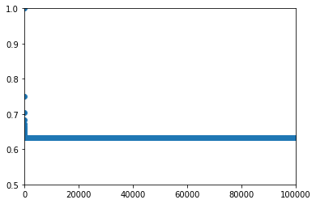
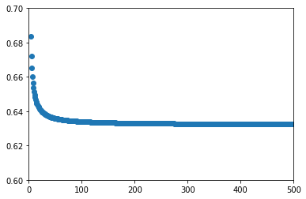
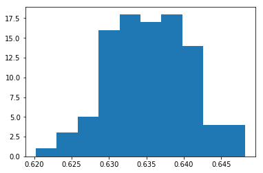

# Exercise 5.2

To solve this exercise, it is important to remember that bootstrap samples have <b>replacement</b>.

# (a)

The probability that the first bootstrap observation is not the jth observation is:

$$\frac{n-1}{n}.$$

Why? Since all observations have the same chance of being chosen (equiprobable events), the probability we are looking for is just the number of favorable cases dividing by the total number of possible cases. That is, $n-1$ observations other than the $j$th observation dividing by the $n$ total observations.

# (b)

The probability that the second bootstrap observation is not the jth observation is also:

$$\frac{n-1}{n}$$

Since we sample with replacement, everything stays the same as in (a). So, when we go for the second bootstrap observation, our set of observations is composed by all the initial observations. Thus, from *n* possible observations, *n-1* observations correspond to the probability that we want to compute (probability that the second observation is not the jth observation).

# (c)

We already saw that the probability of *not* taking the jth observation is $\frac{n-1}{n}$. Now, we want to the probability of not having the jth observation in the boostrap sample. In other words, we are saying that we don't get the jth observation in the first boostrap observation, nor in the second, nor in the third and so one.

Crucially, these events are independent. That is, the probability of picking the $j$th observation in, say, the second observation does not depend on whether it was chosen on the first, and so on. This means, we need only multiply the probabilities of all events. Let's consider that our boostrap sample has size equal to the number of observations *n*. If so, the probability of *not* taking the jth observation is:

$$ (\frac{n-1}{n})_1 \times (\frac{n-1}{n})_2 \times \ldots \times (\frac{n-1}{n})_n = \left(\frac{n-1}{n}\right)^n  = \left(1 - \frac{1}{n}\right)^n $$

# (d)

Having the $j$th observation in the bootstrap sample is the complementary event of *not* having the jth observation in any of the bootstrap samples. 
This means, that the probabiliy of the $j$th observation *being in the bootstrap sample* (*Pr(in)*) is one minus the probability of *not being in the bootstrap sample* (*Pr(out)*).

Using the general expression deducted in (c) and considering that $n = 5$, it follows that:

$$ Pr(in) = 1 - Pr(out) = 1 - \left(1-\frac{1}{5}\right)^5 \approx 0.67232.$$


# (e)

This exercise is similar to (d), the only difference is that now we have $n=100$. Applying the same reasoning as before:

$$ Pr(in) = 1 - Pr(out) = 1 - \left(1-\frac{1}{100}\right)^{100} \approx 0.63397. $$

# (f)

Similar to (d) and (e):

$$ Pr(in) = 1 - Pr(out)  = 1 - \left(1- \frac{1}{10000}\right)^{10000}  \approx 0.63231 $$

# (g)


```python
import matplotlib.pyplot as plt

%matplotlib inline


n = 100000   # Number of observations
prob = [1 - (1-1/n)**n for n in range(1, n)]

plt.scatter(range(1,n),prob);
plt.xlim(0, n);
plt.ylim(.5,1);
```





As we can see, the first point has probability equal to one, which makes sense because if we only have on observation it must be in the bootstrap sample.
After, the probability starts decreasing until it reaches a plateau close to the value 0.63.

The limit of the probability when $n$ goes to infinity is well known:

$$ \lim_{n\to\infty} 1-\left(\frac{n-1}{n}\right)^n \Leftrightarrow 1 -  \lim_{n\to\infty} \left(1-\frac{1}{n}\right)^n = 1 - e^{-1} \approx 1 - 0.36788 = 0.63212.$$

Let's try zooming in the plot above for smaller values of $n$ so we can better observe the approach to the asymptote.


```python
n = 500   # Number of observations
prob = [1 - (1-1/n)**n for n in range(1, n)]

plt.scatter(range(1,n),prob);
plt.xlim(0, n);
plt.ylim(.6,.7);
```





# (h)

From (e) we know this value is approximately 0.63397.

Since we are solving it in Python, we will adapt the code proposed in the statement of the exercise.


```python
import random

n = 100
N = 10000
count = 0

for _ in range(N):
    # True equals 1 in Python
    # choices(l, k=k) takes k samples from the list l with replacement
    count += 4 in random.choices(range(1,n+1), k=n) 
    
print(count/N)
```

    0.6316


As expected, the value found is close to 0.63397, the value given by the formula. But it is an underestimate.
If we repeat the calculation several times, we would expect approximately half the estimates to be an underestimate, and the other half to be an overestimate.
Let's try it.
So, for fun, we redo the calculation above a few more times (now with numpy) and do confirm this from the histogram below.


```python
import numpy as np
x = []

for i in range(100):
    # https://stackoverflow.com/questions/367565/how-do-i-build-a-numpy-array-from-a-generator
    a = np.fromiter((4 in np.random.choice(100, 100, replace=True) for _ in range(N)), dtype=bool)
    x.append(np.mean(a)) 
    
plt.hist(x)
```


    (array([  1.,   3.,   5.,  16.,  18.,  17.,  18.,  14.,   4.,   4.]),
     array([ 0.6202,  0.623 ,  0.6258,  0.6286,  0.6314,  0.6342,  0.637 ,
             0.6398,  0.6426,  0.6454,  0.6482]),
     <a list of 10 Patch objects>)




