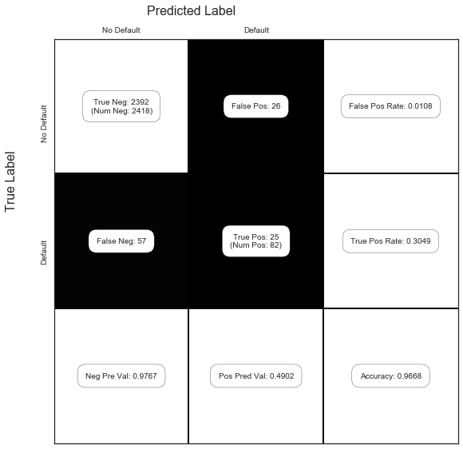

# Exercise 5.5


```python
import pandas as pd
import numpy as np
import patsy
import seaborn as sns
import matplotlib.pyplot as plt

import statsmodels.formula.api as smf
from sklearn.model_selection import train_test_split
from sklearn.linear_model import LogisticRegression
from sklearn.metrics import confusion_matrix

# statsmodels issue: https://github.com/statsmodels/statsmodels/issues/3931
from scipy import stats
stats.chisqprob = lambda chisq, df: stats.chi2.sf(chisq, df)

sns.set(style="white")
%matplotlib inline
```


```python
np.random.seed(1)

df = pd.read_csv("../data/Default.csv", index_col=0)

df['default_yes'] = (df['default'] == 'Yes').astype('int')
df.head()
```


<div>
<style scoped>
    .dataframe tbody tr th:only-of-type {
        vertical-align: middle;
    }

    .dataframe tbody tr th {
        vertical-align: top;
    }

    .dataframe thead th {
        text-align: right;
    }
</style>
<table border="1" class="dataframe">
  <thead>
    <tr style="text-align: right;">
      <th></th>
      <th>default</th>
      <th>student</th>
      <th>balance</th>
      <th>income</th>
      <th>default_yes</th>
    </tr>
  </thead>
  <tbody>
    <tr>
      <th>1</th>
      <td>No</td>
      <td>No</td>
      <td>729.526495</td>
      <td>44361.625074</td>
      <td>0</td>
    </tr>
    <tr>
      <th>2</th>
      <td>No</td>
      <td>Yes</td>
      <td>817.180407</td>
      <td>12106.134700</td>
      <td>0</td>
    </tr>
    <tr>
      <th>3</th>
      <td>No</td>
      <td>No</td>
      <td>1073.549164</td>
      <td>31767.138947</td>
      <td>0</td>
    </tr>
    <tr>
      <th>4</th>
      <td>No</td>
      <td>No</td>
      <td>529.250605</td>
      <td>35704.493935</td>
      <td>0</td>
    </tr>
    <tr>
      <th>5</th>
      <td>No</td>
      <td>No</td>
      <td>785.655883</td>
      <td>38463.495879</td>
      <td>0</td>
    </tr>
  </tbody>
</table>
</div>


```python
df.info()
```

    <class 'pandas.core.frame.DataFrame'>
    Int64Index: 10000 entries, 1 to 10000
    Data columns (total 5 columns):
    default        10000 non-null object
    student        10000 non-null object
    balance        10000 non-null float64
    income         10000 non-null float64
    default_yes    10000 non-null int64
    dtypes: float64(2), int64(1), object(2)
    memory usage: 468.8+ KB


## (a)

We are looking for LogisticRegression without regularization. In sklearn this is not implemented, but we can use l2 regularization and set C, the inverese strenght, to a very high number, effectively removing the regularization. We also compare the coefficients to the ones obtained from statsmodel LogisticRegression which has no regularization, and we verify that the coefficient estimates match.

Another parameter we have to consider is the tolerance. In this case, the default 1e-4 is not enough to reach convergence, so we increased it until it did.

Below we that the coefficients obtained with sklearn agree with those from statsmodels.


```python
lr = LogisticRegression(C=10**6, tol=1e-6)
X = df[['income', 'balance']]
y = df['default_yes']
mod = lr.fit(X, y)
mod.coef_
```


    array([[  2.07267113e-05,   5.64079143e-03]])


```python
f = 'default_yes ~ income + balance'
res = smf.logit(formula=f, data=df).fit()
res.summary()
```

    Optimization terminated successfully.
             Current function value: 0.078948
             Iterations 10


<table class="simpletable">
<caption>Logit Regression Results</caption>
<tr>
  <th>Dep. Variable:</th>    <td>default_yes</td>   <th>  No. Observations:  </th>   <td> 10000</td>  
</tr>
<tr>
  <th>Model:</th>               <td>Logit</td>      <th>  Df Residuals:      </th>   <td>  9997</td>  
</tr>
<tr>
  <th>Method:</th>               <td>MLE</td>       <th>  Df Model:          </th>   <td>     2</td>  
</tr>
<tr>
  <th>Date:</th>          <td>Fri, 05 Jan 2018</td> <th>  Pseudo R-squ.:     </th>   <td>0.4594</td>  
</tr>
<tr>
  <th>Time:</th>              <td>16:05:52</td>     <th>  Log-Likelihood:    </th>  <td> -789.48</td> 
</tr>
<tr>
  <th>converged:</th>           <td>True</td>       <th>  LL-Null:           </th>  <td> -1460.3</td> 
</tr>
<tr>
  <th> </th>                      <td> </td>        <th>  LLR p-value:       </th> <td>4.541e-292</td>
</tr>
</table>
<table class="simpletable">
<tr>
      <td></td>         <th>coef</th>     <th>std err</th>      <th>z</th>      <th>P>|z|</th>  <th>[0.025</th>    <th>0.975]</th>  
</tr>
<tr>
  <th>Intercept</th> <td>  -11.5405</td> <td>    0.435</td> <td>  -26.544</td> <td> 0.000</td> <td>  -12.393</td> <td>  -10.688</td>
</tr>
<tr>
  <th>income</th>    <td> 2.081e-05</td> <td> 4.99e-06</td> <td>    4.174</td> <td> 0.000</td> <td>  1.1e-05</td> <td> 3.06e-05</td>
</tr>
<tr>
  <th>balance</th>   <td>    0.0056</td> <td>    0.000</td> <td>   24.835</td> <td> 0.000</td> <td>    0.005</td> <td>    0.006</td>
</tr>
</table>


## (b)

## i.


```python
X_train, X_test, y_train, y_test = train_test_split(X, y, test_size=0.5)
```

## ii.


```python
mod = lr.fit(X_train, y_train)
mod.coef_
```


    array([[  1.62553551e-05,   5.83500517e-03]])


## iii.

Let's try to plot this region and boundary. For more info on how to draw the boundary for logistic regression, here's [two](https://stackoverflow.com/a/28257799) [answers](https://stackoverflow.com/a/22356551) by Michael Waskom, the creator of seaborn, and you can also see Jake VanderPlas' [book](https://jakevdp.github.io/PythonDataScienceHandbook/04.04-density-and-contour-plots.html) for an introduction to contour plots in general.


```python
xx, yy = np.mgrid[0:80000:100, -100:3000:10]
grid = np.c_[xx.ravel(), yy.ravel()]                    # https://www.quora.com/Can-anybody-elaborate-the-use-of-c_-in-numpy
probs = mod.predict_proba(grid)[:, 1].reshape(xx.shape)
```


```python
f, ax = plt.subplots(figsize=(8,6))
contour = ax.contourf(xx, yy, probs, 25, cmap="RdBu",    # 25 levels
                     vmin=0, vmax=1)
ax_c = f.colorbar(contour)
ax_c.set_label("P(default)")
ax_c.set_ticks([0,0.25,0.5,.75,1])

ax.scatter(X_test['income'], X_test['balance'], c=y_test, s=50, 
          cmap="RdBu", vmin=-0.2, vmax=1.2,
          edgecolor="white", linewidth=1)

ax.set(xlabel="income", ylabel="balance");
```


## iv.


```python
y_pred = mod.predict(X_test)
1-(y_pred == y_test).mean()
```


    0.025000000000000022


So our general test error is 2.5%.

But from the figure above, it seems that the error rates are very different depending on whether we are considering a positive or a negative.
Let's have a look at the [confusion matrix](https://en.wikipedia.org/wiki/Confusion_matrix) as well (page 145 of ISLR). 
The function show_confusion_matrix() we use below is from [this blog post](http://notmatthancock.github.io/2015/10/28/confusion-matrix.html) by Matt Hancock (with a slight modification).


```python
def show_confusion_matrix(C,class_labels=['0','1']):
    """
    C: ndarray, shape (2,2) as given by scikit-learn confusion_matrix function
    class_labels: list of strings, default simply labels 0 and 1.

    Draws confusion matrix with associated metrics.
    """
    import matplotlib.pyplot as plt
    import numpy as np
    
    assert C.shape == (2,2), "Confusion matrix should be from binary classification only."
    
    # true negative, false positive, etc...
    tn = C[0,0]; fp = C[0,1]; fn = C[1,0]; tp = C[1,1];

    NP = fn+tp # Num positive examples
    NN = tn+fp # Num negative examples
    N  = NP+NN

    fig = plt.figure(figsize=(8,8))
    ax  = fig.add_subplot(111)
    ax.imshow(C, interpolation='nearest', cmap=plt.cm.gray)

    # Draw the grid boxes
    ax.set_xlim(-0.5,2.5)
    ax.set_ylim(2.5,-0.5)
    ax.plot([-0.5,2.5],[0.5,0.5], '-k', lw=2)
    ax.plot([-0.5,2.5],[1.5,1.5], '-k', lw=2)
    ax.plot([0.5,0.5],[-0.5,2.5], '-k', lw=2)
    ax.plot([1.5,1.5],[-0.5,2.5], '-k', lw=2)

    # Set xlabels
    ax.set_xlabel('Predicted Label', fontsize=16)
    ax.set_xticks([0,1,2])
    ax.set_xticklabels(class_labels + [''])
    ax.xaxis.set_label_position('top')
    ax.xaxis.tick_top()
    # These coordinate might require some tinkering. Ditto for y, below.
    ax.xaxis.set_label_coords(0.34,1.06)

    # Set ylabels
    ax.set_ylabel('True Label', fontsize=16, rotation=90)
    ax.set_yticklabels(class_labels + [''],rotation=90)
    ax.set_yticks([0,1,2])
    ax.yaxis.set_label_coords(-0.09,0.65)


    # Fill in initial metrics: tp, tn, etc...
    ax.text(0,0,
            'True Neg: %d\n(Num Neg: %d)'%(tn,NN),
            va='center',
            ha='center',
            bbox=dict(fc='w',boxstyle='round,pad=1'))

    ax.text(0,1,
            'False Neg: %d'%fn,
            va='center',
            ha='center',
            bbox=dict(fc='w',boxstyle='round,pad=1'))

    ax.text(1,0,
            'False Pos: %d'%fp,
            va='center',
            ha='center',
            bbox=dict(fc='w',boxstyle='round,pad=1'))


    ax.text(1,1,
            'True Pos: %d\n(Num Pos: %d)'%(tp,NP),
            va='center',
            ha='center',
            bbox=dict(fc='w',boxstyle='round,pad=1'))

    # Fill in secondary metrics: accuracy, true pos rate, etc...
    ax.text(2,0,
            'False Pos Rate: %.4f'%(fp / (fp+tn+0.)),
            va='center',
            ha='center',
            bbox=dict(fc='w',boxstyle='round,pad=1'))

    ax.text(2,1,
            'True Pos Rate: %.4f'%(tp / (tp+fn+0.)),
            va='center',
            ha='center',
            bbox=dict(fc='w',boxstyle='round,pad=1'))

    ax.text(2,2,
            'Accuracy: %.4f'%((tp+tn+0.)/N),
            va='center',
            ha='center',
            bbox=dict(fc='w',boxstyle='round,pad=1'))

    ax.text(0,2,
            'Neg Pre Val: %.4f'%(1-fn/(fn+tn+0.)),
            va='center',
            ha='center',
            bbox=dict(fc='w',boxstyle='round,pad=1'))

    ax.text(1,2,
            'Pos Pred Val: %.4f'%(tp/(tp+fp+0.)),
            va='center',
            ha='center',
            bbox=dict(fc='w',boxstyle='round,pad=1'))


    plt.tight_layout()
    plt.show()
```


```python
C = confusion_matrix(y_test, y_pred)
show_confusion_matrix(C, ['No Default', 'Default'])
```


Recall the definitions used in the [confusion matrix](https://en.wikipedia.org/wiki/Confusion_matrix) above:
* P - condition positive (the number of real positive cases in the data)
* N - condition negative (the number of real negative cases in the data)
* TP - true positive (hit)
* TN - true negative (correct rejection)
* FP - false positive (false alarm, Type I error)
* FN - false negative (miss, Type II error)
* True positive rate, TPR = $\frac{TP}{P} = \frac{TP}{TP + FN}$
* False positive rate, FPR = $\frac{FP}{N} = \frac{FP}{FP + TN}$
* Positive predictive value, PPV = $\frac{TP}{TP + FP}$
* Negative predictive value, NPV = $\frac{TN}{TN + FN}$
* Accuracy, ACC = $\frac{TP + TN}{P+N} = \frac{TP+TN}{TP+TN+FP+FN}$

So, our true positive rate (or sensitivity, recall or hit rate) is 0.3648, our false positive rate (or fall-out) is 0.0050, our positive predictive value (or precision) is 0.7073, our negative predictive value is 0.9795, and our accuracy is 0.9750.

## (c)

Let's keep a vector of the confusion matrices, and compute the different errors for each validation set. 


```python
C = [C]
```


```python
for i in range(1,4):
    X_train, X_test, y_train, y_test = train_test_split(X, y, test_size=0.5)
    mod = lr.fit(X_train, y_train)
    y_pred = mod.predict(X_test)
    C.append(confusion_matrix(y_test, y_pred))
```


```python
tpr, fpr, ppv, npv, acc = ([] for i in range(5))

for c in C:
    tn = c[0,0] 
    fp = c[0,1]
    fn = c[1,0]
    tp = c[1,1]
    tpr.append((tp / (tp+fn+0.)))
    fpr.append((fp / (fp+tn+0.)))
    ppv.append((tp/(tp+fp+0.)))
    npv.append((1-fn/(fn+tn+0.)))
    acc.append(((tp+tn+0.)/(tn+fp+fn+tp)))
```


```python
def line(l):
    return " ".join( '{:06.4f}'.format(a) for a in l) + ', Average: ' +'{:06.4f}'.format(sum(l)/ len(l))
    
print('TPR: ')
print(line(tpr))
print('FPR: ')
print(line(fpr))
print('PPV: ')
print(line(ppv))
print('NPV: ')
print(line(npv))
print('ACC: ')
print(line(acc))
```

    TPR: 
    0.3648 0.3452 0.3030 0.3293, Average: 0.3356
    FPR: 
    0.0050 0.0029 0.0041 0.0029, Average: 0.0037
    PPV: 
    0.7073 0.8056 0.7143 0.7941, Average: 0.7553
    NPV: 
    0.9795 0.9777 0.9767 0.9777, Average: 0.9779
    ACC: 
    0.9750 0.9752 0.9730 0.9752, Average: 0.9746


The values above indicate that some quantities vary more than others when we change the validation set. In particular, the positive predicted value (PPV) varies from 0.71 to 0.81. The PPV is the ratio of the true positives over the sum of the true positives and false positives. In other words, it's a ratio involving the quantities above the boundary in the region above. And since both these quantities vary significantly in this case, the variance of the PPV is expected. The accuracy on the other handle is much more robust across different validation sets, for the opposite reason. The quantities involved in its computation do not vary as much. The denominator is a constant, and the numerator, TP + TN, is somewhat stable, since TP and TN would on average vary in opposite directions.

## (d)


```python
df['student_yes'] = (df['student'] == 'Yes').astype('int')
```


```python
df.head()
```


<div>
<style scoped>
    .dataframe tbody tr th:only-of-type {
        vertical-align: middle;
    }

    .dataframe tbody tr th {
        vertical-align: top;
    }

    .dataframe thead th {
        text-align: right;
    }
</style>
<table border="1" class="dataframe">
  <thead>
    <tr style="text-align: right;">
      <th></th>
      <th>default</th>
      <th>student</th>
      <th>balance</th>
      <th>income</th>
      <th>default_yes</th>
      <th>student_yes</th>
    </tr>
  </thead>
  <tbody>
    <tr>
      <th>1</th>
      <td>No</td>
      <td>No</td>
      <td>729.526495</td>
      <td>44361.625074</td>
      <td>0</td>
      <td>0</td>
    </tr>
    <tr>
      <th>2</th>
      <td>No</td>
      <td>Yes</td>
      <td>817.180407</td>
      <td>12106.134700</td>
      <td>0</td>
      <td>1</td>
    </tr>
    <tr>
      <th>3</th>
      <td>No</td>
      <td>No</td>
      <td>1073.549164</td>
      <td>31767.138947</td>
      <td>0</td>
      <td>0</td>
    </tr>
    <tr>
      <th>4</th>
      <td>No</td>
      <td>No</td>
      <td>529.250605</td>
      <td>35704.493935</td>
      <td>0</td>
      <td>0</td>
    </tr>
    <tr>
      <th>5</th>
      <td>No</td>
      <td>No</td>
      <td>785.655883</td>
      <td>38463.495879</td>
      <td>0</td>
      <td>0</td>
    </tr>
  </tbody>
</table>
</div>


```python
X = df[['income','balance','student_yes']]
y = df['default_yes']

f = 'default_yes ~ income + balance + student_yes'

X_train, X_test, y_train, y_test = train_test_split(X, y)
train = X_train.join(y_train)


res = smf.logit(formula=f, data=train).fit()
res.summary()
```

    Optimization terminated successfully.
             Current function value: 0.076250
             Iterations 10


<table class="simpletable">
<caption>Logit Regression Results</caption>
<tr>
  <th>Dep. Variable:</th>    <td>default_yes</td>   <th>  No. Observations:  </th>   <td>  7500</td>  
</tr>
<tr>
  <th>Model:</th>               <td>Logit</td>      <th>  Df Residuals:      </th>   <td>  7496</td>  
</tr>
<tr>
  <th>Method:</th>               <td>MLE</td>       <th>  Df Model:          </th>   <td>     3</td>  
</tr>
<tr>
  <th>Date:</th>          <td>Fri, 05 Jan 2018</td> <th>  Pseudo R-squ.:     </th>   <td>0.4799</td>  
</tr>
<tr>
  <th>Time:</th>              <td>16:07:39</td>     <th>  Log-Likelihood:    </th>  <td> -571.88</td> 
</tr>
<tr>
  <th>converged:</th>           <td>True</td>       <th>  LL-Null:           </th>  <td> -1099.5</td> 
</tr>
<tr>
  <th> </th>                      <td> </td>        <th>  LLR p-value:       </th> <td>1.954e-228</td>
</tr>
</table>
<table class="simpletable">
<tr>
       <td></td>          <th>coef</th>     <th>std err</th>      <th>z</th>      <th>P>|z|</th>  <th>[0.025</th>    <th>0.975]</th>  
</tr>
<tr>
  <th>Intercept</th>   <td>  -10.9255</td> <td>    0.579</td> <td>  -18.873</td> <td> 0.000</td> <td>  -12.060</td> <td>   -9.791</td>
</tr>
<tr>
  <th>income</th>      <td>-6.764e-06</td> <td>  9.4e-06</td> <td>   -0.720</td> <td> 0.472</td> <td>-2.52e-05</td> <td> 1.17e-05</td>
</tr>
<tr>
  <th>balance</th>     <td>    0.0061</td> <td>    0.000</td> <td>   21.174</td> <td> 0.000</td> <td>    0.006</td> <td>    0.007</td>
</tr>
<tr>
  <th>student_yes</th> <td>   -1.0870</td> <td>    0.274</td> <td>   -3.961</td> <td> 0.000</td> <td>   -1.625</td> <td>   -0.549</td>
</tr>
</table>


```python
y_pred = (res.predict(X_test) > .5) * 1
```


```python
C = confusion_matrix(y_test, y_pred)
show_confusion_matrix(C, ['No Default', 'Default'])
```





So compared to the values above without the student dummy variable, it seems that adding the student variable does not help in any of the metrics since they are worse or very similar (although we should consider the variance, in a more careful analysis).  
