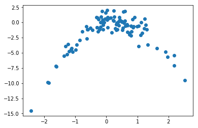

# Exercise 5.8


```python
import pandas as pd
import numpy as np
import math
import matplotlib.pyplot as plt
from sklearn.model_selection import LeaveOneOut  # To use cross-validation in (c); only available after scikit v0.17.1
from sklearn.linear_model import LinearRegression
from sklearn.preprocessing import PolynomialFeatures
from sklearn.pipeline import Pipeline
from sklearn.metrics import mean_squared_error
import statsmodels.api as sm  # To fit models using least squares

%matplotlib inline
```

# (a)


```python
np.random.seed(1)  # Random numbers generated by Python are different from those generated by R, as mentioned in Exercise 3.11

y = np.random.normal(size=100)  # By default np.random.normal considers a standard normal, so we just have to define the size
x = np.random.normal(size=100)
epsilon = np.random.normal(size=100)

y = x - 2 * x**2 + epsilon
```

<b>n</b> = number of observations = 100

<b>p</b> = number of predictors = 2 (X and X^2)

Model in equation form:
$$Y = X - 2 X^{2} + \epsilon$$

# (b)


```python
plt.scatter(x, y);
```





<b>Comments</b>:

* Quadratic plot
* Convex function with negative concavity
* X from about -2 to 2
* Y from about -10 to 2

# (c)


```python
# Set new random seed
np.random.seed(5)
```


```python
# Create LOOCV object
loo = LeaveOneOut()
```


```python
# Organize data into a dataframe (easier to handle)
df = pd.DataFrame({'x':x, 'y':y})
```


```python
# Initiate variables
min_deg = 1  # Minimum degree of the polynomial equations considered
max_deg = 4+1  # Maximum degree of the polynomial equations considered
scores = []

# Compute mean squared error (MSE) for the different polynomial equations.
for i in range(min_deg, max_deg):
    # Leave-one-out cross validation 
    for train, test in loo.split(df):
        X_train = df['x'][train]
        y_train = df['y'][train]
        X_test = df['x'][test]
        y_test = df['y'][test]
        
        # Pipeline
        model = Pipeline([('poly', PolynomialFeatures(degree = i)),
                      ('linear', LinearRegression())])
        model.fit(X_train[:,np.newaxis], y_train)
        
        # MSE
        score = mean_squared_error(y_test, model.predict(X_test[:,np.newaxis]))
        scores.append(score)
    print('Model %i (MSE): %f' % (i,np.mean(scores)))
    scores = []
```

    /Users/disciplina/anaconda3/envs/islp/lib/python3.6/site-packages/scipy/linalg/basic.py:1226: RuntimeWarning: internal gelsd driver lwork query error, required iwork dimension not returned. This is likely the result of LAPACK bug 0038, fixed in LAPACK 3.2.2 (released July 21, 2010). Falling back to 'gelss' driver.
      warnings.warn(mesg, RuntimeWarning)


    Model 1 (MSE): 8.292212
    Model 2 (MSE): 1.017096
    Model 3 (MSE): 1.046553
    Model 4 (MSE): 1.057493


# (d)


```python
# Set new random seed
np.random.seed(10)
```


```python
# Compute MSE as in (c)
min_deg = 1  
max_deg = 4+1 
scores = []

for i in range(min_deg, max_deg):
    for train, test in loo.split(df):
        X_train = df['x'][train]
        y_train = df['y'][train]
        X_test = df['x'][test]
        y_test = df['y'][test]
        
        model = Pipeline([('poly', PolynomialFeatures(degree = i)),
                      ('linear', LinearRegression())])
        model.fit(X_train[:,np.newaxis], y_train)
        
        score = mean_squared_error(y_test, model.predict(X_test[:,np.newaxis]))
        scores.append(score)
    print('Model %i (MSE): %f' % (i,np.mean(scores)))
    scores = []
```

    Model 1 (MSE): 8.292212
    Model 2 (MSE): 1.017096
    Model 3 (MSE): 1.046553
    Model 4 (MSE): 1.057493


The results are <b>exactly the same</b> because we only remove one observation from the training set. Thus, there is no random effect resulting from the observations used for the test set. LOOCV will always be the same, no matter the random seed.

# (e)

The model that had the smallest LOOCV error was <b>model (ii)</b>. This was an expected result because model (ii) has the same form as y (second order polynomial).

<b>Comment:</b> If we used *np.random.seed(0)* instead of *np.random.seed(1)* or *np.random.seed(10)*, the answer to the problem would be different. Using *seed(0)*, the epsilon values are proportional higher to the remaining values in the y equation. Thus, its influence is greater and the random effect prevails over the second order parameters y. We didn't try what happens for other seed values, but there may be other seed values that produce a similar effect to *seed(0)*.

# (f)


```python
# Models with polynomial features
min_deg = 1  
max_deg = 4+1 

for i in range(min_deg, max_deg):
    pol = PolynomialFeatures(degree = i)
    X_pol = pol.fit_transform(df['x'][:,np.newaxis])
    y = df['y']
    
    model = sm.OLS(y, X_pol)
    results = model.fit()
    
    print(results.summary())  
```

                                OLS Regression Results                            
    ==============================================================================
    Dep. Variable:                      y   R-squared:                       0.088
    Model:                            OLS   Adj. R-squared:                  0.079
    Method:                 Least Squares   F-statistic:                     9.460
    Date:                Fri, 05 Jan 2018   Prob (F-statistic):            0.00272
    Time:                        17:15:28   Log-Likelihood:                -242.69
    No. Observations:                 100   AIC:                             489.4
    Df Residuals:                      98   BIC:                             494.6
    Df Model:                           1                                         
    Covariance Type:            nonrobust                                         
    ==============================================================================
                     coef    std err          t      P>|t|      [0.025      0.975]
    ------------------------------------------------------------------------------
    const         -1.7609      0.280     -6.278      0.000      -2.317      -1.204
    x1             0.9134      0.297      3.076      0.003       0.324       1.503
    ==============================================================================
    Omnibus:                       40.887   Durbin-Watson:                   1.957
    Prob(Omnibus):                  0.000   Jarque-Bera (JB):               83.786
    Skew:                          -1.645   Prob(JB):                     6.40e-19
    Kurtosis:                       6.048   Cond. No.                         1.19
    ==============================================================================
    
    Warnings:
    [1] Standard Errors assume that the covariance matrix of the errors is correctly specified.
                                OLS Regression Results                            
    ==============================================================================
    Dep. Variable:                      y   R-squared:                       0.882
    Model:                            OLS   Adj. R-squared:                  0.880
    Method:                 Least Squares   F-statistic:                     362.9
    Date:                Fri, 05 Jan 2018   Prob (F-statistic):           9.26e-46
    Time:                        17:15:28   Log-Likelihood:                -140.40
    No. Observations:                 100   AIC:                             286.8
    Df Residuals:                      97   BIC:                             294.6
    Df Model:                           2                                         
    Covariance Type:            nonrobust                                         
    ==============================================================================
                     coef    std err          t      P>|t|      [0.025      0.975]
    ------------------------------------------------------------------------------
    const         -0.0216      0.122     -0.177      0.860      -0.264       0.221
    x1             1.2132      0.108     11.238      0.000       0.999       1.428
    x2            -2.0014      0.078    -25.561      0.000      -2.157      -1.846
    ==============================================================================
    Omnibus:                        0.094   Durbin-Watson:                   2.221
    Prob(Omnibus):                  0.954   Jarque-Bera (JB):                0.009
    Skew:                          -0.022   Prob(JB):                        0.995
    Kurtosis:                       2.987   Cond. No.                         2.26
    ==============================================================================
    
    Warnings:
    [1] Standard Errors assume that the covariance matrix of the errors is correctly specified.
                                OLS Regression Results                            
    ==============================================================================
    Dep. Variable:                      y   R-squared:                       0.883
    Model:                            OLS   Adj. R-squared:                  0.880
    Method:                 Least Squares   F-statistic:                     242.1
    Date:                Fri, 05 Jan 2018   Prob (F-statistic):           1.26e-44
    Time:                        17:15:28   Log-Likelihood:                -139.91
    No. Observations:                 100   AIC:                             287.8
    Df Residuals:                      96   BIC:                             298.2
    Df Model:                           3                                         
    Covariance Type:            nonrobust                                         
    ==============================================================================
                     coef    std err          t      P>|t|      [0.025      0.975]
    ------------------------------------------------------------------------------
    const          0.0046      0.125      0.037      0.971      -0.244       0.253
    x1             1.0639      0.189      5.636      0.000       0.689       1.439
    x2            -2.0215      0.081    -24.938      0.000      -2.182      -1.861
    x3             0.0550      0.057      0.965      0.337      -0.058       0.168
    ==============================================================================
    Omnibus:                        0.034   Durbin-Watson:                   2.253
    Prob(Omnibus):                  0.983   Jarque-Bera (JB):                0.050
    Skew:                           0.032   Prob(JB):                        0.975
    Kurtosis:                       2.911   Cond. No.                         6.55
    ==============================================================================
    
    Warnings:
    [1] Standard Errors assume that the covariance matrix of the errors is correctly specified.
                                OLS Regression Results                            
    ==============================================================================
    Dep. Variable:                      y   R-squared:                       0.885
    Model:                            OLS   Adj. R-squared:                  0.880
    Method:                 Least Squares   F-statistic:                     182.4
    Date:                Fri, 05 Jan 2018   Prob (F-statistic):           1.13e-43
    Time:                        17:15:28   Log-Likelihood:                -139.24
    No. Observations:                 100   AIC:                             288.5
    Df Residuals:                      95   BIC:                             301.5
    Df Model:                           4                                         
    Covariance Type:            nonrobust                                         
    ==============================================================================
                     coef    std err          t      P>|t|      [0.025      0.975]
    ------------------------------------------------------------------------------
    const          0.0866      0.144      0.600      0.550      -0.200       0.373
    x1             1.0834      0.189      5.724      0.000       0.708       1.459
    x2            -2.2455      0.214    -10.505      0.000      -2.670      -1.821
    x3             0.0436      0.058      0.755      0.452      -0.071       0.158
    x4             0.0482      0.043      1.132      0.260      -0.036       0.133
    ==============================================================================
    Omnibus:                        0.102   Durbin-Watson:                   2.214
    Prob(Omnibus):                  0.950   Jarque-Bera (JB):                0.117
    Skew:                           0.069   Prob(JB):                        0.943
    Kurtosis:                       2.906   Cond. No.                         17.5
    ==============================================================================
    
    Warnings:
    [1] Standard Errors assume that the covariance matrix of the errors is correctly specified.


To answer to the question, we should pay attention to the t-statistic value of each coefficient. 

As we can see, when we have a second order polynomial, both x1 and x2 have high t-statistic values. When we have a third order polynomial, x2 has the highest t-statistic, followed by x1 and then by x3. Finally, when we have a fourth order polynomial, x2 is the variable with the highest t-statistic, followed by x1, x4 and x3.

We can conclude that x2 and x1 are variables with relevance for the presented models. These results agree with the conclusions drawn based on the cross-validation results, showing that the first and second order terms are the most significant.

# References 
* https://github.com/scikit-learn/scikit-learn/issues/6161 (scikit.model_selection only available after 0.17.1)
* http://scikit-learn.org/stable/install.html (to install scikit)
* http://stats.stackexchange.com/questions/58739/polynomial-regression-using-scikit-learn (polynomial linear regression)
* http://stackoverflow.com/questions/29241056/the-use-of-python-numpy-newaxis  (use of np.newaxis)
* http://scikit-learn.org/stable/modules/linear_model.html#polynomial-regression-extending-linear-models-with-basis-functions  (about the use of pipeline)
