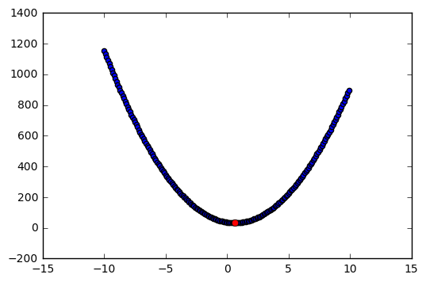
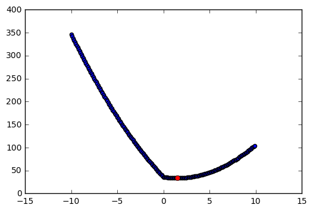
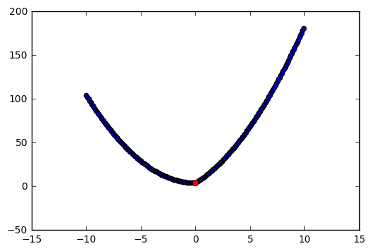

# Exercise 6.6


```python
import pandas as pd
import numpy as np
import matplotlib.pyplot as plt

%matplotlib inline
```

# (a)

For p = 1, (6.12) takes the form: $(y-\beta)^2 + \lambda \beta^2$.


```python
# Random variables
np.random.seed(1)
y1 = np.random.randint(low=1, high=10)
lamb = np.random.randint(low=1, high=10)
```


```python
# Functions
beta = np.arange(-10,10,.1)
y = (y1 - beta)**2 + lamb*beta**2 

min_beta = y1/(1+lamb)
y_min = (y1 - min_beta)**2 + lamb*min_beta**2 
```


```python
# Plot
plt.scatter(beta,y);
plt.plot(min_beta, y_min, 'ro');
```





As we can see, the point that corresponds to (6.14) solves (6.12). By other words, the point resulting from (6.14) is the point that minimizes the ridge regression.

# (b)

For p = 1, (6.12) takes the form: $(y-\beta)^2 + \lambda |\beta|$.


```python
# Case 1: y1 > lamb/2
y1 = 6
lamb = 4
```


```python
# Functions
beta = np.arange(-10,10,.1)
y = (y1 - beta)**2 + lamb*abs(beta)

min_beta = y1 - (lamb/2)
y_min = (y1 - min_beta)**2 + lamb*abs(min_beta)
```


```python
# Plot 
plt.scatter(beta,y)
plt.plot(min_beta, y_min, 'ro');
```





```python
# Case 1: y1 < -lamb/2
y1 = -6
lamb = 4
```


```python
# Functions
beta = np.arange(-10,10,.1)
y = (y1 - beta)**2 + lamb*abs(beta)

min_beta = y1 + (lamb/2)
y_min = (y1 - min_beta)**2 + lamb*abs(min_beta)
```


```python
# Plot 
plt.scatter(beta,y)
plt.plot(min_beta, y_min, 'ro');
```


```python
# Case 3: |y1| <= lamb/2
y1 = -2
lamb = 4
```


```python
# Functions
beta = np.arange(-10,10,.1)
y = (y1 - beta)**2 + lamb*abs(beta)

min_beta = 0
y_min = (y1 - min_beta)**2 + lamb*abs(min_beta)
```


```python
# Plot 
plt.scatter(beta,y)
plt.plot(min_beta, y_min, 'ro');
```





As we can see in the figures above, (6.13) is solved by (6.15). This means that (6.15) minimizes the lasso estimates.
