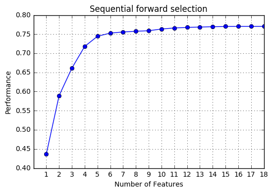

# Exercise 7.10


```python
import pandas as pd
import numpy as np
import matplotlib.pyplot as plt
from sklearn.model_selection import train_test_split
from sklearn.linear_model import LinearRegression
from mlxtend.feature_selection import SequentialFeatureSelector as SFS
from mlxtend.plotting import plot_sequential_feature_selection as plot_sfs

%matplotlib inline
```


```python
df = pd.read_csv('../data/College.csv', index_col=0)
```


```python
df.head()
```


<div>
<table border="1" class="dataframe">
  <thead>
    <tr style="text-align: right;">
      <th></th>
      <th>Private</th>
      <th>Apps</th>
      <th>Accept</th>
      <th>Enroll</th>
      <th>Top10perc</th>
      <th>Top25perc</th>
      <th>F.Undergrad</th>
      <th>P.Undergrad</th>
      <th>Outstate</th>
      <th>Room.Board</th>
      <th>Books</th>
      <th>Personal</th>
      <th>PhD</th>
      <th>Terminal</th>
      <th>S.F.Ratio</th>
      <th>perc.alumni</th>
      <th>Expend</th>
      <th>Grad.Rate</th>
    </tr>
  </thead>
  <tbody>
    <tr>
      <th>Abilene Christian University</th>
      <td>Yes</td>
      <td>1660</td>
      <td>1232</td>
      <td>721</td>
      <td>23</td>
      <td>52</td>
      <td>2885</td>
      <td>537</td>
      <td>7440</td>
      <td>3300</td>
      <td>450</td>
      <td>2200</td>
      <td>70</td>
      <td>78</td>
      <td>18.1</td>
      <td>12</td>
      <td>7041</td>
      <td>60</td>
    </tr>
    <tr>
      <th>Adelphi University</th>
      <td>Yes</td>
      <td>2186</td>
      <td>1924</td>
      <td>512</td>
      <td>16</td>
      <td>29</td>
      <td>2683</td>
      <td>1227</td>
      <td>12280</td>
      <td>6450</td>
      <td>750</td>
      <td>1500</td>
      <td>29</td>
      <td>30</td>
      <td>12.2</td>
      <td>16</td>
      <td>10527</td>
      <td>56</td>
    </tr>
    <tr>
      <th>Adrian College</th>
      <td>Yes</td>
      <td>1428</td>
      <td>1097</td>
      <td>336</td>
      <td>22</td>
      <td>50</td>
      <td>1036</td>
      <td>99</td>
      <td>11250</td>
      <td>3750</td>
      <td>400</td>
      <td>1165</td>
      <td>53</td>
      <td>66</td>
      <td>12.9</td>
      <td>30</td>
      <td>8735</td>
      <td>54</td>
    </tr>
    <tr>
      <th>Agnes Scott College</th>
      <td>Yes</td>
      <td>417</td>
      <td>349</td>
      <td>137</td>
      <td>60</td>
      <td>89</td>
      <td>510</td>
      <td>63</td>
      <td>12960</td>
      <td>5450</td>
      <td>450</td>
      <td>875</td>
      <td>92</td>
      <td>97</td>
      <td>7.7</td>
      <td>37</td>
      <td>19016</td>
      <td>59</td>
    </tr>
    <tr>
      <th>Alaska Pacific University</th>
      <td>Yes</td>
      <td>193</td>
      <td>146</td>
      <td>55</td>
      <td>16</td>
      <td>44</td>
      <td>249</td>
      <td>869</td>
      <td>7560</td>
      <td>4120</td>
      <td>800</td>
      <td>1500</td>
      <td>76</td>
      <td>72</td>
      <td>11.9</td>
      <td>2</td>
      <td>10922</td>
      <td>15</td>
    </tr>
  </tbody>
</table>
</div>


```python
# Dummy variables
# The feature 'Private' is categorical. In order to use it in our models, we need to use dummy variables.
df = pd.get_dummies(df)
```


```python
df.head()
```


<div>
<table border="1" class="dataframe">
  <thead>
    <tr style="text-align: right;">
      <th></th>
      <th>Apps</th>
      <th>Accept</th>
      <th>Enroll</th>
      <th>Top10perc</th>
      <th>Top25perc</th>
      <th>F.Undergrad</th>
      <th>P.Undergrad</th>
      <th>Outstate</th>
      <th>Room.Board</th>
      <th>Books</th>
      <th>Personal</th>
      <th>PhD</th>
      <th>Terminal</th>
      <th>S.F.Ratio</th>
      <th>perc.alumni</th>
      <th>Expend</th>
      <th>Grad.Rate</th>
      <th>Private_No</th>
      <th>Private_Yes</th>
    </tr>
  </thead>
  <tbody>
    <tr>
      <th>Abilene Christian University</th>
      <td>1660</td>
      <td>1232</td>
      <td>721</td>
      <td>23</td>
      <td>52</td>
      <td>2885</td>
      <td>537</td>
      <td>7440</td>
      <td>3300</td>
      <td>450</td>
      <td>2200</td>
      <td>70</td>
      <td>78</td>
      <td>18.1</td>
      <td>12</td>
      <td>7041</td>
      <td>60</td>
      <td>0.0</td>
      <td>1.0</td>
    </tr>
    <tr>
      <th>Adelphi University</th>
      <td>2186</td>
      <td>1924</td>
      <td>512</td>
      <td>16</td>
      <td>29</td>
      <td>2683</td>
      <td>1227</td>
      <td>12280</td>
      <td>6450</td>
      <td>750</td>
      <td>1500</td>
      <td>29</td>
      <td>30</td>
      <td>12.2</td>
      <td>16</td>
      <td>10527</td>
      <td>56</td>
      <td>0.0</td>
      <td>1.0</td>
    </tr>
    <tr>
      <th>Adrian College</th>
      <td>1428</td>
      <td>1097</td>
      <td>336</td>
      <td>22</td>
      <td>50</td>
      <td>1036</td>
      <td>99</td>
      <td>11250</td>
      <td>3750</td>
      <td>400</td>
      <td>1165</td>
      <td>53</td>
      <td>66</td>
      <td>12.9</td>
      <td>30</td>
      <td>8735</td>
      <td>54</td>
      <td>0.0</td>
      <td>1.0</td>
    </tr>
    <tr>
      <th>Agnes Scott College</th>
      <td>417</td>
      <td>349</td>
      <td>137</td>
      <td>60</td>
      <td>89</td>
      <td>510</td>
      <td>63</td>
      <td>12960</td>
      <td>5450</td>
      <td>450</td>
      <td>875</td>
      <td>92</td>
      <td>97</td>
      <td>7.7</td>
      <td>37</td>
      <td>19016</td>
      <td>59</td>
      <td>0.0</td>
      <td>1.0</td>
    </tr>
    <tr>
      <th>Alaska Pacific University</th>
      <td>193</td>
      <td>146</td>
      <td>55</td>
      <td>16</td>
      <td>44</td>
      <td>249</td>
      <td>869</td>
      <td>7560</td>
      <td>4120</td>
      <td>800</td>
      <td>1500</td>
      <td>76</td>
      <td>72</td>
      <td>11.9</td>
      <td>2</td>
      <td>10922</td>
      <td>15</td>
      <td>0.0</td>
      <td>1.0</td>
    </tr>
  </tbody>
</table>
</div>


# (a)


```python
# Dataset
X = df.ix[:, df.columns != 'Outstate']
y = df['Outstate']
```


```python
# Split into train and test subsets
X_train, X_test, y_train, y_test = train_test_split(X, y, test_size=.3, random_state=1)
```


```python
# Forward stepwise selection
lr = LinearRegression()

sfs = SFS(lr,
          k_features = 18,  # We have 18 features
          forward = True,
          floating = False,
          scoring = 'r2',
          cv = 0)

sfs = sfs.fit(X_train.as_matrix(), y_train)  # as_matrix() to be readable by sfs

fig = plot_sfs(sfs.get_metric_dict())

#plt.title('Sequential forward selection (w. StdDev)')
plt.title('Sequential forward selection')
plt.grid()
plt.show()
```

    c:\program files\anaconda3\lib\site-packages\numpy\core\_methods.py:82: RuntimeWarning: Degrees of freedom <= 0 for slice
      warnings.warn("Degrees of freedom <= 0 for slice", RuntimeWarning)





We will choose <b>6 features</b>. The figure shows that a larger number of features will not increase the performance significantly.


```python
# Visualizing the results in dataframes
pd.DataFrame.from_dict(sfs.get_metric_dict()).T
```

    c:\program files\anaconda3\lib\site-packages\numpy\core\_methods.py:82: RuntimeWarning: Degrees of freedom <= 0 for slice
      warnings.warn("Degrees of freedom <= 0 for slice", RuntimeWarning)


<div>
<table border="1" class="dataframe">
  <thead>
    <tr style="text-align: right;">
      <th></th>
      <th>avg_score</th>
      <th>ci_bound</th>
      <th>cv_scores</th>
      <th>feature_idx</th>
      <th>std_dev</th>
      <th>std_err</th>
    </tr>
  </thead>
  <tbody>
    <tr>
      <th>1</th>
      <td>0.43622</td>
      <td>NaN</td>
      <td>[0.436219807936]</td>
      <td>(7,)</td>
      <td>0</td>
      <td>NaN</td>
    </tr>
    <tr>
      <th>2</th>
      <td>0.589207</td>
      <td>NaN</td>
      <td>[0.589206513899]</td>
      <td>(13, 7)</td>
      <td>0</td>
      <td>NaN</td>
    </tr>
    <tr>
      <th>3</th>
      <td>0.661242</td>
      <td>NaN</td>
      <td>[0.661241618445]</td>
      <td>(13, 14, 7)</td>
      <td>0</td>
      <td>NaN</td>
    </tr>
    <tr>
      <th>4</th>
      <td>0.718047</td>
      <td>NaN</td>
      <td>[0.71804725948]</td>
      <td>(16, 13, 14, 7)</td>
      <td>0</td>
      <td>NaN</td>
    </tr>
    <tr>
      <th>5</th>
      <td>0.744539</td>
      <td>NaN</td>
      <td>[0.744538917009]</td>
      <td>(16, 10, 13, 14, 7)</td>
      <td>0</td>
      <td>NaN</td>
    </tr>
    <tr>
      <th>6</th>
      <td>0.75298</td>
      <td>NaN</td>
      <td>[0.752979718057]</td>
      <td>(16, 7, 10, 13, 14, 15)</td>
      <td>0</td>
      <td>NaN</td>
    </tr>
    <tr>
      <th>7</th>
      <td>0.755819</td>
      <td>NaN</td>
      <td>[0.755818691645]</td>
      <td>(16, 7, 9, 10, 13, 14, 15)</td>
      <td>0</td>
      <td>NaN</td>
    </tr>
    <tr>
      <th>8</th>
      <td>0.757751</td>
      <td>NaN</td>
      <td>[0.757750769449]</td>
      <td>(16, 4, 7, 9, 10, 13, 14, 15)</td>
      <td>0</td>
      <td>NaN</td>
    </tr>
    <tr>
      <th>9</th>
      <td>0.759088</td>
      <td>NaN</td>
      <td>[0.759088496118]</td>
      <td>(1, 4, 7, 9, 10, 13, 14, 15, 16)</td>
      <td>0</td>
      <td>NaN</td>
    </tr>
    <tr>
      <th>10</th>
      <td>0.763593</td>
      <td>NaN</td>
      <td>[0.763592832578]</td>
      <td>(0, 1, 4, 7, 9, 10, 13, 14, 15, 16)</td>
      <td>0</td>
      <td>NaN</td>
    </tr>
    <tr>
      <th>11</th>
      <td>0.766277</td>
      <td>NaN</td>
      <td>[0.766276542748]</td>
      <td>(0, 1, 2, 4, 7, 9, 10, 13, 14, 15, 16)</td>
      <td>0</td>
      <td>NaN</td>
    </tr>
    <tr>
      <th>12</th>
      <td>0.767782</td>
      <td>NaN</td>
      <td>[0.767781703908]</td>
      <td>(0, 1, 2, 3, 4, 7, 9, 10, 13, 14, 15, 16)</td>
      <td>0</td>
      <td>NaN</td>
    </tr>
    <tr>
      <th>13</th>
      <td>0.768725</td>
      <td>NaN</td>
      <td>[0.768724891242]</td>
      <td>(0, 1, 2, 3, 4, 7, 9, 10, 12, 13, 14, 15, 16)</td>
      <td>0</td>
      <td>NaN</td>
    </tr>
    <tr>
      <th>14</th>
      <td>0.769542</td>
      <td>NaN</td>
      <td>[0.769541795295]</td>
      <td>(0, 1, 2, 3, 4, 7, 9, 10, 11, 12, 13, 14, 15, 16)</td>
      <td>0</td>
      <td>NaN</td>
    </tr>
    <tr>
      <th>15</th>
      <td>0.77035</td>
      <td>NaN</td>
      <td>[0.770349525842]</td>
      <td>(0, 1, 2, 3, 4, 7, 8, 9, 10, 11, 12, 13, 14, 1...</td>
      <td>0</td>
      <td>NaN</td>
    </tr>
    <tr>
      <th>16</th>
      <td>0.770451</td>
      <td>NaN</td>
      <td>[0.770451018385]</td>
      <td>(0, 1, 2, 3, 4, 6, 7, 8, 9, 10, 11, 12, 13, 14...</td>
      <td>0</td>
      <td>NaN</td>
    </tr>
    <tr>
      <th>17</th>
      <td>0.770452</td>
      <td>NaN</td>
      <td>[0.770451587]</td>
      <td>(0, 1, 2, 3, 4, 5, 6, 7, 8, 9, 10, 11, 12, 13,...</td>
      <td>0</td>
      <td>NaN</td>
    </tr>
    <tr>
      <th>18</th>
      <td>0.770452</td>
      <td>NaN</td>
      <td>[0.770451587]</td>
      <td>(0, 1, 2, 3, 4, 5, 6, 7, 8, 9, 10, 11, 12, 13,...</td>
      <td>0</td>
      <td>NaN</td>
    </tr>
  </tbody>
</table>
</div>


```python
# Variables that we will choose
print('Variables: %s, %s, %s, %s, %s, %s' % (X.columns[16], X.columns[7], X.columns[10], X.columns[13], X.columns[14], X.columns[15]))
```

    Variables: Private_No, Room.Board, PhD, perc.alumni, Expend, Grad.Rate


# References

* https://github.com/dswah/pyGAM (GAM in Python)
* http://scikit-learn.org/stable/modules/generated/sklearn.model_selection.train_test_split.html (scikit train and test splits)
* http://rasbt.github.io/mlxtend/user_guide/feature_selection/SequentialFeatureSelector/ (mlxtend forward stepwise)
* https://github.com/rasbt/mlxtend/blob/master/mlxtend/plotting/plot_sequential_feature_selection.py (plot_sequential_feature_selection source)
* https://github.com/bsilverthorn/gampy/blob/master/src/python/gampy/backfit.py (GAM package???)
