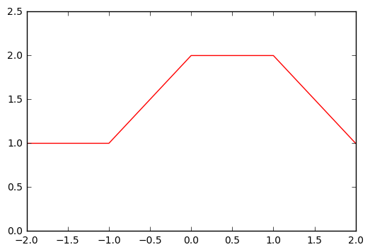

# Exercise 7.4


```python
import numpy as np
import matplotlib.pyplot as plt

%matplotlib inline
```

To solve this exercise, we just have to replace X in the expression. The main expression is:

$$Y =\beta_0 + \beta_1 b_1(X) + \beta_2 b_2(X) + \epsilon $$

where $\hat{\beta}_0 = 1$, $\hat{\beta}_1 = 1$ and $\hat{\beta}_2 = 3$. Accordingly, we get the expression:

$$Y = 1 + b_1(X) + 3 \times b_2(X) + \epsilon $$

Considering that $I(a \leq X \leq b) = 1$ as long as X is in the interval [a,b] (being zero otherwise), and since we are just estimating the curve between the interval [-2,2], our expression turns into:

$$Y = 1 + b_1(X) + \epsilon $$

At this point, we can make the necessary computations to solve the exercise:

* $X=-2 \implies Y = 1$
* $X=-1 \implies Y = 1$
* $X=0 \implies Y = 2$
* $X=1 \implies Y = 2$
* $X=2 \implies Y = 1$


```python
# Plot
x = np.arange(-2,3,1)
y = [1,1,2,2,1]


plt.xlim([-2,2])
plt.ylim([0,2.5])
plt.plot(x,y,'-r');
```


    [<matplotlib.lines.Line2D at 0x81007f0>]




