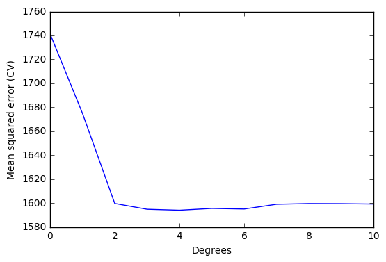
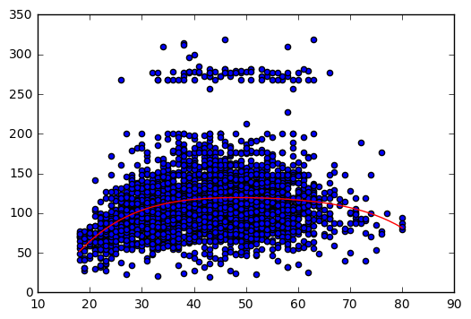

# Exercise 7.6


```python
import pandas as pd
import numpy as np
import matplotlib.pyplot as plt
import statsmodels.api as sm
import statsmodels.formula.api as smf
from sklearn.pipeline import Pipeline
from sklearn.linear_model import LinearRegression
from sklearn.preprocessing import PolynomialFeatures
from sklearn import metrics
from sklearn.model_selection import cross_val_score
from sklearn.feature_selection import f_regression

%matplotlib inline
```


```python
df = pd.read_csv('../data/Wage.csv', index_col=0)
```


```python
df.head()
```


<div>
<table border="1" class="dataframe">
  <thead>
    <tr style="text-align: right;">
      <th></th>
      <th>year</th>
      <th>age</th>
      <th>sex</th>
      <th>maritl</th>
      <th>race</th>
      <th>education</th>
      <th>region</th>
      <th>jobclass</th>
      <th>health</th>
      <th>health_ins</th>
      <th>logwage</th>
      <th>wage</th>
    </tr>
  </thead>
  <tbody>
    <tr>
      <th>231655</th>
      <td>2006</td>
      <td>18</td>
      <td>1. Male</td>
      <td>1. Never Married</td>
      <td>1. White</td>
      <td>1. &lt; HS Grad</td>
      <td>2. Middle Atlantic</td>
      <td>1. Industrial</td>
      <td>1. &lt;=Good</td>
      <td>2. No</td>
      <td>4.318063</td>
      <td>75.043154</td>
    </tr>
    <tr>
      <th>86582</th>
      <td>2004</td>
      <td>24</td>
      <td>1. Male</td>
      <td>1. Never Married</td>
      <td>1. White</td>
      <td>4. College Grad</td>
      <td>2. Middle Atlantic</td>
      <td>2. Information</td>
      <td>2. &gt;=Very Good</td>
      <td>2. No</td>
      <td>4.255273</td>
      <td>70.476020</td>
    </tr>
    <tr>
      <th>161300</th>
      <td>2003</td>
      <td>45</td>
      <td>1. Male</td>
      <td>2. Married</td>
      <td>1. White</td>
      <td>3. Some College</td>
      <td>2. Middle Atlantic</td>
      <td>1. Industrial</td>
      <td>1. &lt;=Good</td>
      <td>1. Yes</td>
      <td>4.875061</td>
      <td>130.982177</td>
    </tr>
    <tr>
      <th>155159</th>
      <td>2003</td>
      <td>43</td>
      <td>1. Male</td>
      <td>2. Married</td>
      <td>3. Asian</td>
      <td>4. College Grad</td>
      <td>2. Middle Atlantic</td>
      <td>2. Information</td>
      <td>2. &gt;=Very Good</td>
      <td>1. Yes</td>
      <td>5.041393</td>
      <td>154.685293</td>
    </tr>
    <tr>
      <th>11443</th>
      <td>2005</td>
      <td>50</td>
      <td>1. Male</td>
      <td>4. Divorced</td>
      <td>1. White</td>
      <td>2. HS Grad</td>
      <td>2. Middle Atlantic</td>
      <td>2. Information</td>
      <td>1. &lt;=Good</td>
      <td>1. Yes</td>
      <td>4.318063</td>
      <td>75.043154</td>
    </tr>
  </tbody>
</table>
</div>


# (a)


```python
# Model variables
y = df['wage'][:,np.newaxis]
X = df['age'][:,np.newaxis]
```


```python
# Compute regression models with different degrees
# Variable 'scores' saves mean squared errors resulting from the different degrees models.
# Cross validation is used
scores = []  
for i in range(0,11):
    model = Pipeline([('poly', PolynomialFeatures(degree=i)), ('linear', LinearRegression())])
    model.fit(X,y)
    
    score = cross_val_score(model, X, y, cv=5, scoring='neg_mean_squared_error')
    scores.append(np.mean(score))
    
scores = np.abs(scores)  # Scikit computes negative mean square errors, so we need to turn the values positive.
```


```python
# Plot errors
x_plot = np.arange(0,11)

plt.plot(x_plot, scores)
plt.ylabel('Mean squared error (CV)')
plt.xlabel('Degrees')
plt.xlim(0,10)
plt.show()
```





```python
# Print array element correspoding to the minimum mean squared error
# Element number = polynomial degree for minimum mean squared error
print(np.where(scores == np.min(scores)))
```

    (array([4], dtype=int64),)


Optimal degree *d* for the polynomial according to cross-validation: <b>4</b>

We will use *statsmodels* to perform the hypothesis testing using ANOVA. *Statsmodels* has a built-in function that simplifies our job and we didn't find an equivalent way of solving the problem with *scikit-learn*.


```python
# Fit polynomial models to use in statsmodels.
models=[]
for i in range(0,11):
    poly = PolynomialFeatures(degree=i)
    X_pol = poly.fit_transform(X)
    model = smf.GLS(y, X_pol).fit()
    models.append(model)
```


```python
# Hypothesis testing using ANOVA
sm.stats.anova_lm(models[0], models[1], models[2], models[3], models[4], models[5], models[6], typ=1)
```


<div>
<table border="1" class="dataframe">
  <thead>
    <tr style="text-align: right;">
      <th></th>
      <th>df_resid</th>
      <th>ssr</th>
      <th>df_diff</th>
      <th>ss_diff</th>
      <th>F</th>
      <th>Pr(&gt;F)</th>
    </tr>
  </thead>
  <tbody>
    <tr>
      <th>0</th>
      <td>2999.0</td>
      <td>5.222086e+06</td>
      <td>0.0</td>
      <td>NaN</td>
      <td>NaN</td>
      <td>NaN</td>
    </tr>
    <tr>
      <th>1</th>
      <td>2998.0</td>
      <td>5.022216e+06</td>
      <td>1.0</td>
      <td>199869.664970</td>
      <td>125.505882</td>
      <td>1.444930e-28</td>
    </tr>
    <tr>
      <th>2</th>
      <td>2997.0</td>
      <td>4.793430e+06</td>
      <td>1.0</td>
      <td>228786.010128</td>
      <td>143.663571</td>
      <td>2.285169e-32</td>
    </tr>
    <tr>
      <th>3</th>
      <td>2996.0</td>
      <td>4.777674e+06</td>
      <td>1.0</td>
      <td>15755.693664</td>
      <td>9.893609</td>
      <td>1.674794e-03</td>
    </tr>
    <tr>
      <th>4</th>
      <td>2995.0</td>
      <td>4.771604e+06</td>
      <td>1.0</td>
      <td>6070.152124</td>
      <td>3.811683</td>
      <td>5.098933e-02</td>
    </tr>
    <tr>
      <th>5</th>
      <td>2994.0</td>
      <td>4.770322e+06</td>
      <td>1.0</td>
      <td>1282.563017</td>
      <td>0.805371</td>
      <td>3.695646e-01</td>
    </tr>
    <tr>
      <th>6</th>
      <td>2993.0</td>
      <td>4.766389e+06</td>
      <td>1.0</td>
      <td>3932.257136</td>
      <td>2.469216</td>
      <td>1.162015e-01</td>
    </tr>
  </tbody>
</table>
</div>


The lower the values of F, the lower the significance of the coefficient. Degrees higher than 4 don't improve the polynomial regression model significantly. This results is in <b>agreement with cross validation results</b>.


```python
# Save optimal degree
opt_degree = 4
```


```python
# Plot polynomial regression
# Auxiliary variables X_line and y_line are created.
# These variables allow us to draw the polynomial regression.
# np.linspace() is used to create an ordered sequence of numbers. Then we can plot the polynomial regression.
model = Pipeline([('poly', PolynomialFeatures(degree = opt_degree)), ('linear', LinearRegression())])
model.fit(X,y)

X_lin = np.linspace(18,80)[:,np.newaxis]
y_lin = model.predict(X_lin)

plt.scatter(X,y)
plt.plot(X_lin, y_lin,'-r');
```





# (b)


```python
# Compute cross-validated errors of step function
'''
To define the step function, we need to cut the dataset into parts (pd.cut() does the job)
and associate a each part to a dummy variable. For example, if we have two parts (age<50
and age >= 50), we will have one dummy variable that gets value 1 if age<50 and value 0
if age>50.

Once we have the dataset in these conditions, we need to fit a linear regression to it.
The governing model will be defined by: y = b0 + b1 C1 + b2 C2 + ... + bn Cn, where
  b stands for the regression coefficient;
  C stands for the value of a dummy variable.

Using the same example as above, we have y = b0 + b1 C1, thus ...
'''
scores = []
for i in range(1,10):
    age_groups = pd.cut(df['age'], i)
    df_dummies = pd.get_dummies(age_groups)
    
    X_cv = df_dummies
    y_cv = df['wage']
    
    model.fit(X_cv, y_cv)
    score = cross_val_score(model, X_cv, y_cv, cv=5, scoring='neg_mean_squared_error')
    scores.append(score)

scores = np.abs(scores)  # Scikit computes negative mean square errors, so we need to turn the values positive.
```


```python
# Number of cuts that minimize the error
min_scores = []
for i in range(0,9):
    min_score = np.mean(scores[i,:])
    min_scores.append(min_score)
    
    print('Number of cuts: %i, error %.3f' % (i+1, min_score))
```

    Number of cuts: 1, error 1741.335
    Number of cuts: 2, error 1733.925
    Number of cuts: 3, error 1687.688
    Number of cuts: 4, error 1635.756
    Number of cuts: 5, error 1635.556
    Number of cuts: 6, error 1627.397
    Number of cuts: 7, error 1619.168
    Number of cuts: 8, error 1607.926
    Number of cuts: 9, error 1616.550


The number of cuts that minimize the error is <b>8</b>.


```python
# Plot
# The following code shows, step by step, how to plot the step function.
```


```python
# Convert ages to groups of age ranges
n_groups = 8
age_groups = pd.cut(df['age'], n_groups)
```


```python
# Dummy variables
# Dummy variables is a way to deal with categorical variables in linear regressions.
# It associates the value 1 to the group to which the variable belongs, and the value 0 to the remaining groups.
# For example, if age == 20, the (18,25] will have the value 1 while the group (25, 32] will have the value 0.
age_dummies = pd.get_dummies(age_groups)
```


```python
# Dataset for step function
# Add wage to the dummy dataset.
df_step = age_dummies.join(df['wage'])

df_step.head()  # Just to visualize the dataset with the specified number of cuts
```


<div>
<table border="1" class="dataframe">
  <thead>
    <tr style="text-align: right;">
      <th></th>
      <th>(17.938, 25.75]</th>
      <th>(25.75, 33.5]</th>
      <th>(33.5, 41.25]</th>
      <th>(41.25, 49]</th>
      <th>(49, 56.75]</th>
      <th>(56.75, 64.5]</th>
      <th>(64.5, 72.25]</th>
      <th>(72.25, 80]</th>
      <th>wage</th>
    </tr>
  </thead>
  <tbody>
    <tr>
      <th>231655</th>
      <td>1.0</td>
      <td>0.0</td>
      <td>0.0</td>
      <td>0.0</td>
      <td>0.0</td>
      <td>0.0</td>
      <td>0.0</td>
      <td>0.0</td>
      <td>75.043154</td>
    </tr>
    <tr>
      <th>86582</th>
      <td>1.0</td>
      <td>0.0</td>
      <td>0.0</td>
      <td>0.0</td>
      <td>0.0</td>
      <td>0.0</td>
      <td>0.0</td>
      <td>0.0</td>
      <td>70.476020</td>
    </tr>
    <tr>
      <th>161300</th>
      <td>0.0</td>
      <td>0.0</td>
      <td>0.0</td>
      <td>1.0</td>
      <td>0.0</td>
      <td>0.0</td>
      <td>0.0</td>
      <td>0.0</td>
      <td>130.982177</td>
    </tr>
    <tr>
      <th>155159</th>
      <td>0.0</td>
      <td>0.0</td>
      <td>0.0</td>
      <td>1.0</td>
      <td>0.0</td>
      <td>0.0</td>
      <td>0.0</td>
      <td>0.0</td>
      <td>154.685293</td>
    </tr>
    <tr>
      <th>11443</th>
      <td>0.0</td>
      <td>0.0</td>
      <td>0.0</td>
      <td>0.0</td>
      <td>1.0</td>
      <td>0.0</td>
      <td>0.0</td>
      <td>0.0</td>
      <td>75.043154</td>
    </tr>
  </tbody>
</table>
</div>


```python
# Variables to fit the step function
# X == dummy variables; y == wage.
X_step = df_step.iloc[:,:-1]
y_step = df_step.iloc[:,-1]
```


```python
# Fit step function (statsmodels)
reg = sm.GLM(y_step[:,np.newaxis], X_step).fit()
```


```python
# Auxiliary data to plot the step function
# We need to create a comprehensive set of ordered points to draw the figure.
# These points are based on 'age' values but include also the dummy variables identifiying the group that 'age' belongs.
X_aux = np.linspace(18,80)
groups_aux = pd.cut(X_aux, n_groups)
aux_dummies = pd.get_dummies(groups_aux)
```


```python
# Plot step function
X_step_lin = np.linspace(18,80)
y_lin = reg.predict(aux_dummies)

plt.scatter(X,y)
plt.plot(X_step_lin, y_lin,'-r');
```


# References
* http://statsmodels.sourceforge.net/stable/examples/notebooks/generated/glm_formula.html
* http://pandas.pydata.org/pandas-docs/stable/generated/pandas.cut.html
