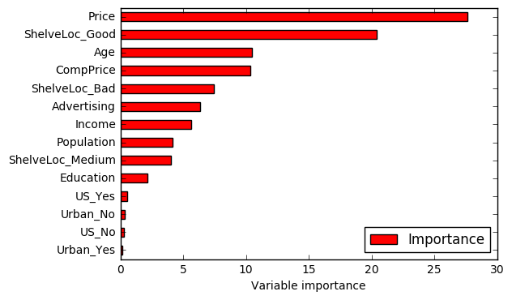

# Exercise 8.8


```python
import pandas as pd
import numpy as np
import pydotplus  # Check the references if you need help to install this module.
import matplotlib.pyplot as plt

from sklearn.model_selection import train_test_split
from sklearn.tree import DecisionTreeRegressor, export_graphviz  # References: download link and instructions to install Graphviz.
from IPython.display import Image  # To plot decision tree.
from sklearn.externals.six import StringIO  # To plot decision tree.
from sklearn.metrics import mean_squared_error
from sklearn.model_selection import GridSearchCV
from sklearn.ensemble import BaggingRegressor
from sklearn.ensemble import RandomForestRegressor

%matplotlib inline
```


```python
df = pd.read_csv('../data/Carseats.csv')
```


```python
df.head()
```


<div>
<table border="1" class="dataframe">
  <thead>
    <tr style="text-align: right;">
      <th></th>
      <th>Sales</th>
      <th>CompPrice</th>
      <th>Income</th>
      <th>Advertising</th>
      <th>Population</th>
      <th>Price</th>
      <th>ShelveLoc</th>
      <th>Age</th>
      <th>Education</th>
      <th>Urban</th>
      <th>US</th>
    </tr>
  </thead>
  <tbody>
    <tr>
      <th>0</th>
      <td>9.50</td>
      <td>138</td>
      <td>73</td>
      <td>11</td>
      <td>276</td>
      <td>120</td>
      <td>Bad</td>
      <td>42</td>
      <td>17</td>
      <td>Yes</td>
      <td>Yes</td>
    </tr>
    <tr>
      <th>1</th>
      <td>11.22</td>
      <td>111</td>
      <td>48</td>
      <td>16</td>
      <td>260</td>
      <td>83</td>
      <td>Good</td>
      <td>65</td>
      <td>10</td>
      <td>Yes</td>
      <td>Yes</td>
    </tr>
    <tr>
      <th>2</th>
      <td>10.06</td>
      <td>113</td>
      <td>35</td>
      <td>10</td>
      <td>269</td>
      <td>80</td>
      <td>Medium</td>
      <td>59</td>
      <td>12</td>
      <td>Yes</td>
      <td>Yes</td>
    </tr>
    <tr>
      <th>3</th>
      <td>7.40</td>
      <td>117</td>
      <td>100</td>
      <td>4</td>
      <td>466</td>
      <td>97</td>
      <td>Medium</td>
      <td>55</td>
      <td>14</td>
      <td>Yes</td>
      <td>Yes</td>
    </tr>
    <tr>
      <th>4</th>
      <td>4.15</td>
      <td>141</td>
      <td>64</td>
      <td>3</td>
      <td>340</td>
      <td>128</td>
      <td>Bad</td>
      <td>38</td>
      <td>13</td>
      <td>Yes</td>
      <td>No</td>
    </tr>
  </tbody>
</table>
</div>


```python
# Dummy variables
# Transform qualitative variables into quantitative to enable the use of regressors.
df = pd.get_dummies(df)
```


```python
df.head()
```


<div>
<table border="1" class="dataframe">
  <thead>
    <tr style="text-align: right;">
      <th></th>
      <th>Sales</th>
      <th>CompPrice</th>
      <th>Income</th>
      <th>Advertising</th>
      <th>Population</th>
      <th>Price</th>
      <th>Age</th>
      <th>Education</th>
      <th>ShelveLoc_Bad</th>
      <th>ShelveLoc_Good</th>
      <th>ShelveLoc_Medium</th>
      <th>Urban_No</th>
      <th>Urban_Yes</th>
      <th>US_No</th>
      <th>US_Yes</th>
    </tr>
  </thead>
  <tbody>
    <tr>
      <th>0</th>
      <td>9.50</td>
      <td>138</td>
      <td>73</td>
      <td>11</td>
      <td>276</td>
      <td>120</td>
      <td>42</td>
      <td>17</td>
      <td>1.0</td>
      <td>0.0</td>
      <td>0.0</td>
      <td>0.0</td>
      <td>1.0</td>
      <td>0.0</td>
      <td>1.0</td>
    </tr>
    <tr>
      <th>1</th>
      <td>11.22</td>
      <td>111</td>
      <td>48</td>
      <td>16</td>
      <td>260</td>
      <td>83</td>
      <td>65</td>
      <td>10</td>
      <td>0.0</td>
      <td>1.0</td>
      <td>0.0</td>
      <td>0.0</td>
      <td>1.0</td>
      <td>0.0</td>
      <td>1.0</td>
    </tr>
    <tr>
      <th>2</th>
      <td>10.06</td>
      <td>113</td>
      <td>35</td>
      <td>10</td>
      <td>269</td>
      <td>80</td>
      <td>59</td>
      <td>12</td>
      <td>0.0</td>
      <td>0.0</td>
      <td>1.0</td>
      <td>0.0</td>
      <td>1.0</td>
      <td>0.0</td>
      <td>1.0</td>
    </tr>
    <tr>
      <th>3</th>
      <td>7.40</td>
      <td>117</td>
      <td>100</td>
      <td>4</td>
      <td>466</td>
      <td>97</td>
      <td>55</td>
      <td>14</td>
      <td>0.0</td>
      <td>0.0</td>
      <td>1.0</td>
      <td>0.0</td>
      <td>1.0</td>
      <td>0.0</td>
      <td>1.0</td>
    </tr>
    <tr>
      <th>4</th>
      <td>4.15</td>
      <td>141</td>
      <td>64</td>
      <td>3</td>
      <td>340</td>
      <td>128</td>
      <td>38</td>
      <td>13</td>
      <td>1.0</td>
      <td>0.0</td>
      <td>0.0</td>
      <td>0.0</td>
      <td>1.0</td>
      <td>1.0</td>
      <td>0.0</td>
    </tr>
  </tbody>
</table>
</div>


```python
# This function creates images of tree models using pydot
# Source: http://nbviewer.jupyter.org/github/JWarmenhoven/ISL-python/blob/master/Notebooks/Chapter%208.ipynb
# The original code used pydot instead of pydotplus. We didn't change anything else.
def print_tree(estimator, features, class_names=None, filled=True):
    tree = estimator
    names = features
    color = filled
    classn = class_names
    
    dot_data = StringIO()
    export_graphviz(estimator, out_file=dot_data, feature_names=features, class_names=classn, filled=filled)
    graph = pydotplus.graph_from_dot_data(dot_data.getvalue())
    return(graph)
```

# (a)


```python
# Split data into training and test set
X = df.ix[:,1:]
y = df['Sales']

X_train, X_test, y_train, y_test = train_test_split(X, y, test_size=.3, random_state=1)
```

# (b)


```python
# Fit regression tree
rgr = DecisionTreeRegressor(max_depth=3)  # We could have chosen another max_depth value. 
rgr.fit(X_train, y_train)
```


    DecisionTreeRegressor(criterion='mse', max_depth=3, max_features=None,
               max_leaf_nodes=None, min_impurity_split=1e-07,
               min_samples_leaf=1, min_samples_split=2,
               min_weight_fraction_leaf=0.0, presort=False, random_state=None,
               splitter='best')


```python
# Plot the tree
graph = print_tree(rgr, features=list(X_train.columns.values))
Image(graph.create_png())
```


<b>Interpretation</b>: According to the tree, ShelveLoc is the most important factor in determining Sales. Shelveloc is an indicator
of the quality of the shelving location — that is, the space within a store in which the car seat is displayed — at each location. Cars with a good shelving location sell more (value = 10.1377) than cars in bad or medium shelving locations (value = 6.8035). Among each of these groups, Price is the second most important factor in determining Sales. For example, for cars with a good shelving location, when the Price is above 135, Sales decrease (6.8218 vs. 10.882). The same analysis logic applies for the remaining branches of the regression tree.


```python
# Test MSE
print('Test MSE: ', mean_squared_error(y_test, rgr.predict(X_test)))
```

    Test MSE:  4.72516600994


# (c) 

To determine the optimal level of
tree complexity using cross-validation we will use <b>GridSearchCV</b>.


```python
# Build a regressor
rgr = DecisionTreeRegressor(random_state=1)
```


```python
# Grid of parameters to hypertune
param_grid = {'max_depth':[1,2,3,4,5,6,7,8,9,10]}
```


```python
# Run grid search
grid_search = GridSearchCV(rgr, 
                           param_grid=param_grid, 
                           cv=5)
grid_search.fit(X_train, y_train)
```


    GridSearchCV(cv=5, error_score='raise',
           estimator=DecisionTreeRegressor(criterion='mse', max_depth=None, max_features=None,
               max_leaf_nodes=None, min_impurity_split=1e-07,
               min_samples_leaf=1, min_samples_split=2,
               min_weight_fraction_leaf=0.0, presort=False, random_state=1,
               splitter='best'),
           fit_params={}, iid=True, n_jobs=1,
           param_grid={'max_depth': [1, 2, 3, 4, 5, 6, 7, 8, 9, 10]},
           pre_dispatch='2*n_jobs', refit=True, return_train_score=True,
           scoring=None, verbose=0)


```python
# Find the best estimator
grid_search.best_estimator_
```


    DecisionTreeRegressor(criterion='mse', max_depth=5, max_features=None,
               max_leaf_nodes=None, min_impurity_split=1e-07,
               min_samples_leaf=1, min_samples_split=2,
               min_weight_fraction_leaf=0.0, presort=False, random_state=1,
               splitter='best')


The best value for *max_depth* using cross-validation is <b>5</b>.

<b>Note:</b> *Pruning* is currently not supported by scikit-learn, so we didn't solve that part of the exercise.

# (d)


```python
# Fit bagging regressor
rgr = BaggingRegressor()
rgr.fit(X_train, y_train)
```


    BaggingRegressor(base_estimator=None, bootstrap=True,
             bootstrap_features=False, max_features=1.0, max_samples=1.0,
             n_estimators=10, n_jobs=1, oob_score=False, random_state=None,
             verbose=0, warm_start=False)


```python
# Test MSE
print('Test MSE:', mean_squared_error(y_test, rgr.predict(X_test)))
```

    Test MSE: 3.33869740833


<b>Note:</b> We didn't find a way to get variable's importance using scikit-learn, so we didn't solve that part of the exercise.

# (e)


```python
# Fit random forest regressor
rgr = RandomForestRegressor()
rgr.fit(X_train, y_train)
```


    RandomForestRegressor(bootstrap=True, criterion='mse', max_depth=None,
               max_features='auto', max_leaf_nodes=None,
               min_impurity_split=1e-07, min_samples_leaf=1,
               min_samples_split=2, min_weight_fraction_leaf=0.0,
               n_estimators=10, n_jobs=1, oob_score=False, random_state=None,
               verbose=0, warm_start=False)


```python
# Test MSE
print('Test MSE:', mean_squared_error(y_test, rgr.predict(X_test)))
```

    Test MSE: 3.23118576667


```python
# Variable importance
importance = pd.DataFrame({'Importance':rgr.feature_importances_*100}, index=X_train.columns)
importance.sort_values('Importance', axis=0, ascending=True).plot(kind='barh', color='r')
plt.xlabel('Variable importance')
plt.legend(loc='lower right')
```


    <matplotlib.legend.Legend at 0xec02978>





The test MSE decreased when compared with the previous answers. One possible explanation for this result is the effect of *m*. In random forests, the number of variables considered at each split changes. This means that, at each split, only a subset of predictors is taken into account. In some sense, this works as a process to decorrelate the decision trees. For example, in baggin, if there is a strong predictor in the data set, most of the bagged trees wil use this predictor in the top split. As a consequence, the predictions from the bagged trees will tend to be highly correlated. In random forests, this doesn't happen because the method forces each split to consider only a subset of the predictors. Hence, the method leads to models with reducted variance and increased reliability. That's a possible reason for the reduction verified in the test MSE value.

# References

* https://packaging.python.org/installing/ (help to install Python modules)
* http://www.graphviz.org/Download..php (download Graphviz)
* http://stackoverflow.com/questions/18438997/why-is-pydot-unable-to-find-graphvizs-executables-in-windows-8 (how to install Graphviz)
* http://scikit-learn.org/stable/modules/tree.html  (plotting decision trees with scikit)

# 2DO

* Pay attention during the review because the solutions that I've don't match with the existing solutions. I suppose that happens because of the randomness associated to the exercise, but I'm not sure.
* Find out how to get variable importance when using bagging.
