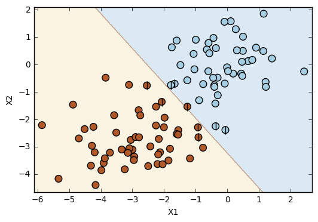
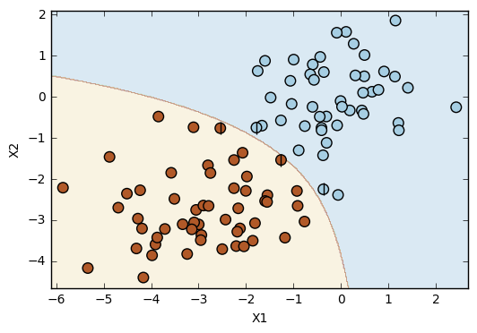

# Exercise 9.4


```python
import pandas as pd
import matplotlib.pyplot as plt
import numpy as np
from sklearn.svm import SVC
from sklearn.model_selection import train_test_split
from sklearn.metrics import confusion_matrix

%matplotlib inline
```

<b> Function to plot classifiers with support vectors </b>


```python
# Plot classifiers
# Source: https://github.com/JWarmenhoven/ISLR-python/blob/master/Notebooks/Chapter%209.ipynb
def plot_svc(svc, X, y, h=0.02, pad=0.25):
    x_min, x_max = X[:, 0].min()-pad, X[:, 0].max()+pad
    y_min, y_max = X[:, 1].min()-pad, X[:, 1].max()+pad
    xx, yy = np.meshgrid(np.arange(x_min, x_max, h), np.arange(y_min, y_max, h))
    Z = svc.predict(np.c_[xx.ravel(), yy.ravel()])
    Z = Z.reshape(xx.shape)
    plt.contourf(xx, yy, Z, cmap=plt.cm.Paired, alpha=0.2)

    plt.scatter(X[:,0], X[:,1], s=70, c=y, cmap=plt.cm.Paired)
    # Support vectors indicated in plot by vertical lines
    sv = svc.support_vectors_
    plt.scatter(sv[:,0], sv[:,1], c='k', marker='|', s=100, linewidths='1')
    plt.xlim(x_min, x_max)
    plt.ylim(y_min, y_max)
    plt.xlabel('X1')
    plt.ylabel('X2')
    plt.show()
    print('Number of support vectors: ', svc.support_.size)
```

<b> Prepare data </b>


```python
# Generate data set
control = 3  # Controls how mixed the classes can be.
np.random.seed(5)  # We changed the random.seed value until it gets what we wanted.
X = np.random.randn(100,2)
y = np.random.choice([-1,1], 100)
X[y == 1] = X[y == 1] - control
```


```python
# Plot
plt.scatter(X[:,0], X[:,1], s=50, c=y, cmap=plt.cm.Paired)
plt.xlabel('X1')
plt.ylabel('X2');
```


```python
# Split data into train and test 
X_train, X_test, y_train, y_test = train_test_split(X, y, test_size=.2, random_state=1)
```

<b> Linear SVC </b>


```python
# Linear SVC
svc = SVC(kernel='linear', random_state=1)
svc.fit(X_train,y_train)
```


    SVC(C=1.0, cache_size=200, class_weight=None, coef0=0.0,
      decision_function_shape=None, degree=3, gamma='auto', kernel='linear',
      max_iter=-1, probability=False, random_state=1, shrinking=True,
      tol=0.001, verbose=False)


```python
# Plot
plot_svc(svc, X, y)
```





    Number of support vectors:  9


```python
# Confusion matrices
print('Confusion matrix for train set: ', confusion_matrix(y_train, svc.predict(X_train)))
print('Confusion matrix for test set: ', confusion_matrix(y_test, svc.predict(X_test)))
```

    Confusion matrix for train set:  [[37  0]
     [ 1 42]]
    Confusion matrix for test set:  [[10  0]
     [ 0 10]]


```python
# Error rate
print('Error rate for train set: ', (0+1)/(37+0+1+42))
print('Error rate for test set: ', (0+0)/(10+0+0+10))
```

    Error rate for train set:  0.0125
    Error rate for test set:  0.0


<b> Polynomial SVC </b>


```python
# Polynomial SVC
svc = SVC(kernel='poly', random_state=1)
svc.fit(X_train,y_train)
```


    SVC(C=1.0, cache_size=200, class_weight=None, coef0=0.0,
      decision_function_shape=None, degree=3, gamma='auto', kernel='poly',
      max_iter=-1, probability=False, random_state=1, shrinking=True,
      tol=0.001, verbose=False)


```python
# Plot
plot_svc(svc, X, y)
```





    Number of support vectors:  4


```python
# Confusion matrices
print('Confusion matrix for train set: ', confusion_matrix(y_train, svc.predict(X_train)))
print('Confusion matrix for test set: ', confusion_matrix(y_test, svc.predict(X_test)))
```

    Confusion matrix for train set:  [[37  0]
     [ 0 43]]
    Confusion matrix for test set:  [[10  0]
     [ 0 10]]


```python
# Error rate
print('Error rate for train set: ', (0+0)/(37+0+0+43))
print('Error rate for test set: ', (0+0)/(10+0+0+10))
```

    Error rate for train set:  0.0
    Error rate for test set:  0.0


<b> Radial SVC </b>


```python
# Radial SVC
svc = SVC(kernel='rbf', random_state=1)
svc.fit(X_train,y_train)
```


    SVC(C=1.0, cache_size=200, class_weight=None, coef0=0.0,
      decision_function_shape=None, degree=3, gamma='auto', kernel='rbf',
      max_iter=-1, probability=False, random_state=1, shrinking=True,
      tol=0.001, verbose=False)


```python
# Plot
plot_svc(svc, X, y)
```


    Number of support vectors:  25


```python
# Confusion matrices
print('Confusion matrix for train set: ', confusion_matrix(y_train, svc.predict(X_train)))
print('Confusion matrix for test set: ', confusion_matrix(y_test, svc.predict(X_test)))
```

    Confusion matrix for train set:  [[37  0]
     [ 0 43]]
    Confusion matrix for test set:  [[10  0]
     [ 0 10]]


```python
# Error rate
print('Error rate for train set: ', (0+0)/(37+0+0+43))
print('Error rate for test set: ', (0+0)/(10+0+0+10))
```

    Error rate for train set:  0.0
    Error rate for test set:  0.0


<b> Discussion </b>

This simple example shows a situation in which the linear SVC doesn't work as well as the other kernels (polynomial and radial). Considering the dataset, it is not possible to get a perfect prediction with a linear kernel. However, it is possible to get a perfect prediction with both the polynomial and the radial kernels. In this specific dataset, the polynomial and the radial error rates have the same value, but it is possible to notice the differences between these two kernels by the observation of the plots. The boundary line in the polynomial kernel has a shape similar to a polynomial function (!!!), while the boundary line resulting from the radial kernel is more flexible in its shape.
