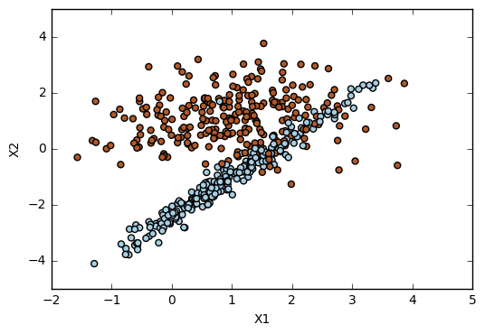

# Exercise 9.6


```python
import pandas as pd
import numpy as np
import matplotlib.pyplot as plt
from sklearn.svm import SVC
from sklearn.metrics import confusion_matrix
from sklearn.model_selection import train_test_split
from sklearn.metrics import accuracy_score
from sklearn.model_selection import cross_val_score
from sklearn.datasets import make_classification

%matplotlib inline
```

# (a)


```python
# Generate dataset
X, y = make_classification(n_samples=500, n_features=2, n_redundant=0, n_informative=2, n_clusters_per_class=1, random_state=0)
```


```python
# Plot
plt.scatter(X[:,0], X[:,1], s=25, c=y, cmap=plt.cm.Paired)
plt.xlabel('X1')
plt.ylabel('X2')
```


    <matplotlib.text.Text at 0x12ea2cf8>





# (b)


```python
# Split data
X_train, X_test, y_train, y_test = train_test_split(X, y, test_size=.3, random_state=1)
```


```python
# Cost range
cost_range = [0.01, .1, 1, 10]
```


```python
# Cross-validation error rates
for i in cost_range:
    svc = SVC(kernel='linear', C=i, random_state=1)
    svc.fit(X_train, y_train)
    print('\ni = ', i)
    print('%.3f' % (np.average(1-cross_val_score(svc, X, y, cv=5, scoring='accuracy'))))
```

    
    i =  0.01
    0.140
    
    i =  0.1
    0.122
    
    i =  1
    0.126
    
    i =  10
    0.124


```python
# Confusion matrix for a range of cost values
# This is a necessary step to get the number of misclassifications.
for i in cost_range:
    svc = SVC(kernel='linear', C=i, random_state=1)
    svc.fit(X_train, y_train)
    print('\ni =', i)
    print('Confusion matrix: ', confusion_matrix(y_train, svc.predict(X_train)))
```

    
    i = 0.01
    Confusion matrix:  [[153  23]
     [ 27 147]]
    
    i = 0.1
    Confusion matrix:  [[167   9]
     [ 32 142]]
    
    i = 1
    Confusion matrix:  [[163  13]
     [ 31 143]]
    
    i = 10
    Confusion matrix:  [[162  14]
     [ 31 143]]


```python
# Misclassifications
misclass_1 = 23+27
misclass_2 = 9+32
misclass_3 = 13+31
misclass_4 = 14+31

misclass = [misclass_1, misclass_2, misclass_3, misclass_4]

for i in range(0,4):
    print('Misclassifications, i = %.3f, %i' % (cost_range[i], misclass[i]))
```

    Misclassifications, i = 0.010, 50
    Misclassifications, i = 0.100, 41
    Misclassifications, i = 1.000, 44
    Misclassifications, i = 10.000, 45


The cost value with less cross-validation error is C=0.1, which is also the cost value with less misclassifications. This is what we wanted to see because it shows that the training error (evaluated by the number of misclassifications) is in accordance with test error (here evaluated by the cross-validation error). 

# (c)


```python
# Generate dataset
X, y = make_classification(n_samples=500, random_state=1)
```


```python
# Plot
plt.scatter(X[:,0], X[:,1], s=25, c=y, cmap=plt.cm.Paired)
plt.xlabel('X1')
plt.ylabel('X2')
```


    <matplotlib.text.Text at 0x12f2c3c8>


```python
# Split data
X_train, X_test, y_train, y_test = train_test_split(X, y, test_size=.3, random_state=1)
```


```python
# Test errors
for i in cost_range:
    svc = SVC(kernel='linear', C=i, random_state=1)
    svc.fit(X_train, y_train)
    print('\ni: ', i)
    print('Test error: ', 1-accuracy_score(y_test, svc.predict(X_test)))
```

    
    i:  0.01
    Test error:  0.0533333333333
    
    i:  0.1
    Test error:  0.06
    
    i:  1
    Test error:  0.08
    
    i:  10
    Test error:  0.0866666666667


```python
# Training errors
for i in cost_range:
    svc = SVC(kernel='linear', C=i, random_state=1)
    svc.fit(X_train, y_train)
    print('\ni: ', i)
    print('Training error: ', 1-accuracy_score(y_train, svc.predict(X_train)))
```

    
    i:  0.01
    Training error:  0.0485714285714
    
    i:  0.1
    Training error:  0.0571428571429
    
    i:  1
    Training error:  0.0428571428571
    
    i:  10
    Training error:  0.0371428571429


```python
# Cross-validation errors
for i in cost_range:
    svc = SVC(kernel='linear', C=i, random_state=1)
    svc.fit(X_train, y_train)
    print('\ni: ', i)
    print('Cross-validation error: ', np.average(1-cross_val_score(svc, X, y, scoring='accuracy', cv=5)))
```

    
    i:  0.01
    Cross-validation error:  0.0540218021802
    
    i:  0.1
    Cross-validation error:  0.05600160016
    
    i:  1
    Cross-validation error:  0.0580218021802
    
    i:  10
    Cross-validation error:  0.0660420042004


The fewest training error is reached when the cost value is 10, while the fewest cross-validation errors occurs when the cost value is 0.01. The fewest cross-validation error is also when the cost value is 0.01. 

These results show that high cost values tend to overfit the data. They can give the best results regarding the training error, but when we try to generalize the results they don't work so well. This happens because an high cost value will reduce the number of support vector violating the margin. Thus, the approach gets too sticked to the observations of the training set and will not be able to generalize well, missing the noisy points.
